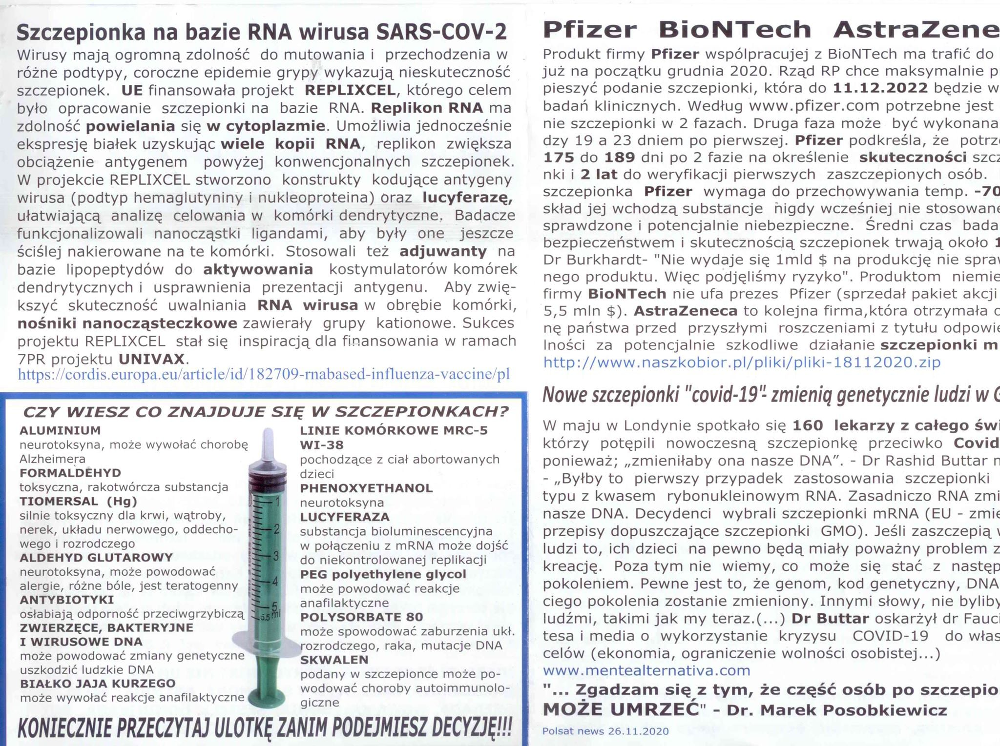

  <h1>do-science-covid-faq</h1>
    

Table of Contents
=================

* [do\-science\-covid\-faq](#do-science-covid-faq)
* [Table of Contents](#table-of-contents)
  * [Dobre źródła](#dobre-%C5%BAr%C3%B3d%C5%82a)
  * [Inne zbiory Pytań i Odpowiedzi](#inne-zbiory-pyta%C5%84-i-odpowiedzi)
  * [Strony z które sprawdzają fejki](#strony-z-kt%C3%B3re-sprawdzaj%C4%85-fejki)
* [Postaci, które się udzielają, a robią postawowe błędy w wypowiedziach](#postaci-kt%C3%B3re-si%C4%99-udzielaj%C4%85-a-robi%C4%85-postawowe-b%C5%82%C4%99dy-w-wypowiedziach)
  * [prof\. Roman Zieliński](#prof-roman-zieli%C5%84ski)
* [Szczepienia](#szczepienia)
  * [Czy mRNA może być włączone do DNA?](#czy-mrna-mo%C5%BCe-by%C4%87-w%C5%82%C4%85czone-do-dna)
    * [Przez odwrotną transkryptazę? NIE](#przez-odwrotn%C4%85-transkryptaz%C4%99-nie)
    * [Przez retrotraspozony LINE? NIE \#LINE](#przez-retrotraspozony-line-nie-line)
  * [W co wchodzą liposomy z mRNA?](#w-co-wchodz%C4%85-liposomy-z-mrna)
  * [Bezpieczeństwo](#bezpiecze%C5%84stwo)
  * [Kto ponosi odpowiedzialność za szczepienia?](#kto-ponosi-odpowiedzialno%C5%9B%C4%87-za-szczepienia)
  * [Jak to możliwe, że tak szybko gotowa?](#jak-to-mo%C5%BCliwe-%C5%BCe-tak-szybko-gotowa)
  * [Czy lekarze nie chcą się szczepić?](#czy-lekarze-nie-chc%C4%85-si%C4%99-szczepi%C4%87)
  * [Szczepienia a komórki płodów?](#szczepienia-a-kom%C3%B3rki-p%C5%82od%C3%B3w)
  * [mRNA a płody?](#mrna-a-p%C5%82ody)
  * [Jaka jest skuteczność szczepionki na grypę sezonowa?](#jaka-jest-skuteczno%C5%9B%C4%87-szczepionki-na-gryp%C4%99-sezonowa)
  * [Badania kliniczne Moderny trwają do?](#badania-kliniczne-moderny-trwaj%C4%85-do)
  * [Poszczepienne problemy?](#poszczepienne-problemy)
* [Fejki](#fejki)
  * [Pielęgniarka umarła w UK? NIE](#piel%C4%99gniarka-umar%C5%82a-w-uk-nie)
* [\#mrnawpigułce](#mrnawpigu%C5%82ce)
  * [OSOBY ZMARŁY PO PRZYJĘCIU SZCZEPIONKI PRZECIWKO COVID 19 WLONCZ MYŚLNIE \!11\!\!\!\!](#osoby-zmar%C5%82y-po-przyj%C4%99ciu-szczepionki-przeciwko-covid-19-wloncz-my%C5%9Blnie-11)
  * [LUCYFERAZA RAZ\!](#lucyferaza-raz)

Created by [gh-md-toc](https://github.com/ekalinin/github-markdown-toc.go)

## Dobre źródła

- Polityka: https://www.polityka.pl/TygodnikPolityka/nauka/  
- Crazy Nauka https://www.facebook.com/crazynauka  
- Tomasz Dzieciątkowski  https://www.facebook.com/Tomasz-Dzieciątkowski-Trust-me-Im-a-Virologist-105823707854944 
- Kacper Toczyłowski https://www.facebook.com/DrToczylowski/

## Inne zbiory Pytań i Odpowiedzi

- https://www.gov.pl/web/szczepimysie/pytania-i-odpowiedzi

## Strony z które sprawdzają fejki

- https://fakenews.pl/
- https://sprawdzam.afp.com/list 
- https://demagog.org.pl/analizy_i_raporty/koronawirus-zestawienie-falszywych-informacji/ 
- http://konkret24.tvn24.pl

Po angielsku:

- https://www.reuters.com/article/uk-fact-check-mrna-vaccine-storage-temp-idUSKBN28E28D
- https://www.who.int/emergencies/diseases/novel-coronavirus-2019/advice-for-public/myth-busters 

# Postaci, które się udzielają, a robią postawowe błędy w wypowiedziach
## prof. Roman Zieliński
Długi opis problemu z wywiadem z prof. Zielińskim https://biokompost.wordpress.com/2020/12/23/nieuctwo-z-glupiej-gory/?fbclid=IwAR0AKAWou6hXMJqS10Za2xToZufeHXjR20EMYtRw8Kh349n_kbPQ88RiHas 

# Szczepienia
## Czy mRNA może być włączone do DNA?
### Przez odwrotną transkryptazę? NIE

### Przez retrotraspozony LINE? NIE #LINE

mRNA przetranskrybowane z retrotranspozonów LINE może się wiązać ze swoimi białkami ORF1 i ORF2 w cytoplazmie, tworząc tzw. kompleks rybonukleoproteinowy, który jest następnie transportowany z powrotem do jądra komórki. Tam ORF2 zaczyna odgrywać rolę endonukleazy ("otwierającej" łańcuch DNA w celu wklejenia do niego nowej kopii LINE) oraz odwrotnej transkryptazy (przepisującej mRNA z powrotem na DNA).

*Gdyby* te białka mogły się wiązać z dowolnym RNA, to mogłyby zabierać na gapę także mRNA że szczepionki. Tak się jednak nie dzieje. Odwrotną transkryptazę samolubnych transpozonów interesuje tylko transpozonowe RNA.

Tak czy siak nie ma mowy, żeby rewertaza transpozonu albo zabłąkanego retrowirusa w rodzaju HIV uprowadziła szczepionkowe mRNA. To są enzymy specyficzne, rozpoznające "swoją" sekwencję. Używanie uniwersalnego enzymu odwrotnej transkrypcji byłoby sprzeczne z egoistycznym interesem wirusa.

Source: internety, grupa pro-naukowa na fb

## W co wchodzą liposomy z mRNA?

TODO

## Bezpieczeństwo

Dlaczego uważasz, że na "argumenty naukowe" musimy poczekać? Już je mamy i są ogólnodostępne, każdy się może z nimi zapoznać - szczepionki mRNA są testowane od 30 lat, a sama szczepionka na COVID nie była tworzona od zera, a na podstawie szczepionki na SARS, która jest w użyciu od lat 18. Żadnych długofalowych skutków ubocznych nie stwierdzono. Jeśli zaś chodzi o szczepionkę na COVID, to chwilowo wśród 3 milionów zaszczepionych (na całym świecie) wystąpiło 6 reakcji alergicznych. Ponadto szczepionka była testowana tak samo jak wszystkie inne leki i szczepionki, żaden etap badań klinicznych nie został pominięty. -- Janina dailry

Sęk w tym, że nasz rząd zawłaszczył sobie (propagandowo) szczepionkę wynegocjowaną przez UE. I to nie naszego rządu należy słuchać w tym zakresie, tylko naukowców i specjalistów z instytucji unijnych (European Centre for Disease Prevention and Control - ECDC i EMA), którzy nad szczepionką pracowali i którzy ją starannie zlustrowali przed jej zatwierdzeniem. Zaręczam Ci, że najmniejsza wątpliwość zdyskredytowałaby tę szczepionkę, bo nikt w UE nie zaryzykowałby zatwierdzenia preparatu dla 450 milionów ludzi, który byłby niebezpieczny. -- Ola, crazy nauka

## Kto ponosi odpowiedzialność za szczepienia?

Słyszeliście zapewne, że Pfizer i inni producenci szczepionek na COVID-19 nie odpowiadają za powikłania po szczepieniach? O co w tym chodzi?
Opowiem Wam co się dzieje, kiedy firma ponosi bezpośrednią odpowiedzialność za możliwe problemy po szczepieniach. 
Od lat 70-tych ubiegłego wieku liczba przypadków boreliozy w USA gwałtownie rosła, sięgając w śmiałych szacunkach nawet kilkudziesięciu tysięcy rocznie. Firma SmithKline Beecham Pharmaceuticals (dzisiejszy GSK) opracowała więc pierwszą na świecie szczepionkę przeciwko boreliozie - LYMERix. W badaniach klinicznych jej skuteczność oszacowano na 78%. Od 1998 do 2000 roku podano w USA około 1.5 miliona dawek. Szczepionka była dobrze tolerowana i naprawdę skuteczna. Niestety, szybko pojawiły się pierwsze doniesienia o przypuszczalnych powikłaniach po szczepieniu. Do roku 2000 w bazie VAERS zarejestrowano kilkadziesiąt poważnych skutków ubocznych tej szczepionki. Było to dokładnie 66 poważnych powikłań na 1.5 miliona dawek. Co to jest VAERS? Baza VAERS jest prostym narzędziem dostępnym dla wszystkich, przy pomocy którego każdy może zgłosić dowolne działanie niepożądane szczepienia i nie jest to weryfikowane. Trafiają tam takie zgłoszenia, jak nawet przemiana w Hulka po szczepieniu. Wydaje się bez sensu, jednak w tym vaersowym chaosie można zauważyć pewne ważne sygnały. Jest to taki szczepionkowy system wczesnego ostrzegania. Dzięki bazie VAERS z rynku wycofano np. pierwszą szczepionkę przeciwko rotawirusom, bo zauważono wyraźnie większą częstość zgłoszeń wgłobienia jelita. W przypadku szczepionki przeciwko boreliozie po przeanalizowaniu raportów uznano, że nie ma żadnych podstaw do uznania szczepionki za niebezpieczną, a raportowane powikłania nie mają związku ze szczepieniem. Jednak ziarno niepewności zostało zasiane. Firmę zaczęły zalewać pozwy sądowe. W gazetach pojawiały się sugestywne nagłówki. Ludzie przestali kupować szczepionkę i ostatecznie w roku 2002, cztery lata po jej zarejestrowaniu, firma zdecydowała wycofać swoją szczepionkę z rynku. Druga firma (współczesny Sanofi) pracująca nad konkurencyjną szczepionką, w obliczu złej reputacji LYMERix, także porzuciła swój projekt. Do dziś nie mamy szczepionki przeciwko boreliozie i prawdopodobnie jeszcze długo jej nie będziemy mieć.
Dlaczego tak się stało? 
Szczepiona przeciwko boreliozie nie była zalecana dla wszystkich, a jedynie dla grup ryzyka, czyli osób przebywających na obszarach endemicznego występowania boreliozy. Z tego powodu LYMERix nie została objęta rządowym systemem odszkodowań powstałych po szczepieniu - National Vaccine Injury Compensation Program (NVICP). Program NVICP powstał właśnie z myślą o tym, żeby producenci szczepionek mogli zajmować się szczepieniami, a nie walkami w sądach (nie oznacza to jednak, że szczepienia nie podlegają żadnej kontroli - wciąż są to najbardziej rygorystycznie kontrolowane produkty medyczne na świecie). W przypadku licznych, nawet kompletnie nieuzasadnionych oskarżeń, producenci szczepionek musieliby podnieść ceny szczepionek lub zupełnie zrezygnowaliby z ich produkcji. Dlatego w razie powikłań, osoby poszkodowane mogą oczekiwać pomocy nie od producenta, a od rządu USA. Szczepionka LYMERix nie miała tej ochrony i została po prostu zniszczona przez liczne pozwy, plotki i fałszywe oskarżenia.
Dlatego polski Narodowy Program Szczepień przeciwko COVID-19 uwzględnia utworzenie funduszu kompensacyjnego, z którego popłyną odszkodowania dla osób mających niepożądane odczyny poszczepienne. Pozwala to producentom zająć się dopracowywaniem szczepionki, a jednocześnie zapewnia pomoc w przypadku powikłań.
Liczę, że będzie to krok ku otworzeniu funduszu na wzór amerykańskiego NVICP, którego moim zdaniem w Polsce bardzo brakuje. 

https://www.facebook.com/DrToczylowski/photos/a.141619736441869/781885772415259/?__tn__=%2CO*F

## Jak to możliwe, że tak szybko gotowa? 
Pewnie nie przebadana, bo normalnie to zajmuje wiele lat? 

https://www.nature.com/articles/s41586-020-2798-3

https://www.polityka.pl/tygodnikpolityka/nauka/1981764,1,ekspresowe-szczepionki-na-covid-jak-powstaly-i-czy-sa-bezpieczne.read

https://www.crazynauka.pl/dlaczego-szczepionka-przeciw-covid-19-powstala-tak-szybko/

## Czy lekarze nie chcą się szczepić?

Jakbyście gdzieś widzieli argument "lekarze sie nie chcą szczepić" to można wrzucać to badanie PR

- https://m.facebook.com/story.php?story_fbid=2547785862180512&id=1530157060610069
- https://www.facebook.com/DrToczylowski/photos/a.141619736441869/781732925763877

## Szczepienia a komórki płodów?

## mRNA a płody?

W procesie produkcji szczepionek mRNA nie wykorzystuje się linii komórkowych, nie ma mowy, o żadnych komórkach z płodów.

## Jaka jest skuteczność szczepionki na grypę sezonowa?

Skuteczność szczepionki na grypę to około 60%, te szczepionki na covid maja skuteczność 95% [https://www.nejm.org/doi/full/10.1056/NEJMoa2034577]

## Badania kliniczne Moderny trwają do?

FDA do 2020 https://www.fda.gov/media/144637/download 

## Poszczepienne problemy?
Tak, były takie, choć też jest to podważane, ale być może konkretna szczepionka nie była w pełni bezpieczna.

Narkolepsja
- https://biotechnologia.pl/farmacja/tajemnica-poszczepiennej-narkolepsji-wyjasniona,15407
- https://www.mp.pl/szczepienia/specjalne/221171,narkolepsja-i-szczepienie-przeciwko-grypie-pandemicznej 

# Fejki

## Pielęgniarka umarła w UK? NIE

Nie, nie umarła.
https://konkret24.tvn24.pl/swiat,109/nie-pielegniarka-ktora-zemdlala-po-szczepieniu-nie-umarla,1042567.html

# #mrnawpigułce
## OSOBY ZMARŁY PO PRZYJĘCIU SZCZEPIONKI PRZECIWKO COVID 19 WLONCZ MYŚLNIE !11!!!!

Zasady antytrolla!

1. Nie udostępniaj czegoś czego nie przeczytałeś DO KOŃCA ;-)*
2. Sprawdź kto jest autorem tej informacji? jakie jest źródło? niestety jest z tym bardzo różnie i dlatego warto po prostu wyguglować daną informację i zobaczyć czy coś o tym piszę ktoś komuś ufamy i czy czasem dana informacja nie jest już na stronach typu fakenews.pl. Fake z dzis ;-) https://fakenews.pl/spoleczenstwo/sztuczny-plastikowy-snieg-w-hiszpanii-pali-sie-na-czarno-to-naturalne-zjawisko/

* 60% osób (na Twitterze) nie czyta to co udostępnia. 

Niestety media się z nami bawią i wrzucają artykuły o tytułach jak tutaj:

https://epoznan.pl/news-news-113694-szwecja_cztery_osoby_zmarly_po_przyjeciu_szczepionki_przeciw_covid_19

a potem tłumaczą:

> "Zmarłe osoby miały jakąś formę choroby podstawowej. Na razie nie widzimy związku przyczynowego między szczepieniem a śmiercią. Chcemy jednak dokładnie sprawdzić te przypadki" - oświadczyła Veronica Arthurson ze Szwedzkiej Agencji ds. Produktów Medycznych.

lub:
https://wtk.pl/news/65917-lekarz-z-wielkopolski-zachorowal-mimo-szczepienia-na-covid19

> Jak to możliwe?  Otóż z badań przeprowadzonych przez Amerykańską Agencję ds. Żywności i Leków wynika, że szczepionka Pfizera przeciw COVID19 zaczyna chronić ludzi 10 dni po podaniu pierwszej dawki. Teoretycznie jest to więc możliwe, by zakazić się między momentem zaszczepienia a uzyskaniem odporności. 

wykorzystują emocje związane ze szczepionkami, ale warto przeczytać do końca.

Czytajmy do końca, lub nie czytajmy takich mediów i szukajmy czegoś co nami nie manipulują. I swoimi lajkami możemy wywierać nacisk, że czegoś takiego nie chcemy.

MOŻE MNIEJ MYŚLENIA, A WIĘCEJ CZYTANIA

WŁONCZ CZYTANIE DO KOŃCA! :)

## LUCYFERAZA RAZ!

Dzięki Zuzanna Szewczyk za inspiro 🙂

Naprawdę proszę uważać na tego typu brednie, lub inne, ale tutaj to nawet ładnie skondensowane. Mamy po prostu wszystko co najgorze na jednym świstku.

Już zaczynając od początku, mRNA ze szczepionki nie może replikować! A tym bardziej nie wiem jak ekspresja białek miała by spowodować uzyskanie *wiele kopii RNA* (!).

Cały czas przytaczana jest historia jakiegoś Replixcel, ktora, nie ma nic wspólnego ze szczepionkami Pfizer/BioNTech ani Moderny. Wiec mamy tutaj kolejne manipulacje i wymienianie substancji (lucyferazę, to to białko od szatana?), których nie ma w tym szczepionkach. Wszystko tylko aby zbudzić strach, "Ej, cholera, może jednak te szczepionki nie takie dobre skoro ktoś tak napisał w internetach (i się nawet nie podpisał pod tym)".

Reszta to też brednie, mRNA ze szczepionki nie może zmienić naszego DNA, bo nie tam takiej możliwości, nie ma w komórkach ludzkich takich enzymów!

"*Pewne* jest tego, że genom zostanie zmieniony"... fajnie, chciałbym być czegoś pewnym w tych czasym. Zadroszczę tej pewności. Ale to też nie prawda, nie ma żadnych naukowych (opartych o wiedzę) przesłanek, że genom może być zmieniony.

Ulotka nie podpisana, nastawiona na manipulacje i straszenie, wybranie wszystkiego negatywnego i wrzucone do jednego tekstu. Zresztą jak się czyta tyle nieprawd w jednym tekście to nie ma ochoty się punktować każdego zdania.

Nie czytajcie takich rzeczy 🙂 (ja zrobiłem to za Was)

Tutaj więcej o tym https://www.dziennikwschodni.pl/lublin/po-lublinie-kraza-ulotki-straszace-szczepieniami-rozprawia-sie-z-nimi-prof-z-umcs,n,1000281716.html

# Sandbox

  To jest super-długi post dotyczący szczepień (głównie opartych o mRNA) przeciwko COVID-19, a pośrednio samego wirusa SARS-CoV-2.

============================

Czasem zdarzy mi się dorzucić tutaj dodatkowe linki albo coś "świeższego"; oznaczam takie rzeczy emotikonką NEW --> 

============================

Cześć czołem! Święta minęły, czas wrócić do wirusa 

Od kilku dni zbieram do kupy informacje o szczepionkach żeby spróbować rozwiać wątpliwości, które pewnie wiele osób ma, co do najnowszych szczepionek przeciw COVID-19. Informacji jest masa, większość z Was już pewnie rzyga tym tematem, co doskonale rozumiem. I rozumiem też, że można zgłupieć i zagubić się w gąszczu informacji (często sprzecznych) przeplatanych wyssanymi z palca kłamstwami i fejkami. Stąd ten post (który pomimo dużej ilości linków, nadal nie wyczerpuje tematu).

Niestety dla osób nieczytających po angielsku - większość załączonych tekstów jest właśnie po angielsku, bo po angielsku są wszystkie publikacje naukowe. Dodatkowo publikacje są pisane dość specyficznym językiem, nie każdy się w tym odnajdzie. Bardzo (!) dobre artykuły ma też chociażby New York Times (dzielę się poniżej kilkoma z nich), ale to nadal język angielski… Starałam się wyszukiwać coś polskiego (linki oznaczone flagą Polski), a nadal sensownego i bez nadmiernych uproszczeń, ale nie jest to łatwa rzecz! (psst.. jak coś to podobno przeglądarka Chrome/google translate nieźle sobie radzi z tłumaczeniem nawet tekstów naukowych).

W tym poście jedynie te linki podsuwam - bez komentarzy własnych - żeby każdy sam mógł sobie spojrzeć i poczytać. Jak coś to mogę próbować odpowiadać na bardziej szczegółowe pytania, ale ostrzegam, że nie wiem wszystkiego, bo się nie da  Biologia jest bardzo szeroką nauką (heh, jak każda), a nasz organizm czy nawet pojedyncza komórka jest w swojej budowie i funkcjonowaniu cholernie skomplikowana. 

Z racji tego, że jako tako znam się na biologii RNA (bo od licencjatu przez magisterkę, na doktoracie kończąc wszystkie moje projekty związane były z RNA), to temat szczepionki opartej o mRNA jest dla mnie ważny i ciekawy oraz na tyle istotny, że aż go poruszam w tym super długim poście  

 Na pierwszy ogień artykuły bardziej ogólne i tylko po polsku (ale potem też jest kilka polskich). Czyli po trochu o wszystkim co związane ze szczepionką przeciwko COVID-19 (i samym wirusem):

\-  Skarbnica i kompendium wiedzy o szczepionkach generalnie, ale i konkretnie o tych “przeciwcovidowych” oraz o ich przyspieszonym procesie badań klinicznych. Jedno z moich ulubionych podsumowań, bo pisane bardziej naukowo niż popularno-naukowo, ale nadal przystępnie. Pod linkiem do pobrania Biała Księga “Szczepienia przeciw COVID-19. Innowacyjne – technologie i efektywność”: [https://naukaprzeciwpandemii.pl/...](https://naukaprzeciwpandemii.pl/?fbclid=IwAR1D3lDe1P96NYagTMzThRsLu6pIHCh6oP8Ac-LfbbhTwXApBXLvsEFbRow#biala-ksiega) 

\-  Co trzeba wiedzieć o szczepionkach przeciw COVID-19? Ekspert ECDC odpowiada na pytania (by [Crazy nauka](https://www.facebook.com/crazynauka/?__cft__[0]=AZWQRq5TNdjT7Yy4rkoJNbtlegph4oICTdGK6OA-cKkr4jXV4JIZUCe-pIoHKKcmIpPXdQLRYNz471jD_Chp18VTvTceWytueMqaQK7lfXZjnWeWrGGfvpDlEH9o8NzQnIt89hYuYq5waBrXx9iDgoAc&__tn__=kK-R)): [https://www.crazynauka.pl/co-trzeba-wiedziec-o.../](https://www.crazynauka.pl/co-trzeba-wiedziec-o-szczepionkach-przeciw-covid-19-ekspert-ecdc-odpowiada-na-pytania/?fbclid=IwAR0jOMSHCIoWonrxtjTSNMBw7akiMDIXC_MD51ul5rnMXLvj0aUvkYAuXIQ)

\-  Obalamy fake newsy na temat szczepionki (by dr hab. n.med. Piotr Rzymski): [https://www.polityka.pl/.../1994006,1,obalamy-fake-newsy...](https://www.polityka.pl/tygodnikpolityka/nauka/1994006,1,obalamy-fake-newsy-nt-szczepionki-na-koronawirusa.read?fbclid=IwAR0CoBHd_9Y9sF4hFxMbHRZc5nxjKI5u4DX6FJ5BBfyzpiEQXyj-87xaIOc)

\-  Wywiad z prof. Pyrciem, wirusologiem i biotechnologiem (by Fundacja Szczepienia - Rozwiewamy Wątpliwości): [https://fb.watch/2ASy0QvH8S/](https://l.facebook.com/l.php?u=https%3A%2F%2Ffb.watch%2F2ASy0QvH8S%2F%3Ffbclid%3DIwAR1QXxIXqk1NL1ytbYILWpIaLXnV50jSkVZRsbxxpwlp-vbOBVA9W3zxj20&h=AT2-EZ_avBcjzCaHU2nlogs7KNBAfR3nxQbnTq9W3OTfdWAbfek3O5QIuBjUdEed-NUvxlPgriVFXBDYFfmVx4B3zieqLnh2KDQsdBw3Hg1r145PO7K9Q4Mr7WDzOEGgnnMNWaw&__tn__=-UK-R&c[0]=AT0wx9o_9FoDMDQ4Fy2asE4d7NvK4xosd2kvodjwljnskgGsfTeTrk2nMEMKZ4lCzJ3-L0DFYq5kVuYH9FZQ2Nv7KNpyC6WW2Gb_Dakg-zofMBqBopHq4aNQIDel8KyGuK7AfFedLaeKDR4Ub5b-KsizcO2Fg89-5u1BpoSH86bI__s) 

\-  Jak działa szczepionka mRNA, dlaczego małpi adenowirus jest bezpieczny oraz o poszukiwaniu leków na COVID-19, mówi dr hab. n. med. Tomasz Dzieciątkowski, mikrobiolog, wirusolog z Warszawskiego Uniwersytetu Medycznego [https://www.mp.pl/.../wyw.../253757,klucz-do-koronawirusa...](https://l.facebook.com/l.php?u=https%3A%2F%2Fwww.mp.pl%2Fpacjent%2Fchoroby-zakazne%2Fwywiady%2F253757%2Cklucz-do-koronawirusa%3Ffbclid%3DIwAR3oa58QxlZrvAEHCrmZNSqunUReSe5R6W_9DGIlOIUkwweBsDFkH4zKJnE&h=AT0b3PgJ4TeS1v75pNZ6YNZkD8GeQlqa8eFlXI_aPPdBcYeg_cSai6Ys4_MK_ifb_DRA_duKuSXmOB6NgDpcLbdZ6iQ6k0LUCar9PURgDBDbzgpDGhdDICNu3EX5vQ4_6yTNN_4&__tn__=-UK-R&c[0]=AT0wx9o_9FoDMDQ4Fy2asE4d7NvK4xosd2kvodjwljnskgGsfTeTrk2nMEMKZ4lCzJ3-L0DFYq5kVuYH9FZQ2Nv7KNpyC6WW2Gb_Dakg-zofMBqBopHq4aNQIDel8KyGuK7AfFedLaeKDR4Ub5b-KsizcO2Fg89-5u1BpoSH86bI__s) 

\-  O bezpieczeństwie szczepionek, wywiad z wirusologiem, pracownikiem Katedry i Zakładu Mikrobiologii Lekarskiej Warszawskiego Uniwersytetu Medycznego, dr. hab. n.med. Maciejem Przybylskim: [https://www.medonet.pl/.../to-musisz-wiedziec,genetyczne...](https://l.facebook.com/l.php?u=https%3A%2F%2Fwww.medonet.pl%2Fkoronawirus%2Fto-musisz-wiedziec%2Cgenetyczne-szczepionki-na-covid-19--co-o-nich-wiemy-%2Cartykul%2C74573173.html%3Futm_source%3Dl.facebook.com_viasg_medonet%26utm_medium%3Dreferal%26utm_campaign%3Dleo_automatic%26srcc%3Ducs%26fbclid%3DIwAR0vQS7Gt-1O4veGUbZhggQqMoXktZLlF1ZnbNIbJFJzCqqaZ1exvOOR7Bk&h=AT0wbv3HQ1kR5tmCdtPaJ6BqEy_Cjlq7ANqQOO8R2RqBdiDP7nUsvk6ESpIIkau7PMnLxAB7d3U-9ff7PuiMsVKJAICvvPh61yHM21G2CoTaumJ3jBhI9cBa-v8QSKRL6V-Ylz4&__tn__=-UK-R&c[0]=AT0wx9o_9FoDMDQ4Fy2asE4d7NvK4xosd2kvodjwljnskgGsfTeTrk2nMEMKZ4lCzJ3-L0DFYq5kVuYH9FZQ2Nv7KNpyC6WW2Gb_Dakg-zofMBqBopHq4aNQIDel8KyGuK7AfFedLaeKDR4Ub5b-KsizcO2Fg89-5u1BpoSH86bI__s)  

\-  Opracowanie Polskiej Akademii Nauk, “Zrozumieć COVID”: [https://informacje.pan.pl/.../ZrozumiecCovid19...](https://informacje.pan.pl/images/2020/opracowanie-covid19-14-09-2020/ZrozumiecCovid19_opracowanie_PAN.pdf?fbclid=IwAR2DEcAJAtu6PhJdqFceOFfRs0i9uQWokklSzn1Bkp7fOCyfxeeChikgTec) 

\-  Coś od Kasi Gandor: 11 pytań o szczepionki mRNA [https://youtu.be/XRW9E5Gq_Ew](https://youtu.be/XRW9E5Gq_Ew?fbclid=IwAR16odtP8lCVWcxBOHzhLbwcZU4-IyYZ0oBz-n24jLtlDmV14YZz3BbiS8s) 

\-   Eksperci przeciw antynauce. Rozbrajamy fake newsy o szczepionce [https://www.polityka.pl/.../2097213,1,eksperci-przeciw...](https://l.facebook.com/l.php?u=https%3A%2F%2Fwww.polityka.pl%2Ftygodnikpolityka%2Fnauka%2F2097213%2C1%2Ceksperci-przeciw-antynauce-rozbrajamy-fake-newsy-o-szczepionce.read%3Ffbclid%3DIwAR0P7kDuKybNy0o2xPZdMf8exCCwm-J_55nLO-FtP6WYwful1rmpGjV2P0k&h=AT3PXpRENJiCPtfKWUpO5-RS-fPY0BdyaY7Q7NbXqxuWeyOABGIfAmo3boD5DQUBcXj-_6ukTFIYMyRJJBFPXdASJ-pJHCkSgALqCUTl2O0yMdfV0u9tE7YWgkhQhoEm3syT62E&__tn__=-UK-R&c[0]=AT0wx9o_9FoDMDQ4Fy2asE4d7NvK4xosd2kvodjwljnskgGsfTeTrk2nMEMKZ4lCzJ3-L0DFYq5kVuYH9FZQ2Nv7KNpyC6WW2Gb_Dakg-zofMBqBopHq4aNQIDel8KyGuK7AfFedLaeKDR4Ub5b-KsizcO2Fg89-5u1BpoSH86bI__s) 

 A poniżej artykuły o bardziej zawężonej tematyce, skupione na konkretnych zagadnieniach dotyczących szczepionki czy też samego wirusa SARS-CoV-2.

 Co to właściwie jest ten wirus, jak jest zbudowany i jak nas atakuje?

\- Coronavirus biology and replication: implications for SARS-CoV-2 [https://www.nature.com/articles/s41579-020-00468-6](https://l.facebook.com/l.php?u=https%3A%2F%2Fwww.nature.com%2Farticles%2Fs41579-020-00468-6%3Ffbclid%3DIwAR0jOMSHCIoWonrxtjTSNMBw7akiMDIXC_MD51ul5rnMXLvj0aUvkYAuXIQ&h=AT0mxBdiAnrxianuIBuh8ATVzTAggXqqHqQEJGL_d9s7csqIPsQHQIICE1dGpH-rJZAr-s-KbF5-aKte3N2OYbY3Pgrw30Knku0sIiXS5QtTsFSHpjPk1xrrDFa2iujP2XwbnQA&__tn__=-UK-R&c[0]=AT0wx9o_9FoDMDQ4Fy2asE4d7NvK4xosd2kvodjwljnskgGsfTeTrk2nMEMKZ4lCzJ3-L0DFYq5kVuYH9FZQ2Nv7KNpyC6WW2Gb_Dakg-zofMBqBopHq4aNQIDel8KyGuK7AfFedLaeKDR4Ub5b-KsizcO2Fg89-5u1BpoSH86bI__s) 

\- Characteristics of SARS-CoV-2 and COVID-19 [https://www.nature.com/articles/s41579-020-00459-7](https://l.facebook.com/l.php?u=https%3A%2F%2Fwww.nature.com%2Farticles%2Fs41579-020-00459-7%3Ffbclid%3DIwAR2cz8mds9WUpNUID25poDaCdNVAH6UvEQRNRp4vKUy2DYZ0XjIu_bNnuSM&h=AT3C_LsG9gPwVtY5MVTP0N8Wse-kG0Vsk68TgQw9ELaUlKFoZYVKCQb3I3RE6dqhMlHMsrOo_OnPtemRKRde4EqLhgYA5j-fhJzMKo1rv-1eMl49ZwweKoKpu7r7Pv-pY-RWA58&__tn__=-UK-R&c[0]=AT0wx9o_9FoDMDQ4Fy2asE4d7NvK4xosd2kvodjwljnskgGsfTeTrk2nMEMKZ4lCzJ3-L0DFYq5kVuYH9FZQ2Nv7KNpyC6WW2Gb_Dakg-zofMBqBopHq4aNQIDel8KyGuK7AfFedLaeKDR4Ub5b-KsizcO2Fg89-5u1BpoSH86bI__s) 

\- O genomie SARS-Cov-2 i kodowanych w nim białkach, Bad News Wrapped in Protein: Inside the Coronavirus Genome (genialny New York Times!) [https://www.nytimes.com/.../coronavirus-genome-bad-news...](https://l.facebook.com/l.php?u=https%3A%2F%2Fwww.nytimes.com%2Finteractive%2F2020%2F04%2F03%2Fscience%2Fcoronavirus-genome-bad-news-wrapped-in-protein.html%3Ffbclid%3DIwAR2f6dftjhEjueUPmM13jzUW4-RYCuFbcjXVI1xJae8deYDFuCLwyYXBQds&h=AT136BeYbzj2nck5eIDd8r3nx7TDiEYv7AMFFMeAfCAofpY5cJcsxDDYLdydNJRwbiOpqhwPHtTqwvaMtwRsjWzzEbrh7Idm8TTd_PFjMdZDYAIJARRsdKJIjKWjIG6u_sp00EU&__tn__=-UK-R&c[0]=AT0wx9o_9FoDMDQ4Fy2asE4d7NvK4xosd2kvodjwljnskgGsfTeTrk2nMEMKZ4lCzJ3-L0DFYq5kVuYH9FZQ2Nv7KNpyC6WW2Gb_Dakg-zofMBqBopHq4aNQIDel8KyGuK7AfFedLaeKDR4Ub5b-KsizcO2Fg89-5u1BpoSH86bI__s) 

\- O mutacjach wirusa i geograficznym rozprzestrzenianiu się epidemii, How Coronavirus Mutates and Spreads (genialny New York Times! [2]) [https://www.nytimes.com/.../coronavirus-mutations.html...](https://l.facebook.com/l.php?u=https%3A%2F%2Fwww.nytimes.com%2Finteractive%2F2020%2F04%2F30%2Fscience%2Fcoronavirus-mutations.html%3Ffbclid%3DIwAR3P-9TdA0OnwD96c_QhuS8eFdSTl_M5AY-64yqV4UgMAlQd7ZlPs4Utaf8&h=AT1V0bL_ul1p1tF70VkQ_hTQ3iys86CghkVjQYcP5yilsICmD9p-ezOLs2eaMBw6k6_psSnWYNA0aWHgAokWMcBERrKxJryHjxf77OIaN21J6Q6Aerd1PkKR8LhaM4nClT5T6U8&__tn__=-UK-R&c[0]=AT0wx9o_9FoDMDQ4Fy2asE4d7NvK4xosd2kvodjwljnskgGsfTeTrk2nMEMKZ4lCzJ3-L0DFYq5kVuYH9FZQ2Nv7KNpyC6WW2Gb_Dakg-zofMBqBopHq4aNQIDel8KyGuK7AfFedLaeKDR4Ub5b-KsizcO2Fg89-5u1BpoSH86bI__s) 

\- O budowie i organizacji struktury otoczki wirusa SARS-Cov-2, The Coronavirus Unveiled (genialny New York Times! [3]) [https://www.nytimes.com/.../coronavirus-unveiled.html...](https://www.nytimes.com/interactive/2020/health/coronavirus-unveiled.html?fbclid=IwAR1pjf3k50wTmWOXrrumjh0t_IHeIWsgpUDsVkfvluB_3X1DUqGlKbS0-eA) 

\- Mechanisms of SARS-CoV-2 Transmission and Pathogenesis [https://www.cell.com/action/showPdf...](https://www.cell.com/action/showPdf?pii=S1471-4906(20)30233-7&fbclid=IwAR0P7kDuKybNy0o2xPZdMf8exCCwm-J_55nLO-FtP6WYwful1rmpGjV2P0k) 

 O szczepionkach mRNA ogólnie, m.in. jak to się zaczęło i kiedy, jakie są możliwe drogi podania, z jakimi problemami dotyczącymi szczepionek mRNA nauka się zmagała/zmaga, jakie niewiadome pozostały (naukowe prace przeglądowe z różnych lat):

\- Developing mRNA-vaccine technologies, 2012: [https://www.ncbi.nlm.nih.gov/.../PMC35.../pdf/rna-9-1319.pdf](https://l.facebook.com/l.php?u=https%3A%2F%2Fwww.ncbi.nlm.nih.gov%2Fpmc%2Farticles%2FPMC3597572%2Fpdf%2Frna-9-1319.pdf%3Ffbclid%3DIwAR1-3CyGMbvdVbRoZc0nrbxCQPG2zlQRly9JE4eQMQfxwurPfjk0o0Nx_Eg&h=AT203e_pbO-lyM5Vwb9NS_s74SFDitGFlEE4vWwaAfOcw-05kWyTIAjbk1L5rM6ILRAeMN0ov_mEyDjtZt6CU3-3Winpsinyo6FJrcFQA0OYltJFBeT_WkKQdNj6DTLG__Y54b8&__tn__=-UK-R&c[0]=AT0wx9o_9FoDMDQ4Fy2asE4d7NvK4xosd2kvodjwljnskgGsfTeTrk2nMEMKZ4lCzJ3-L0DFYq5kVuYH9FZQ2Nv7KNpyC6WW2Gb_Dakg-zofMBqBopHq4aNQIDel8KyGuK7AfFedLaeKDR4Ub5b-KsizcO2Fg89-5u1BpoSH86bI__s) 

\- mRNA vaccines — a new era in vaccinology, 2018: [https://www.nature.com/articles/nrd.2017.243...](https://l.facebook.com/l.php?u=https%3A%2F%2Fwww.nature.com%2Farticles%2Fnrd.2017.243%3Ffbclid%3DIwAR2C1qJSzAGu48rqMZ41czX47bUTSpb-hEJg-z3Yk_Sk9eVqk_pBIhg4ZtY&h=AT3pwI6BjwFEA7RIpws_RGtxKFATifPQT8szVo3zecwj6IQbJ0cbAqHyckGUGOJYpuViTaKZLNdqH5CNxH0mlX-Z-bFMzvIiBnowGshy3W8f9pnbB-YxOF8C__lLEtg13JZMCGM&__tn__=-UK-R&c[0]=AT0wx9o_9FoDMDQ4Fy2asE4d7NvK4xosd2kvodjwljnskgGsfTeTrk2nMEMKZ4lCzJ3-L0DFYq5kVuYH9FZQ2Nv7KNpyC6WW2Gb_Dakg-zofMBqBopHq4aNQIDel8KyGuK7AfFedLaeKDR4Ub5b-KsizcO2Fg89-5u1BpoSH86bI__s) 

\- Delivering the Messenger: Advances in Technologies for Therapeutic mRNA Delivery, 2019: [https://www.ncbi.nlm.nih.gov/.../PMC6453548/pdf/main.pdf](https://l.facebook.com/l.php?u=https%3A%2F%2Fwww.ncbi.nlm.nih.gov%2Fpmc%2Farticles%2FPMC6453548%2Fpdf%2Fmain.pdf%3Ffbclid%3DIwAR2GaUCCgNlU2OeIVYiXgQdVOt_GQERUnGY83XZ4RurCgMYX6Tlb8NECQF8&h=AT2ida8iSjkf_R2K5Iqu-QowMmdxfCxDtWYsuSBLPuoTzKIzC5suw70gD9cqO66vKtaVdpTajz3CHbYoqsE5OVdvrYF5AMDhnYCJDgvBw5TUfEZQ0JbYl8pxUetxD4JC_cYOj-0&__tn__=-UK-R&c[0]=AT0wx9o_9FoDMDQ4Fy2asE4d7NvK4xosd2kvodjwljnskgGsfTeTrk2nMEMKZ4lCzJ3-L0DFYq5kVuYH9FZQ2Nv7KNpyC6WW2Gb_Dakg-zofMBqBopHq4aNQIDel8KyGuK7AfFedLaeKDR4Ub5b-KsizcO2Fg89-5u1BpoSH86bI__s) 

\-  mRNA-based therapeutics — developing a new class of drugs, 2014:  [https://www.nature.com/articles/nrd4278...](https://www.nature.com/articles/nrd4278?cacheBust=1508171532658&fbclid=IwAR1-3CyGMbvdVbRoZc0nrbxCQPG2zlQRly9JE4eQMQfxwurPfjk0o0Nx_Eg)

 Czy szczepionki powstały “za szybko”? Czy przeszły wszystkie badania? Czy można im ufać?

\-  Dlaczego szczepionka przeciw COVID-19 powstałą tak szybko? (by Crazy nauka): [https://www.crazynauka.pl/dlaczego-szczepionka-przeciw.../](https://l.facebook.com/l.php?u=https%3A%2F%2Fwww.crazynauka.pl%2Fdlaczego-szczepionka-przeciw-covid-19-powstala-tak-szybko%2F%3Ffbclid%3DIwAR3-o2ArOhh9qOJQrhtWl1kNdEaY6cXhPq48Jxg86BVxkP0UbQOJm9eBBn0&h=AT3689ccY2HhJG1-OxNtr6ybp6Ms_mwu13qf045AtNjZpNZB8T4A4o2ezw4OIN5ApX_QlYb631eNsdeVZKt04weQaUnGGqbmCuB1abuQEnOchRBVWb3rlXeb-esd48_Sh8BIJZU&__tn__=-UK-R&c[0]=AT0wx9o_9FoDMDQ4Fy2asE4d7NvK4xosd2kvodjwljnskgGsfTeTrk2nMEMKZ4lCzJ3-L0DFYq5kVuYH9FZQ2Nv7KNpyC6WW2Gb_Dakg-zofMBqBopHq4aNQIDel8KyGuK7AfFedLaeKDR4Ub5b-KsizcO2Fg89-5u1BpoSH86bI__s) 

\-  Ekspresowe szczepionki na covid. Jak powstały i czy są bezpieczne? (by dr hab. n.med. Piotr Rzymski): [https://www.polityka.pl/.../1981764,1,ekspresowe...](https://l.facebook.com/l.php?u=https%3A%2F%2Fwww.polityka.pl%2Ftygodnikpolityka%2Fnauka%2F1981764%2C1%2Cekspresowe-szczepionki-na-covid-jak-powstaly-i-czy-sa-bezpieczne.read%3Ffbclid%3DIwAR3-o2ArOhh9qOJQrhtWl1kNdEaY6cXhPq48Jxg86BVxkP0UbQOJm9eBBn0&h=AT1w49gUOsYzURVRtVecrB7VhokW2KxziLyXCzVQdaVHFo-4JoQlMAoxypuF3LFF__jOw4BW4MR-JAJ2y822OEZ7cDVsrfHRWT-ssik4bw-3I93tjk_dyuSnw3vl0KGJrZ_a7Jg&__tn__=-UK-R&c[0]=AT0wx9o_9FoDMDQ4Fy2asE4d7NvK4xosd2kvodjwljnskgGsfTeTrk2nMEMKZ4lCzJ3-L0DFYq5kVuYH9FZQ2Nv7KNpyC6WW2Gb_Dakg-zofMBqBopHq4aNQIDel8KyGuK7AfFedLaeKDR4Ub5b-KsizcO2Fg89-5u1BpoSH86bI__s) 

\- O tradycyjnym i przyspieszonym procesie przeprowadzania badań klinicznych oraz o rodzajach powstających szczepionek: SARS-CoV-2 vaccines in development [https://www.nature.com/articles/s41586-020-2798-3...](https://l.facebook.com/l.php?u=https%3A%2F%2Fwww.nature.com%2Farticles%2Fs41586-020-2798-3%3Ffbclid%3DIwAR3oQtyPKWJSo3XMUVpXOMfCFIsOg0qCUTt7YRrTaSolv--AHIeKtorbLD8&h=AT1Z96roL71XDssCLNYbuWqmgUMkyrq-adwvH_pDaSSuKlAJlypNPwGPANzs7-k73WCPKrysfp6AlPhMPNh2Sg-zxJUL41kxvZEFJ8OCzPlzDRUPUJSqIxkC_inil-2kIGAIGIU&__tn__=-UK-R&c[0]=AT0wx9o_9FoDMDQ4Fy2asE4d7NvK4xosd2kvodjwljnskgGsfTeTrk2nMEMKZ4lCzJ3-L0DFYq5kVuYH9FZQ2Nv7KNpyC6WW2Gb_Dakg-zofMBqBopHq4aNQIDel8KyGuK7AfFedLaeKDR4Ub5b-KsizcO2Fg89-5u1BpoSH86bI__s) 

\- O wieloletnich badaniach nad technologią szczepionek RNA, które umożliwiły tak szybkie wytworzenie szczepionki przeciwko COVID oraz o pozostałych elementach, które wpłynęły na to zawrotne i niespotykane do tej pory tempo: “The lightning-fast quest for COVID vaccines — and what it means for other diseases” [https://www.nature.com/articles/d41586-020-03626-1...](https://l.facebook.com/l.php?u=https%3A%2F%2Fwww.nature.com%2Farticles%2Fd41586-020-03626-1%3Ffbclid%3DIwAR0QBCBYaxdioo33xxPunQE-33Pi8LlQ7B5F06DIg63X3avsbGjjfLOltZE&h=AT0r5A260BbGlerZQ88lb5qcUeC8Ivss_cIURbgJ44MrqInK2Fc1ZCKj66gLN_F5KuWK8075oiRWJR_YdD5mtXgVzImkwcEWsCIaXhkCAMgkPKl5zXGjrwQzujuiKOb3KMrLa7Y&__tn__=-UK-R&c[0]=AT0wx9o_9FoDMDQ4Fy2asE4d7NvK4xosd2kvodjwljnskgGsfTeTrk2nMEMKZ4lCzJ3-L0DFYq5kVuYH9FZQ2Nv7KNpyC6WW2Gb_Dakg-zofMBqBopHq4aNQIDel8KyGuK7AfFedLaeKDR4Ub5b-KsizcO2Fg89-5u1BpoSH86bI__s)

\- strona przygotowana przez Europejską Agencję Leków (EMA) tłumacząca cały proces akceptacji szczepionki (dużo dobrych grafik), COVID-19 vaccines: development, evaluation, approval and monitoring [https://www.ema.europa.eu/.../covid-19-vaccines...](https://www.ema.europa.eu/en/human-regulatory/overview/public-health-threats/coronavirus-disease-covid-19/treatments-vaccines/covid-19-vaccines-development-evaluation-approval-monitoring?fbclid=IwAR3EFZAxj8mJ4LVuHl6yb_q0TmT95uRF887rTYN_167TOGFs_mkhUhU1dWA)

\- Dla super ciekawskich: FDA Briefing Document, czyli co przeanalizowała Amerykańska FDA i na jakiej podstawie dopuścila szczepionkę Pfizera do użycia [https://www.fda.gov/media/144245/download](https://l.facebook.com/l.php?u=https%3A%2F%2Fwww.fda.gov%2Fmedia%2F144245%2Fdownload%3Ffbclid%3DIwAR3fwLi1uGpI1mRnoWbBrpGdeJoUkK6JeiklN4IEutKt6N6bHF8FdHJEjEo&h=AT0pU32DXX471QoCjbJrzBY1HnK7UUjbSpJTRkgJyuMcg29dCAih9BNrC0XEX_cwUOSBysQaxEcJEj7fSuMmyo0uX66OkdvfZ0mFoZc0v11UBHaYNYlD04ULGd_VnvI5f2fCzs0&__tn__=-UK-R&c[0]=AT0wx9o_9FoDMDQ4Fy2asE4d7NvK4xosd2kvodjwljnskgGsfTeTrk2nMEMKZ4lCzJ3-L0DFYq5kVuYH9FZQ2Nv7KNpyC6WW2Gb_Dakg-zofMBqBopHq4aNQIDel8KyGuK7AfFedLaeKDR4Ub5b-KsizcO2Fg89-5u1BpoSH86bI__s) 

 Jak konkretnie działają szczepionki Pfizera/Moderny (oparte o mRNA)?

\-   Świetny post o tym co robi nasz układ odpornościowy w odpowiedzi na szczepionkę mRNA (czyli jak powstaje odporność): [https://www.facebook.com/wojti.glac/posts/2762475584005592](https://www.facebook.com/wojti.glac/posts/2762475584005592?__cft__[0]=AZWQRq5TNdjT7Yy4rkoJNbtlegph4oICTdGK6OA-cKkr4jXV4JIZUCe-pIoHKKcmIpPXdQLRYNz471jD_Chp18VTvTceWytueMqaQK7lfXZjnWeWrGGfvpDlEH9o8NzQnIt89hYuYq5waBrXx9iDgoAc&__tn__=-UK-R)

\- Pfizer: [https://www.nytimes.com/.../pfizer-biontech-covid-19...](https://l.facebook.com/l.php?u=https%3A%2F%2Fwww.nytimes.com%2Finteractive%2F2020%2Fhealth%2Fpfizer-biontech-covid-19-vaccine.html%3Ffbclid%3DIwAR1kBawSmf6oLKGn2roIavpSV2q8h4cY-vYK_CCBRTkf3zXWYizzEb-EgsE&h=AT168mtE6LhPV_LTCEXwpSb0clzJuU2ErOgq9Jz0D1CkPc_wExxRZF3ZJYI00qy9ONkSeHgPIXhMOv2AJgAVVr855U9AG3XM1myK0Sjfl9cdCo_C6K7nUk6E-nbszUfuWmHwOf8&__tn__=-UK-R&c[0]=AT0wx9o_9FoDMDQ4Fy2asE4d7NvK4xosd2kvodjwljnskgGsfTeTrk2nMEMKZ4lCzJ3-L0DFYq5kVuYH9FZQ2Nv7KNpyC6WW2Gb_Dakg-zofMBqBopHq4aNQIDel8KyGuK7AfFedLaeKDR4Ub5b-KsizcO2Fg89-5u1BpoSH86bI__s) 

\- Moderna: [https://www.nytimes.com/.../moderna-covid-19-vaccine.html...](https://l.facebook.com/l.php?u=https%3A%2F%2Fwww.nytimes.com%2Finteractive%2F2020%2Fhealth%2Fmoderna-covid-19-vaccine.html%3Ffbclid%3DIwAR1RUcRRcrNuJmqxd0J6JaANJbhnKMD8HNYPZ1hiWy5mydm38dDZH96CkM8&h=AT1iJ9WO9UC0I6987NnlpftVC_GBPlMX5MrEJbLKGoZB64dshSR3RFnJn7KpqqpnOvTxK2SMo4jEcXKBVlZRCovF2RFY09HmUNIdYdg8c89okqBemuvv5vjq1ewwsdU3gv-Gsag&__tn__=-UK-R&c[0]=AT0wx9o_9FoDMDQ4Fy2asE4d7NvK4xosd2kvodjwljnskgGsfTeTrk2nMEMKZ4lCzJ3-L0DFYq5kVuYH9FZQ2Nv7KNpyC6WW2Gb_Dakg-zofMBqBopHq4aNQIDel8KyGuK7AfFedLaeKDR4Ub5b-KsizcO2Fg89-5u1BpoSH86bI__s)  

 A co w takiej szczepionce właściwie jest? Czy może ona zmienić ludzki genom?

\-  Artykuł z 2018. Trochę o tym, że zjadanie jakiegokolwiek materiału genetycznego (DNA czy RNA) nie powoduje, że wbudowuje się ono w nasz genom: “DNA w szczepionkach, czyli o tym dlaczego nie wyrosną nam skrzydła po spożyciu rosołu z kury”  [https://www.crazynauka.pl/dna-w-szczepionkach-czyli-o.../](https://www.crazynauka.pl/dna-w-szczepionkach-czyli-o-tym-dlaczego-nie-wyrosna-nam-skrzydla-po-spozyciu-rosolu-z-kury/?fbclid=IwAR1M8lo1SRFu7CQFJBil7bt48aFnXMvMlz-sovHMNEmy0efRuFSmhCRpnEw) 

\-  Nie, szczepionki na COVID nie modyfikują ludzkiego genomu (by dr hab. n.med. Piotr Rzymski): [https://www.polityka.pl/.../1979646,1,nie-szczepionki-na...](https://l.facebook.com/l.php?u=https%3A%2F%2Fwww.polityka.pl%2Ftygodnikpolityka%2Fnauka%2F1979646%2C1%2Cnie-szczepionki-na-covid-nie-modyfikuja-ludzkiego-genomu.read%3Ffbclid%3DIwAR0IWDyfN0b_lg4UkhV7ZF3yz9mnLJk5JXCtn-JL4CC94AZ2uLwPVMCpPs4&h=AT2tpZ5wYQwhW2dFbn2v02XLild8jlrDfSLLP6UURFcQGiNpPLupVW-eImhbIbYSchzdAiH-MdKpVXfxhPA9VbhKOblwbSQfwb_BkWBG_CO_K4rs1Vf6eNq1ILosX_OEo8LDQOU&__tn__=-UK-R&c[0]=AT0wx9o_9FoDMDQ4Fy2asE4d7NvK4xosd2kvodjwljnskgGsfTeTrk2nMEMKZ4lCzJ3-L0DFYq5kVuYH9FZQ2Nv7KNpyC6WW2Gb_Dakg-zofMBqBopHq4aNQIDel8KyGuK7AfFedLaeKDR4Ub5b-KsizcO2Fg89-5u1BpoSH86bI__s) 

\- Krótkie i suche info (ulotka) od FDA m.in. na temat składu szczepionki Pfizer: [https://www.fda.gov/media/144414/download](https://l.facebook.com/l.php?u=https%3A%2F%2Fwww.fda.gov%2Fmedia%2F144414%2Fdownload%3Ffbclid%3DIwAR2DEcAJAtu6PhJdqFceOFfRs0i9uQWokklSzn1Bkp7fOCyfxeeChikgTec&h=AT2fAdsCkJeMbRcqvi8OVCQWuno5DP7sVFSK3b4l9xn7ajDF40kM00yOqwwrxpEsJoRW2qscQqQ6FaSf8ps7NiyV8HL0V7lmTTOUaL4_WoXhxacuzfOJOsq7-lY-YlclXtOfdNY&__tn__=-UK-R&c[0]=AT0wx9o_9FoDMDQ4Fy2asE4d7NvK4xosd2kvodjwljnskgGsfTeTrk2nMEMKZ4lCzJ3-L0DFYq5kVuYH9FZQ2Nv7KNpyC6WW2Gb_Dakg-zofMBqBopHq4aNQIDel8KyGuK7AfFedLaeKDR4Ub5b-KsizcO2Fg89-5u1BpoSH86bI__s) 

\- Skład szczepionki Pfizera, z omówieniem po co każdy składnik tam jest oraz czym jest: [https://www.nytimes.com/.../no-there-are-no-microchips-in...](https://l.facebook.com/l.php?u=https%3A%2F%2Fwww.nytimes.com%2F2020%2F12%2F17%2Ftechnology%2Fno-there-are-no-microchips-in-coronavirus-vaccines.html%3Ffbclid%3DIwAR1M8lo1SRFu7CQFJBil7bt48aFnXMvMlz-sovHMNEmy0efRuFSmhCRpnEw&h=AT1cnCot3TlO36A65a-FO2zMyIOSgLgKSAEaLFQ1qbnfpvSHFPgjlvxJGzn0W77Vzxxy-1EX8aXfcp8VVtSbwoqhQItAclZdS9Xr7S-yV-Y990Y6xUiCLViKd7nZlanUI-N9wVQ&__tn__=-UK-R&c[0]=AT0wx9o_9FoDMDQ4Fy2asE4d7NvK4xosd2kvodjwljnskgGsfTeTrk2nMEMKZ4lCzJ3-L0DFYq5kVuYH9FZQ2Nv7KNpyC6WW2Gb_Dakg-zofMBqBopHq4aNQIDel8KyGuK7AfFedLaeKDR4Ub5b-KsizcO2Fg89-5u1BpoSH86bI__s) 

\- Jak wyżej, ale innymi słowami: [https://www.technologyreview.com/.../what-are-the.../](https://l.facebook.com/l.php?u=https%3A%2F%2Fwww.technologyreview.com%2F2020%2F12%2F09%2F1013538%2Fwhat-are-the-ingredients-of-pfizers-covid-19-vaccine%2F%3Ffbclid%3DIwAR3EFZAxj8mJ4LVuHl6yb_q0TmT95uRF887rTYN_167TOGFs_mkhUhU1dWA&h=AT2UG0S3mUD3jE2cKyrZlvNMkVLYLhZbSKWujCOS6wQ0X653yfxJgpUF3rzFcDTQl7wuoxAEd-AODXSRSmpFzgr-jlMPRCxk9lKBlaK2lg8QPTP5h2nuVl3lbG0t6HX2xxp9MkQ&__tn__=-UK-R&c[0]=AT0wx9o_9FoDMDQ4Fy2asE4d7NvK4xosd2kvodjwljnskgGsfTeTrk2nMEMKZ4lCzJ3-L0DFYq5kVuYH9FZQ2Nv7KNpyC6WW2Gb_Dakg-zofMBqBopHq4aNQIDel8KyGuK7AfFedLaeKDR4Ub5b-KsizcO2Fg89-5u1BpoSH86bI__s) 

\-   Super opracowanie dotyczące samej sekwencji nukleotydowej cząsteczki mRNA wykorzystanej w szczepionkach - o jej modyfikacjach i powodach ich wprowadzenia. Wszystko okiem "komputerowca"  Tu oryginał: [https://berthub.eu/.../reverse-engineering-source-code.../](https://l.facebook.com/l.php?u=https%3A%2F%2Fberthub.eu%2Farticles%2Fposts%2Freverse-engineering-source-code-of-the-biontech-pfizer-vaccine%2F%3Ffbclid%3DIwAR35SsNIkjEiu2mHEroHoA73-lEFeszsWPL6Si1gzAh59sM2AHtiI_6J8Eg&h=AT1M_RjrXc71xTgqaPn41DFBD_I85iYTGAf0cWmkpWz1lvmlonFPjNcbuzBLZHbaZPwKpqxbzDm549bwCP4OPd6wR6WP-Qrm6Xvsn_QHKAJ1qcWxeCSko8MGlGwakbWNqc59yUk&__tn__=-UK-R&c[0]=AT0wx9o_9FoDMDQ4Fy2asE4d7NvK4xosd2kvodjwljnskgGsfTeTrk2nMEMKZ4lCzJ3-L0DFYq5kVuYH9FZQ2Nv7KNpyC6WW2Gb_Dakg-zofMBqBopHq4aNQIDel8KyGuK7AfFedLaeKDR4Ub5b-KsizcO2Fg89-5u1BpoSH86bI__s) 

a tu polskie tłumaczenie: [https://randomseed.pl/.../reverse-engineering-kodu.../](https://l.facebook.com/l.php?u=https%3A%2F%2Frandomseed.pl%2Frna%2Freverse-engineering-kodu-zrodlowego-szczepionki-biontech-pfizer-covid-sars-cov-2%2F%3Ffbclid%3DIwAR0a3-CLYhOFviQCdTzoIgBZLKu1urbSxrlbcaspceS1EIzpyb-D9_QUqS0&h=AT2Fw3CfNyQThJnFo9_ina2uAfv66Kpreb4LQjmGur_BU8kTBXpv7qSPk8T6sWgkIpvxkakSJTzylPr0GXuJPzgT3hD4xjI7M4TPQsDP2e6hyADUiL3m9e2m-J-QR3bPTuaAMe8&__tn__=-UK-R&c[0]=AT0wx9o_9FoDMDQ4Fy2asE4d7NvK4xosd2kvodjwljnskgGsfTeTrk2nMEMKZ4lCzJ3-L0DFYq5kVuYH9FZQ2Nv7KNpyC6WW2Gb_Dakg-zofMBqBopHq4aNQIDel8KyGuK7AfFedLaeKDR4Ub5b-KsizcO2Fg89-5u1BpoSH86bI__s) 

\-   Świetnie napisany post skupiający się konkretnie na cząsteczce mRNA zawartej w szczepionce, prosty i konkretny opis z ładnym rysunkiem poglądowym: [https://www.facebook.com/joanna.zalewska.39108/posts/200964331524720](https://www.facebook.com/joanna.zalewska.39108/posts/200964331524720?__cft__[0]=AZWQRq5TNdjT7Yy4rkoJNbtlegph4oICTdGK6OA-cKkr4jXV4JIZUCe-pIoHKKcmIpPXdQLRYNz471jD_Chp18VTvTceWytueMqaQK7lfXZjnWeWrGGfvpDlEH9o8NzQnIt89hYuYq5waBrXx9iDgoAc&__tn__=-UK-R) 

  Słyszałem/-am, że szczepionki mogą powodować bezpłodność i zagrażać ciąży: 

\-  Szczepionki przeciwko SARS-CoV-2, płodność kobiet i syncytyna, tłumaczy wirusolożka Emilia Skirmuntt [https://www.mp.pl/.../255705,szczepionki-przeciwko-sars...](https://l.facebook.com/l.php?u=https%3A%2F%2Fwww.mp.pl%2Fszczepienia%2Fekspert%2Fekspert-covid-19%2F255705%2Cszczepionki-przeciwko-sars-cov-2-plodnosc-kobiet-i-syncytyna%3Ffbclid%3DIwAR1M8lo1SRFu7CQFJBil7bt48aFnXMvMlz-sovHMNEmy0efRuFSmhCRpnEw&h=AT3hmEoqUEJP0j5SXuYmLTdq8i7l7mbLF5lJr_vMfDIHDIm3QKSZNZv91tDGcZdmNYM-KGTTiVA0TtLRlu7QvCt8CNj6bccFb1sRKwD0Qtspdg0J3wd8fnsyIBGJikJP3eNCRJQ&__tn__=-UK-R&c[0]=AT0wx9o_9FoDMDQ4Fy2asE4d7NvK4xosd2kvodjwljnskgGsfTeTrk2nMEMKZ4lCzJ3-L0DFYq5kVuYH9FZQ2Nv7KNpyC6WW2Gb_Dakg-zofMBqBopHq4aNQIDel8KyGuK7AfFedLaeKDR4Ub5b-KsizcO2Fg89-5u1BpoSH86bI__s) 

\-  Czy szczepionka zagraża ciąży? I czy będzie skuteczna mimo mutacji wirusa? Prof. Szuster-Ciesielska odpowiada [https://www.wp.pl/...](https://l.facebook.com/l.php?u=https%3A%2F%2Fwww.wp.pl%2F%3Fs%3Dportal.abczdrowie.pl%2Fprof-szuster-ciesielska-o-szczepionkach-pfitzera-i-moderny-beda-nas-chronily-przed-roznymi-typami-koronawirusow-wideo%26src01%3D8d289%26c%3D168%26fbclid%3DIwAR3oa58QxlZrvAEHCrmZNSqunUReSe5R6W_9DGIlOIUkwweBsDFkH4zKJnE&h=AT3flA70i5IHQ3PM0pgl0PhEk0dnHC8D1stxHEqZ8j4eAn7Q2jnNOsuGoU-KOA9rEgmtBHG06jtFBgl192Q-kcCr0kd56Kb0ChzPyMvbPIS-tnqNcnNUjHNl0ncjNOyfeqwQCjg&__tn__=-UK-R&c[0]=AT0wx9o_9FoDMDQ4Fy2asE4d7NvK4xosd2kvodjwljnskgGsfTeTrk2nMEMKZ4lCzJ3-L0DFYq5kVuYH9FZQ2Nv7KNpyC6WW2Gb_Dakg-zofMBqBopHq4aNQIDel8KyGuK7AfFedLaeKDR4Ub5b-KsizcO2Fg89-5u1BpoSH86bI__s) 

 Podobno Amerykańska pielęgniarka zmarła po podaniu szczepionki Pfizera (spoiler alert: to fejk!)

\-  [https://fakenews.pl/.../zmarla-tiffany-dover.../](https://fakenews.pl/zdrowie/zmarla-tiffany-dover-pielegniarka-zaszczepiona-na-covid-19-brak-dowodow/?fbclid=IwAR1C6G7RYGtp4tV-avgPAZXHa4hFTjheKS8hCcUePWIOemH-rZxO7-10l_g) 

\-  [https://konkret24.tvn24.pl/.../nie-pielegniarka-ktora...](https://konkret24.tvn24.pl/swiat,109/nie-pielegniarka-ktora-zemdlala-po-szczepieniu-nie-umarla,1042567.html?fbclid=IwAR0CoBHd_9Y9sF4hFxMbHRZc5nxjKI5u4DX6FJ5BBfyzpiEQXyj-87xaIOc) 

\- [https://www.reuters.com/.../uk-factcheck-nurse-covid...](https://www.reuters.com/article/uk-factcheck-nurse-covid-vaccine-dead-idUSKBN29629G?fbclid=IwAR1-3CyGMbvdVbRoZc0nrbxCQPG2zlQRly9JE4eQMQfxwurPfjk0o0Nx_Eg) 

\- [https://www.factcheck.org/.../anti-vaccine-posts-use.../](https://l.facebook.com/l.php?u=https%3A%2F%2Fwww.factcheck.org%2F2020%2F12%2Fanti-vaccine-posts-use-deceptively-edited-video-clip%2F%3Ffbclid%3DIwAR1RUcRRcrNuJmqxd0J6JaANJbhnKMD8HNYPZ1hiWy5mydm38dDZH96CkM8&h=AT1zUSH6ilcUKWvtt0aeSDOpeOoa4OE2be_l63w4DjrheJu5gG6-hq1_CyszcfV-49ZnYY9dmvNUmNyuV1OC_tq70ZpF84NMMORug70aJtr12l12zAONyCKH7LCjIUAsvyeTC3g&__tn__=-UK-R&c[0]=AT0wx9o_9FoDMDQ4Fy2asE4d7NvK4xosd2kvodjwljnskgGsfTeTrk2nMEMKZ4lCzJ3-L0DFYq5kVuYH9FZQ2Nv7KNpyC6WW2Gb_Dakg-zofMBqBopHq4aNQIDel8KyGuK7AfFedLaeKDR4Ub5b-KsizcO2Fg89-5u1BpoSH86bI__s) 

 Jak to jest z tą odpornością na COVID? Na ile czasu właściwie szczepionka dostarczy nam odporności? Oraz jak to się ma do tego, że wirus ciągle mutuje?

\- Za Tomasz Dzieciątkowski - Trust me I'm a Virologist:  “Pomimo roku w cieniu SARS-CoV-2 i powolnego wprowadzania szczepionek na rynek, nadal nie jest znany dokładny czas trwania odporności po zakażeniu, bowiem coraz częściej zgłaszane są przypadki osób ponownie zakażonych wirusem. Obecnie nie jest jasne, jak częste są ponowne zakażenia SARS-CoV-2 i jak długo utrzymują się przeciwciała w surowicy czy specyficzne dla wirusa limfocyty T. W przypadku wielu innych infekcji wirusami układu oddechowego, w tym wirusów grypy i sezonowych koronawirusów powodujących przeziębienia, przeciwciała w surowicy mogą utrzymywać się od zaledwie kilku miesięcy do kilku lat, a reinfekcje są bardzo częste. Poniższa praca stanowi przegląd aktualnej wiedz na temat czasu trwania odporności i ponownej infekcji koronawirusami, w tym i SARS-CoV-2, a także czasu trwania odporności na inne wirusy i szczepionki przeciwwirusowe. Badania te mają wpływ na potrzebę stosowania dalszych środków ochronnych i szczepień u osób wcześniej zakażonych SARS-CoV-2.” [https://academic.oup.com/.../10.1093/cid/ciaa1866/6041697...](https://l.facebook.com/l.php?u=https%3A%2F%2Facademic.oup.com%2Fcid%2Fadvance-article%2Fdoi%2F10.1093%2Fcid%2Fciaa1866%2F6041697%3Ffbclid%3DIwAR3EFZAxj8mJ4LVuHl6yb_q0TmT95uRF887rTYN_167TOGFs_mkhUhU1dWA&h=AT0epmVIInQt5oPmLNZRBX71aFBmuL5r9f4JQ4USiI2-CGLksilxBnN39_q8rSU9PgeWIw6oLFz8K1pW72Li0LN43Em4eRmRWqkxIXpmkDgmh-CFIVzfQGfYANz19jyHP04diB4&__tn__=-UK-R&c[0]=AT0wx9o_9FoDMDQ4Fy2asE4d7NvK4xosd2kvodjwljnskgGsfTeTrk2nMEMKZ4lCzJ3-L0DFYq5kVuYH9FZQ2Nv7KNpyC6WW2Gb_Dakg-zofMBqBopHq4aNQIDel8KyGuK7AfFedLaeKDR4Ub5b-KsizcO2Fg89-5u1BpoSH86bI__s) 

\- The Coronavirus Is Mutating. What Does That Mean for Us?: [https://www.nytimes.com/.../coronavirus-britain-variant...](https://www.nytimes.com/2020/12/20/health/coronavirus-britain-variant.html?fbclid=IwAR2GaUCCgNlU2OeIVYiXgQdVOt_GQERUnGY83XZ4RurCgMYX6Tlb8NECQF8) 

\- The coronavirus is mutating — does it matter? [https://www.nature.com/articles/d41586-020-02544-6](https://l.facebook.com/l.php?u=https%3A%2F%2Fwww.nature.com%2Farticles%2Fd41586-020-02544-6%3Ffbclid%3DIwAR3oQtyPKWJSo3XMUVpXOMfCFIsOg0qCUTt7YRrTaSolv--AHIeKtorbLD8&h=AT2Cq0AwOK9kG_rmuVDWOP-4wYkm_WIK9xWICPGfAlG-ZuhyPxrTAJWcw-X3Rqv8DnlpuwNJ7ddM23kjAk4YZbvyOUhNY3xeAvMvuyIqPBTrLco0QpkkGF3cAKT61ehMLQWr26s&__tn__=-UK-R&c[0]=AT0wx9o_9FoDMDQ4Fy2asE4d7NvK4xosd2kvodjwljnskgGsfTeTrk2nMEMKZ4lCzJ3-L0DFYq5kVuYH9FZQ2Nv7KNpyC6WW2Gb_Dakg-zofMBqBopHq4aNQIDel8KyGuK7AfFedLaeKDR4Ub5b-KsizcO2Fg89-5u1BpoSH86bI__s) 

\- Functional SARS-CoV-2-Specific Immune Memory Persists after Mild COVID-19 [https://www.cell.com/cell/fulltext/S0092-8674(20)31565-8...](https://l.facebook.com/l.php?u=https%3A%2F%2Fwww.cell.com%2Fcell%2Ffulltext%2FS0092-8674(20)31565-8%3Ffbclid%3DIwAR1nG0C22ORM8FnIZG4XoOOKiw2Yg9ReVo-9PRLY4b2eXAez_i4h6HedWdc&h=AT2V727XtBUZtipIE3hd4OF3QIB42Q6X-aq7hdpYxaKeI8g-uSKMppJUJMetMD7CC_nk3wwD-YNosF92LwFstg_T4sFvyhOyyZgEpxRyoQGOip6TxDbp1DkkpaD21rTiCzqoAEY&__tn__=-UK-R&c[0]=AT0wx9o_9FoDMDQ4Fy2asE4d7NvK4xosd2kvodjwljnskgGsfTeTrk2nMEMKZ4lCzJ3-L0DFYq5kVuYH9FZQ2Nv7KNpyC6WW2Gb_Dakg-zofMBqBopHq4aNQIDel8KyGuK7AfFedLaeKDR4Ub5b-KsizcO2Fg89-5u1BpoSH86bI__s) 

\- Defining the features and duration of antibody responses to SARS-CoV-2 infection associated with disease severity and outcome [https://immunology.sciencemag.org/content/5/54/eabe0240...](https://l.facebook.com/l.php?u=https%3A%2F%2Fimmunology.sciencemag.org%2Fcontent%2F5%2F54%2Feabe0240%3Ffbclid%3DIwAR0vQS7Gt-1O4veGUbZhggQqMoXktZLlF1ZnbNIbJFJzCqqaZ1exvOOR7Bk&h=AT2kEPopBEi5Mp6W55mni5M2q8tOmqDg42MwAunRhjk9tPoFab3mr7Nj1JnSNc64huOOx_mTuf-1Lq2Gz_VaiLur-rsgeVIhj0nniBasffsdwHs-iBHfT1M8gms8PA5VTnjwbSU&__tn__=-UK-R&c[0]=AT0wx9o_9FoDMDQ4Fy2asE4d7NvK4xosd2kvodjwljnskgGsfTeTrk2nMEMKZ4lCzJ3-L0DFYq5kVuYH9FZQ2Nv7KNpyC6WW2Gb_Dakg-zofMBqBopHq4aNQIDel8KyGuK7AfFedLaeKDR4Ub5b-KsizcO2Fg89-5u1BpoSH86bI__s) 

\- How does Covid immunity work and what does it mean for vaccines? [https://www.theguardian.com/.../how-does-covid-immunity...](https://www.theguardian.com/science/2020/dec/18/how-does-covid-immunity-work-and-what-does-it-mean-for-vaccines?fbclid=IwAR2DEcAJAtu6PhJdqFceOFfRs0i9uQWokklSzn1Bkp7fOCyfxeeChikgTec) 

\-  Immunological memory to SARS-CoV-2 assessed for up to 8 months after infection: [https://science.sciencemag.org/.../01/06/science.abf4063...](https://science.sciencemag.org/content/early/2021/01/06/science.abf4063?fbclid=IwAR1RRce6wjbT3KzyAFcqN1HfPXqR9Y1La9tB4nx34MGcyEjEKVCK1JwxnJY) 

 Brytyjski wariant wirusa, co o nim wiadomo i czy się go bać? 

\-  by dr hab.n.med. Piotr Rzymski: [https://www.polityka.pl/.../2017711,1,brytyjski-wariant...](https://www.polityka.pl/tygodnikpolityka/nauka/2017711,1,brytyjski-wariant-sars-cov-2-co-o-nim-wiemy.read?fbclid=IwAR3oQtyPKWJSo3XMUVpXOMfCFIsOg0qCUTt7YRrTaSolv--AHIeKtorbLD8)

\-  wywiad z [Emilia C Skirmuntt - Evolutionary Virologist](https://www.facebook.com/ECSvirologist/?__cft__[0]=AZWQRq5TNdjT7Yy4rkoJNbtlegph4oICTdGK6OA-cKkr4jXV4JIZUCe-pIoHKKcmIpPXdQLRYNz471jD_Chp18VTvTceWytueMqaQK7lfXZjnWeWrGGfvpDlEH9o8NzQnIt89hYuYq5waBrXx9iDgoAc&__tn__=kK-R), wirusolożką ewolucyjną z Uniwersytetu w Oksfordzie: [https://krytykapolityczna.pl/.../nowy-wariant.../...](https://l.facebook.com/l.php?u=https%3A%2F%2Fkrytykapolityczna.pl%2Fnauka%2Fnowy-wariant-koronawirus-wielka-brytania-loty%2F%3Ffbclid%3DIwAR1RUcRRcrNuJmqxd0J6JaANJbhnKMD8HNYPZ1hiWy5mydm38dDZH96CkM8&h=AT2OT11ROeVG4FMHb1ygs0sTLsTP5rWfvw2UmY7FrRFSnW7mx8ZbJxJN3Zuzxrn0xtVtrpbvxzFQ6TliysJV9b00gBOvtGjx697jkJhNu2drvBzmwNSIfyLQzvMOvBaKGNwiURc&__tn__=-UK-R&c[0]=AT0wx9o_9FoDMDQ4Fy2asE4d7NvK4xosd2kvodjwljnskgGsfTeTrk2nMEMKZ4lCzJ3-L0DFYq5kVuYH9FZQ2Nv7KNpyC6WW2Gb_Dakg-zofMBqBopHq4aNQIDel8KyGuK7AfFedLaeKDR4Ub5b-KsizcO2Fg89-5u1BpoSH86bI__s)

\- Za Tomasz Dzieciątkowski - Trust me I'm a Virologist: “Kilka dni temu media przebojem zdobyła wiadomość o "nowym mutancie koronawirusa". Wzięła się ona stąd, że sekretarz zdrowia Zjednoczonego Królestwa, Matt Hancock, powiedział w parlamencie, że zidentyfikowano nowy wariant SARS-CoV-2, który może powodować infekcje na południowym wschodzie Anglii. Został on zwięźle nazwany VUI-202012/01 i jest zdefiniowany przez zestaw 17 mutacji w obrębie genomu. Jedną z najbardziej znaczących jest mutacja N501Y w obrębie genu kodującego białko kolca, które SARS-CoV-2 wykorzystuje do wiązania się z ludzkim receptorem ACE2. Zmiany w tej części białka S mogą teoretycznie spowodować, że wirus stanie się bardziej zaraźliwy i łatwiej będzie się rozprzestrzeniać pomiędzy ludźmi. Czy wpłynąć to może na skuteczność szczepionki? Teoretycznie tak, jednakże szczepionki indukują wytworzenie przeciwciał przeciwko wielu regionom (epitopom) białka kolca, więc jest mało prawdopodobne, aby pojedyncza zmiana zmniejszyła znacząco ich skuteczność.” [https://www.bmj.com/content/371/bmj.m4857...](https://l.facebook.com/l.php?u=https%3A%2F%2Fwww.bmj.com%2Fcontent%2F371%2Fbmj.m4857%3Ffbclid%3DIwAR2vtxrA2bfZJuK0ZEJYEhickUZ0V6M5DE6zVv6ZNtK7slxk8RCm6LzeI8Q&h=AT0RhHlwKWo4FdbZCqeo9tOGBO8V1Hl4KaZILN9vFj58tee8l63y-Ubf2HrAgZlMPDTK_quBYROsD22-mUe3_bWumJBYh2DnVVDBIzMmbCHcw9wnO3Q3OnDAaCmO_9P774sdvUw&__tn__=-UK-R&c[0]=AT0wx9o_9FoDMDQ4Fy2asE4d7NvK4xosd2kvodjwljnskgGsfTeTrk2nMEMKZ4lCzJ3-L0DFYq5kVuYH9FZQ2Nv7KNpyC6WW2Gb_Dakg-zofMBqBopHq4aNQIDel8KyGuK7AfFedLaeKDR4Ub5b-KsizcO2Fg89-5u1BpoSH86bI__s) 

\- The U.K. Coronavirus Variant: What We Know: [https://www.nytimes.com/.../health/new-covid-strain-uk.html](https://l.facebook.com/l.php?u=https%3A%2F%2Fwww.nytimes.com%2F2020%2F12%2F21%2Fhealth%2Fnew-covid-strain-uk.html%3Ffbclid%3DIwAR0t9w_tI40AYdRfiRBAfz4jWwbSIsmAbwTBmbSbtU_CY09Rp2vSjoDWR_k&h=AT3gkfqLzH1JKqbMOSap9iwQfsvujHJCIWv4QVtbsW1VZfEmiX0sxwclhXEHSaeVjg-rDgXUmpL7GtXpka8q9YKwS4Cx4mP60ImMhluVLWZHkRkVXv4Wu7qqo0CSoyD0VDiGsek&__tn__=-UK-R&c[0]=AT0wx9o_9FoDMDQ4Fy2asE4d7NvK4xosd2kvodjwljnskgGsfTeTrk2nMEMKZ4lCzJ3-L0DFYq5kVuYH9FZQ2Nv7KNpyC6WW2Gb_Dakg-zofMBqBopHq4aNQIDel8KyGuK7AfFedLaeKDR4Ub5b-KsizcO2Fg89-5u1BpoSH86bI__s)? 

\- Mutant coronavirus in the United Kingdom sets off alarms, but its importance remains unclear [https://www.sciencemag.org/.../mutant-coronavirus-united...](https://l.facebook.com/l.php?u=https%3A%2F%2Fwww.sciencemag.org%2Fnews%2F2020%2F12%2Fmutant-coronavirus-united-kingdom-sets-alarms-its-importance-remains-unclear%3Futm_campaign%3Dnews_weekly_2020-12-24%26et_rid%3D99774005%26et_cid%3D3610267%26fbclid%3DIwAR1D3lDe1P96NYagTMzThRsLu6pIHCh6oP8Ac-LfbbhTwXApBXLvsEFbRow&h=AT3SgPohJTyD6rpU2x25U6pMreOb2OBfP2wM1vG9hzpr4TshQ9auuPK-it1xMkC8FUvRvz9-wl9vwpSPAIzJNq09Wd35koFwVH7gKQs421kuOB_NlS9LLN2GbZkQDJdrAB4nz4g&__tn__=-UK-R&c[0]=AT0wx9o_9FoDMDQ4Fy2asE4d7NvK4xosd2kvodjwljnskgGsfTeTrk2nMEMKZ4lCzJ3-L0DFYq5kVuYH9FZQ2Nv7KNpyC6WW2Gb_Dakg-zofMBqBopHq4aNQIDel8KyGuK7AfFedLaeKDR4Ub5b-KsizcO2Fg89-5u1BpoSH86bI__s) 

\- U.K. variant puts spotlight on immunocompromised patients’ role in the COVID-19 pandemic [https://www.sciencemag.org/.../uk-variant-puts-spotlight...](https://l.facebook.com/l.php?u=https%3A%2F%2Fwww.sciencemag.org%2Fnews%2F2020%2F12%2Fuk-variant-puts-spotlight-immunocompromised-patients-role-covid-19-pandemic%3Futm_campaign%3Dnews_weekly_2020-12-24%26et_rid%3D99774005%26et_cid%3D3610267%26fbclid%3DIwAR1Klioga7Vrub0zj8e3wjrpBqPzHNtI5ctlWv6yEykLf-KuaQGfvOyeb14&h=AT2lxKL58jwk_b2MejXkw7y5_jRpqCHdI3Rwb3t0UQPGndtNuJTI2dsVqyuTET7ZcqlSDTb-wK0fMDNBEwqplzYih91hqDz0UZbOjrCgFu9n9RZPkPFgoQtFAKvO2sPaON3L8aQ&__tn__=-UK-R&c[0]=AT0wx9o_9FoDMDQ4Fy2asE4d7NvK4xosd2kvodjwljnskgGsfTeTrk2nMEMKZ4lCzJ3-L0DFYq5kVuYH9FZQ2Nv7KNpyC6WW2Gb_Dakg-zofMBqBopHq4aNQIDel8KyGuK7AfFedLaeKDR4Ub5b-KsizcO2Fg89-5u1BpoSH86bI__s) 

\-  Informacje o nowych wariantach SARS-CoV-2: szczep, wariant a mutacja [https://www.naukatolubie.pl/ekspert-informacje-o.../...](https://l.facebook.com/l.php?u=https%3A%2F%2Fwww.naukatolubie.pl%2Fekspert-informacje-o-nowych-wariantach-sars-cov-2-to-nie-powod-by-wpadac-w-histerie%2F%3Ffbclid%3DIwAR3oQtyPKWJSo3XMUVpXOMfCFIsOg0qCUTt7YRrTaSolv--AHIeKtorbLD8&h=AT2rVxZwMLUDRp5l59_PZumi6EqSL1SaH5ACB8UVhsFoi9ELc4xh7l-r8Bb1GNtBPNXt94Loc6TqZcvpW3oA1XXhn1O14zo0FTtH67xA1DsDAaVsCIg_zL6kMQENKaGCaMKC4UA&__tn__=-UK-R&c[0]=AT0wx9o_9FoDMDQ4Fy2asE4d7NvK4xosd2kvodjwljnskgGsfTeTrk2nMEMKZ4lCzJ3-L0DFYq5kVuYH9FZQ2Nv7KNpyC6WW2Gb_Dakg-zofMBqBopHq4aNQIDel8KyGuK7AfFedLaeKDR4Ub5b-KsizcO2Fg89-5u1BpoSH86bI__s) 

\-  Moderna - Statement on Variants of the SARS-CoV-2 Virus [https://investors.modernatx.com/.../statement-variants...](https://l.facebook.com/l.php?u=https%3A%2F%2Finvestors.modernatx.com%2Fnews-releases%2Fnews-release-details%2Fstatement-variants-sars-cov-2-virus%3Ffbclid%3DIwAR0t9w_tI40AYdRfiRBAfz4jWwbSIsmAbwTBmbSbtU_CY09Rp2vSjoDWR_k&h=AT3iDB_bGxLAEflEy1vPdq41Cudsm-A_3l6ba8eixgnjY1W9kRV5wbCzXWMfS0j1U2boecBWuGlT5YIV0DhL7EJpPlfIJ6TeF8HgS9jzb6ZYaE0SA464hX1KyQyj5sAjrsI21T0&__tn__=-UK-R&c[0]=AT0wx9o_9FoDMDQ4Fy2asE4d7NvK4xosd2kvodjwljnskgGsfTeTrk2nMEMKZ4lCzJ3-L0DFYq5kVuYH9FZQ2Nv7KNpyC6WW2Gb_Dakg-zofMBqBopHq4aNQIDel8KyGuK7AfFedLaeKDR4Ub5b-KsizcO2Fg89-5u1BpoSH86bI__s)

\-  SARS-CoV-2 z RPA i Wielkiej Brytanii:  [https://www.polityka.pl/.../2097955,1,sars-cov-2-z-rpa-i...](https://www.polityka.pl/tygodnikpolityka/nauka/2097955,1,sars-cov-2-z-rpa-i-wielkiej-brytanii-sa-dobre-wiesci.read?fbclid=IwAR1-3CyGMbvdVbRoZc0nrbxCQPG2zlQRly9JE4eQMQfxwurPfjk0o0Nx_Eg) 

 Trochę o silnych, aczkolwiek bardzo rzadkich, reakcjach alergicznych na szczepionkę Pfizera i o generalnych zaleceniach/przeciwwskazaniach:

\- Suspicions grow that nanoparticles in Pfizer’s COVID-19 vaccine trigger rare allergic reactions [https://www.sciencemag.org/.../suspicions-grow...](https://l.facebook.com/l.php?u=https%3A%2F%2Fwww.sciencemag.org%2Fnews%2F2020%2F12%2Fsuspicions-grow-nanoparticles-pfizer-s-covid-19-vaccine-trigger-rare-allergic-reactions%3Futm_campaign%3Dnews_weekly_2020-12-24%26et_rid%3D99774005%26et_cid%3D3610267%26fbclid%3DIwAR2cz8mds9WUpNUID25poDaCdNVAH6UvEQRNRp4vKUy2DYZ0XjIu_bNnuSM&h=AT1VJJqvZiuNGKtii2G7qp_gfDWY6lgRbIy6JPabPJg8Vd2X3RG9vUTU7fW7DDwPUW_OWo_1NoJUcWunHRDV8SG7aXK8sxGNI4Mt7A7nAIBtXnLj4O787pG_ZoEvkxpUD30lCvY&__tn__=-UK-R&c[0]=AT0wx9o_9FoDMDQ4Fy2asE4d7NvK4xosd2kvodjwljnskgGsfTeTrk2nMEMKZ4lCzJ3-L0DFYq5kVuYH9FZQ2Nv7KNpyC6WW2Gb_Dakg-zofMBqBopHq4aNQIDel8KyGuK7AfFedLaeKDR4Ub5b-KsizcO2Fg89-5u1BpoSH86bI__s) 

\- Charakterystyka produktu; podsumowanie od Europejskiej Agencji Leków (EMA): kto szczepionkę może przyjąć, kto powinien być ostrożny, kto nie może. Szczególnie ważne dla alergików. Strona 25 tego dokumentu: "Package leaflet: Information for the user": [https://www.ema.europa.eu/.../comirnaty-epar-product...](https://www.ema.europa.eu/en/documents/product-information/comirnaty-epar-product-information_en.pdf?fbclid=IwAR0jxgF_5eRA0DUhoUuzk8TEKmU4Rt6DunuJaxHOz4dsue6gCCn3Hxwp34M)  

  (a tutaj jeszcze wersja PL: [https://www.ema.europa.eu/.../comirnaty-epar-product...](https://l.facebook.com/l.php?u=https%3A%2F%2Fwww.ema.europa.eu%2Fen%2Fdocuments%2Fproduct-information%2Fcomirnaty-epar-product-information_pl.pdf%3Ffbclid%3DIwAR30C-BHeoS6lVps4g3n5rq8nYVvR9-3Afee-TGAGkhOVPIB7NVpieLk54A&h=AT3pTCB6NvH6voGksEt0wAitNxRyeexbu1LCCPYALxg2g-Zi1UXjdxVEOp5jw2yVoaeOJjQrlrtcQZ7ypXFF3mVnSJXC0X_-h9SFKYmM0DdHrkQuOGYiKJYAG3dRMJaPiTolUno&__tn__=-UK-R&c[0]=AT0wx9o_9FoDMDQ4Fy2asE4d7NvK4xosd2kvodjwljnskgGsfTeTrk2nMEMKZ4lCzJ3-L0DFYq5kVuYH9FZQ2Nv7KNpyC6WW2Gb_Dakg-zofMBqBopHq4aNQIDel8KyGuK7AfFedLaeKDR4Ub5b-KsizcO2Fg89-5u1BpoSH86bI__s) )

\- Szczepionka Pfizer w pytaniach i odpowiedziach: [https://www.ema.europa.eu/.../med.../human/EPAR/comirnaty...](https://l.facebook.com/l.php?u=https%3A%2F%2Fwww.ema.europa.eu%2Fen%2Fmedicines%2Fhuman%2FEPAR%2Fcomirnaty%3Ffbclid%3DIwAR3rSyrtldT2RpVlzyNVBng8o_xcqAUrt_Fe0AQVFCpJBo_ZWeqGxHSSDtE&h=AT1cmiVDcSRgbj1wVt0qVx9XEn0iS6HEAwJ3PXmKos-G7E83Bx9J_81hYXWJYtj9G6XQcOa71qS1BRmAnHZqSuOao6bNxHvJXSETl726izRmAJodpwheKRftlo3Z6e9ap5tP1ss&__tn__=-UK-R&c[0]=AT0wx9o_9FoDMDQ4Fy2asE4d7NvK4xosd2kvodjwljnskgGsfTeTrk2nMEMKZ4lCzJ3-L0DFYq5kVuYH9FZQ2Nv7KNpyC6WW2Gb_Dakg-zofMBqBopHq4aNQIDel8KyGuK7AfFedLaeKDR4Ub5b-KsizcO2Fg89-5u1BpoSH86bI__s)

 Czy wszystkie szczepionki przeciwko COVID, które są w trakcie badań klinicznych, opierają się o tę samą technologię, czyli wykorzystują mRNA?

\- Za Tomasz Dzieciątkowski - Trust me I'm a Virologist: “[…] w poniższej pracy sporządzono listę wszystkich szczepionek przeciwko SARS-CoV-2, które przechodzą testy przedkliniczne i kliniczne z wykorzystaniem baz danych WHO i ClinicalTrials, wraz ze szczegółami dotyczącymi projektu i lokalizacji badania. Najbardziej zaawansowane szczepionki zostały omówione bardziej szczegółowo, ze uwzględnieniem ich technologii, zalet i wad, a także wszelkich dostępnych ostatnich odkryć klinicznych. Omówiono również niektóre z głównych wyzwań, obaw dotyczących bezpieczeństwa i odpowiedzi opinii publicznej na testy szczepionek przeciwko SARS-CoV-2 oraz implikacji, co to może oznaczać na przyszłość. […]”: [https://bpspubs.onlinelibrary.wiley.com/.../10.../bcp.14686](https://l.facebook.com/l.php?u=https%3A%2F%2Fbpspubs.onlinelibrary.wiley.com%2Fdoi%2Fepdf%2F10.1111%2Fbcp.14686%3Ffbclid%3DIwAR3hqd50O-2JAy44yXBIxuJi_jb7fv5nJhDeIRMrAuzHwSj91IVJBm8U8r0&h=AT0kONTPQPaykBi1PrYWg6dO-a5xBSQ0SViOmqwW5acfOPCGmoDhGzzF-2ntvdBG0y2h4BO87QEiAP-euouFISCAoPGcjsXgEXfGCGwLe2CpQ09gmBKwJKuYqS9fUUVYv8cumiI&__tn__=-UK-R&c[0]=AT0wx9o_9FoDMDQ4Fy2asE4d7NvK4xosd2kvodjwljnskgGsfTeTrk2nMEMKZ4lCzJ3-L0DFYq5kVuYH9FZQ2Nv7KNpyC6WW2Gb_Dakg-zofMBqBopHq4aNQIDel8KyGuK7AfFedLaeKDR4Ub5b-KsizcO2Fg89-5u1BpoSH86bI__s) 

\- The race for coronavirus vaccines: a graphical guide: [https://www.nature.com/articles/d41586-020-01221-y](https://l.facebook.com/l.php?u=https%3A%2F%2Fwww.nature.com%2Farticles%2Fd41586-020-01221-y%3Ffbclid%3DIwAR2vtxrA2bfZJuK0ZEJYEhickUZ0V6M5DE6zVv6ZNtK7slxk8RCm6LzeI8Q&h=AT2TVZGqaYAKffnEH8NojY3UfLoOJ9g-se5TDPnvdV6wuVgAAEKN6m9d0IDJn9ycmSUmXJuhQ77LYOPHab5kFw0E4tYQ7DVXXm0PTddBNM1Dd9Zcyb-rWpaBrOQ_kejZ6P_VLXM&__tn__=-UK-R&c[0]=AT0wx9o_9FoDMDQ4Fy2asE4d7NvK4xosd2kvodjwljnskgGsfTeTrk2nMEMKZ4lCzJ3-L0DFYq5kVuYH9FZQ2Nv7KNpyC6WW2Gb_Dakg-zofMBqBopHq4aNQIDel8KyGuK7AfFedLaeKDR4Ub5b-KsizcO2Fg89-5u1BpoSH86bI__s) 

\- Vaccine Tracker: [https://www.nytimes.com/.../coronavirus-vaccine-tracker.html](https://l.facebook.com/l.php?u=https%3A%2F%2Fwww.nytimes.com%2Finteractive%2F2020%2Fscience%2Fcoronavirus-vaccine-tracker.html%3Ffbclid%3DIwAR1M8lo1SRFu7CQFJBil7bt48aFnXMvMlz-sovHMNEmy0efRuFSmhCRpnEw&h=AT1YyGlvkPiuK-NgLFT35M69HiEPVfrAE-ACRJdi0ic8UoOGEFOHEmuzdALLbAFNKy6Doeowpd4ZklSw1IeH0jT8mvXungQpaeCiejhT48o0zATwGqZGAyQ5QgqcyMpYe6iOkCg&__tn__=-UK-R&c[0]=AT0wx9o_9FoDMDQ4Fy2asE4d7NvK4xosd2kvodjwljnskgGsfTeTrk2nMEMKZ4lCzJ3-L0DFYq5kVuYH9FZQ2Nv7KNpyC6WW2Gb_Dakg-zofMBqBopHq4aNQIDel8KyGuK7AfFedLaeKDR4Ub5b-KsizcO2Fg89-5u1BpoSH86bI__s) 

\- A systematic review of SARS-CoV-2 vaccine candidates: [https://www.nature.com/articles/s41392-020-00352-y](https://l.facebook.com/l.php?u=https%3A%2F%2Fwww.nature.com%2Farticles%2Fs41392-020-00352-y%3Ffbclid%3DIwAR13vy3iKJOApx_jKDdZZAYVC5sfP_Ax3qsh-Pmxv7tn-xTCRfWRgbi2ibc&h=AT2CGnrmjREeVRgBKgq-yB_5v8e5tDYQpmMxVVNkA3h7ZHt02gDZsq9HD0oV5mLpBkYJvygsVXdYhtK8nHJ-J3k6XbgS84zAOpT4y9IdfkR6b6fYbBTry7hNQ8d_M-lO0fo4XZc&__tn__=-UK-R&c[0]=AT0wx9o_9FoDMDQ4Fy2asE4d7NvK4xosd2kvodjwljnskgGsfTeTrk2nMEMKZ4lCzJ3-L0DFYq5kVuYH9FZQ2Nv7KNpyC6WW2Gb_Dakg-zofMBqBopHq4aNQIDel8KyGuK7AfFedLaeKDR4Ub5b-KsizcO2Fg89-5u1BpoSH86bI__s) 

\-  How does the Oxford & AstraZeneca COVID-19 vaccine work? A guide to viral vector vaccines (ładna grafika): [https://www.compoundchem.com/.../viral-vector-vaccines/...](https://l.facebook.com/l.php?u=https%3A%2F%2Fwww.compoundchem.com%2F2020%2F12%2F30%2Fviral-vector-vaccines%2F%3Ffbclid%3DIwAR1RRce6wjbT3KzyAFcqN1HfPXqR9Y1La9tB4nx34MGcyEjEKVCK1JwxnJY&h=AT0S6wP1f0piXBrtREt9YAPtWMPCMZAR_DveVTY3_LkCB7hO77yK0AIGY84fMstXKu0PXv9vJO3QJfFzW983rSGfTSUpFiqb4l6dNeFxXqxQYeQ2BHknWmRIFOLIASCGZx5tz2A&__tn__=-UK-R&c[0]=AT0wx9o_9FoDMDQ4Fy2asE4d7NvK4xosd2kvodjwljnskgGsfTeTrk2nMEMKZ4lCzJ3-L0DFYq5kVuYH9FZQ2Nv7KNpyC6WW2Gb_Dakg-zofMBqBopHq4aNQIDel8KyGuK7AfFedLaeKDR4Ub5b-KsizcO2Fg89-5u1BpoSH86bI__s)

  Temat przerzucenia odpowiedzialności za potencjalne działania niepożądane z producentów na rząd. O co w tym wszystkim chodzi?

 Zacznijmy od linków. Potem mój komentarz/podsumowanie (pozwalam sobie na to jedynie w tym miejscu, bo to temat skomplikowany i bardzo istotny):

\-  Państwo bierze odpowiedzialność za skutki uboczne szczepionki: [https://www.prawo.pl/.../kto-ponosi-odpowiedzialnosc-za...](https://www.prawo.pl/zdrowie/kto-ponosi-odpowiedzialnosc-za-skutki-uboczne-szczepionki,505505.html?fbclid=IwAR2DEcAJAtu6PhJdqFceOFfRs0i9uQWokklSzn1Bkp7fOCyfxeeChikgTec)

\-  Czy ktoś odpowiada za bezpieczeństwo szczepionki? (by Uwaga! Naukowy bełkot): [https://youtu.be/o9fhxfdrt6E](https://youtu.be/o9fhxfdrt6E?fbclid=IwAR3EFZAxj8mJ4LVuHl6yb_q0TmT95uRF887rTYN_167TOGFs_mkhUhU1dWA)

 Generalnie jest to bardzo skomplikowane zagadnienie. Skomplikowane nie tylko w przypadku szczepionek przeciwko COVID, ale skomplikowane tak po prostu. Dzielę się tutaj linkami i wypowiedziami, które jako tako rozjaśniły mi samej o co w tym wszystkim chodzi. Tzn. nadal nie wiem, ale przynamniej wiem, że sprowadzenie tego do jednego zdania mówiącego, że producenci szczepionek na COVID-19 nie odpowiadają za powikłania po szczepieniach, jest po prostu zbytnim uproszczeniem. 

 Przede wszystkim wszyscy musimy wiedzieć, że Europejska Agencja Leków (EMA) zatwierdziła szczepionki Pfizer na drodze zwanej Conditional Marketing Authorization (CMA). Jest to odmienna droga od tej przyjętej przez Wielką Brytanię i amerykańską FDA (tam, szczepionki zostały wdrożone w trybie Emergency Use Authorization, EUA). W “naszej” europejskiej sytuacji co do zasady odpowiedzialnym jest producent. Doniesienia prasowe, na które wiele osób się powołuje pochodzą sprzed dopuszczenia szczepionki w trybie CMA, gdyż wcześniej mówiło się o dopuszczeniu szczepionki w trybie EUA, a to znaczna różnica w kontekście odpowiedzialności za te szczepionki.

Szczegóły i różnice między CMA a EUA opisane tutaj: [https://ec.europa.eu/.../presscorner/detail/en/QANDA_20_2390](https://l.facebook.com/l.php?u=https%3A%2F%2Fec.europa.eu%2Fcommission%2Fpresscorner%2Fdetail%2Fen%2FQANDA_20_2390%3Ffbclid%3DIwAR0P7kDuKybNy0o2xPZdMf8exCCwm-J_55nLO-FtP6WYwful1rmpGjV2P0k&h=AT0QcJW6ZrAN9NkDjVvQ46vXiKr33pTLdYcZlvgDNFKohRxMZwUDMnYgD12DNpvvPXoz1PG8Mj_wC3oWM9J5yasM7JAD8_Of1bJ8mG7GQJoPX_-kx30dVcec-CpKZmDAKFmSLh4&__tn__=-UK-R&c[0]=AT0wx9o_9FoDMDQ4Fy2asE4d7NvK4xosd2kvodjwljnskgGsfTeTrk2nMEMKZ4lCzJ3-L0DFYq5kVuYH9FZQ2Nv7KNpyC6WW2Gb_Dakg-zofMBqBopHq4aNQIDel8KyGuK7AfFedLaeKDR4Ub5b-KsizcO2Fg89-5u1BpoSH86bI__s)

Najważniejszy fragment:

“Under an EU Conditional Marketing Authorisation (CMA), liability is with the holder of the marketing authorisation. The marketing authorisation holder will be responsible for the product and its safe use.

The CMA is valid for a one-year period, on a renewable basis and contains the same rights and liability for its holder as per that of a standard marketing authorisation. In addition, the holder of a CMA has specific obligations such as to complete or conduct new studies within a defined time period in order to confirm that the benefit/risk balance remains positive.

In the case of an Emergency Use Authorisation to temporarily authorise the distribution as an unauthorised product (Art. 5(2) of Directive 2001/83), EU legislation requires Member States to remove administrative and civil liability from the manufacturer and marketing authorisation holder, when this emergency use is recommended or required by the Member State. “

W skrócie (cytując osobę, która mi to tłumaczyła): „w przypadku trybu EUA państwa członkowskie mogę tymczasowo zezwolić na dystrybucję nieobjętych pozwoleniem szczepionek i ustanawiają (a nie "mogą ustanowić") przepisy zgodnie z którymi producent nie podlega odpowiedzialności cywilnej i administracyjnej z tytułu stosowania szczepionek jeżeli zastosowanie szczepionek jest zalecane lub wymagane przez państwo członkowskie w reakcji na covid. I do tego pewnie odnosiła się KE w listopadzie i stąd mowa o zwolnieniu z odpowiedzialności, bo producenci chcieli zastosowania właśnie procedury EUA i zwolnienia ich z odpowiedzialności.

Natomiast szczepionki, które zostały dopuszczone do użycia na terenie UE zostały dopuszczone nie na bazie Emergency Use Authorisation, a Conditional Marketing Authorisation, a przy tej procedurze odpowiedzialność pozostaje co do zasady przy producencie.”

 Oczywiście mogło zdarzyć się tak, że w umowie między producentami szczepionek a UE jest zapis o zwolnieniu producenta z odpowiedzialności (pomimo wdrożenia szczepionek drogą CMA). Jednakże nigdzie nie mogę (nie da się?) znaleźć oficjalnego tekstu owej umowy.

(znowu cytuję) "Jeśli w umowie jest zobowiązanie państw członkowskich do zwolnienia z odpowiedzialności producenta to wtedy zasądzone roszczenia wypłacał będzie nie producent, a Skarb Państwa, co z jednej strony sprawia, że w przypadku ewentualnego bankructwa producenta nadal będziemy mogli otrzymać odszkodowanie w przypadku powstania szkody po powstaniu szczepionki, a z drugiej - to my wszyscy jako podatnicy zapłacimy te odszkodowania. Z perspektywy osoby dotkniętej negatywnymi skutkami szczepionki odpowiedzialność Skarbu Państwa jest jak najbardziej korzystna. Patrząc z perspektywy społeczeństwa - nie bardzo, bo wszyscy się na to zrzucimy. Dla producenta to oczywiście świetnie."

 Coraz więcej słyszy się od naszych władz o utworzeniu tzw. funduszu kompensacyjnego za efekty niepożądane szczepionek (na wzór USA? [https://www.facebook.com/.../a.1416197364.../781885772415259](https://www.facebook.com/DrToczylowski/photos/a.141619736441869/781885772415259?__cft__[0]=AZWQRq5TNdjT7Yy4rkoJNbtlegph4oICTdGK6OA-cKkr4jXV4JIZUCe-pIoHKKcmIpPXdQLRYNz471jD_Chp18VTvTceWytueMqaQK7lfXZjnWeWrGGfvpDlEH9o8NzQnIt89hYuYq5waBrXx9iDgoAc&__tn__=-UK-R) ). Na tej podstawie można wywnioskować, że Skarb Państwa będzie zwalniał z odpowiedzialności za negatywne skutki szczepionek. Ale ponownie: dopóki nie znamy treści umowy między producentami a UE, to nie wiemy czy faktycznie jest tam mowa o zwolnieniu producenta z odpowiedzialności, czy może kwestia zorganizowania funduszu kompensacyjnego za efekty niepożądane szczepionek to jakaś indywidualna akcja naszego rządu mająca zachęcić do szczepień.

  Na koniec – Krótki film o prawdzie i fałszu:

[https://youtu.be/T1vW8YDDCSc](https://l.facebook.com/l.php?u=https%3A%2F%2Fyoutu.be%2FT1vW8YDDCSc%3Ffbclid%3DIwAR2zu33Iwdh1I9XtlL86nsmlBdQ8UOjXteVJmP1JmjYd-dSzY2Ntu2hvqJw&h=AT0l8ZaYX4lrh9RYZ1RWs-JAGI0XIZwhc5wF8IqgEYovPUN2WnmsxuAqtgoYabKK0j_0yNGf1Av-FrO1Q7-NdIhFzNfj1dfZJ_ZyQ7UP5J9jIEYCX99ATvlob3hhFrvsslnl83w&__tn__=-UK-R&c[0]=AT0wx9o_9FoDMDQ4Fy2asE4d7NvK4xosd2kvodjwljnskgGsfTeTrk2nMEMKZ4lCzJ3-L0DFYq5kVuYH9FZQ2Nv7KNpyC6WW2Gb_Dakg-zofMBqBopHq4aNQIDel8KyGuK7AfFedLaeKDR4Ub5b-KsizcO2Fg89-5u1BpoSH86bI__s) 

Nawet jak ktoś już oglądał, to warto sobie od czasu do czasu przypomnieć  

  Grafika stąd: „Here’s the visual proof of why vaccines do more good than harm” [https://www.sciencemag.org/.../here-s-visual-proof-why...](https://l.facebook.com/l.php?u=https%3A%2F%2Fwww.sciencemag.org%2Fnews%2F2017%2F04%2Fhere-s-visual-proof-why-vaccines-do-more-good-harm%3Futm_campaign%3DScienceNow%26utm_source%3DContractor%26utm_medium%3DFacebook%26fbclid%3DIwAR30C-BHeoS6lVps4g3n5rq8nYVvR9-3Afee-TGAGkhOVPIB7NVpieLk54A&h=AT22lLgxVTmJgeOnMwadg0IUN5oTJ-c13VdTqu_WRbJ5kFrsw3OCLIwOkMmxSOSVG7JYllhtFkxnheeTsSRPgJpqiQhibQhr2NvxWIOQMKyHo5EEzG6pSbDHb-sRGiIZQQ2gqSI&__tn__=-UK-R&c[0]=AT0wx9o_9FoDMDQ4Fy2asE4d7NvK4xosd2kvodjwljnskgGsfTeTrk2nMEMKZ4lCzJ3-L0DFYq5kVuYH9FZQ2Nv7KNpyC6WW2Gb_Dakg-zofMBqBopHq4aNQIDel8KyGuK7AfFedLaeKDR4Ub5b-KsizcO2Fg89-5u1BpoSH86bI__s)

Mam nadzieję, że komuś się to przyda. Enjoy!