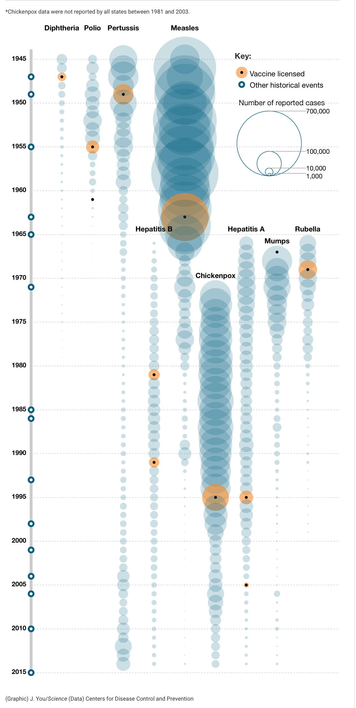

<div align="left">
  <h1>Do Science! Covid FAQ</h1>
    </center>
</div>

Zgoś poprawkę przez https://github.com/mmagnus/do-science-covid-faq/issues/new

Agregator wiedzy o pandemii.

https://github.com/mmagnus/do-science-covid-faq

Table of Contents
=================

* [Do Science\! Covid FAQ](#do-science-covid-faq)
* [Table of Contents](#table-of-contents)
  * [Dobre źródła](#dobre-%C5%BAr%C3%B3d%C5%82a)
  * [Inne zbiory Pytań i Odpowiedzi](#inne-zbiory-pyta%C5%84-i-odpowiedzi)
  * [Strony z które sprawdzają fejki](#strony-z-kt%C3%B3re-sprawdzaj%C4%85-fejki)
* [Postaci, które się udzielają, a robią postawowe błędy w wypowiedziach](#postaci-kt%C3%B3re-si%C4%99-udzielaj%C4%85-a-robi%C4%85-postawowe-b%C5%82%C4%99dy-w-wypowiedziach)
  * [prof\. Roman Zieliński](#prof-roman-zieli%C5%84ski)
* [Wyjątkowo dobre artykuły](#wyj%C4%85tkowo-dobre-artyku%C5%82y)
  * [Wyjątkowo dobre filmy](#wyj%C4%85tkowo-dobre-filmy)
* [Najnowsze](#najnowsze)
  * [Czy 23 osoby zmarły w Norwegii na skutek szczepienia na COVID\-19? Brak dowodów](#czy-23-osoby-zmar%C5%82y-w-norwegii-na-skutek-szczepienia-na-covid-19-brak-dowod%C3%B3w)
  * [Kilka procent umiera\! Ja nie umrę? FAŁSZ](#kilka-procent-umiera-ja-nie-umr%C4%99-fa%C5%82sz)
* [FAQ](#faq)
  * [Czy szczepionki mRNA to "terapie genowe?" NIE](#czy-szczepionki-mrna-to-terapie-genowe-nie)
  * [Czy mRNA ze szczepionki replikuje się w komórkach? NIE](#czy-mrna-ze-szczepionki-replikuje-si%C4%99-w-kom%C3%B3rkach-nie)
  * [Czy mRNA może być włączone do DNA?](#czy-mrna-mo%C5%BCe-by%C4%87-w%C5%82%C4%85czone-do-dna)
    * [Przez odwrotną transkryptazę? NIE](#przez-odwrotn%C4%85-transkryptaz%C4%99-nie)
    * [Przez retrotraspozony LINE? NIE](#przez-retrotraspozony-line-nie)
  * [Jak to możliwe, że tak szybko gotowa?](#jak-to-mo%C5%BCliwe-%C5%BCe-tak-szybko-gotowa)
  * [Czy lekarze nie chcą się szczepić?](#czy-lekarze-nie-chc%C4%85-si%C4%99-szczepi%C4%87)
  * [Szczepionki (mRNA) a płody?](#szczepionki-mrna-a-p%C5%82ody)
  * [O co chodzi z tymi płodami?](#o-co-chodzi-z-tymi-p%C5%82odami)
  * [Badania kliniczne Moderny trwają do?](#badania-kliniczne-moderny-trwaj%C4%85-do)
  * [Co zawiera sekwencja mRNA Pfizer/BioNTech?](#co-zawiera-sekwencja-mrna-pfizerbiontech)
  * [Na pierwszy ogień artykuły bardziej ogólne i tylko po polsku (ale potem też jest kilka polskich)\.](#na-pierwszy-ogie%C5%84-artyku%C5%82y-bardziej-og%C3%B3lne-i-tylko-po-polsku-ale-potem-te%C5%BC-jest-kilka-polskich)
  * [Co to właściwie jest ten wirus, jak jest zbudowany i jak nas atakuje?](#co-to-w%C5%82a%C5%9Bciwie-jest-ten-wirus-jak-jest-zbudowany-i-jak-nas-atakuje)
  * [O szczepionkach mRNA ogólnie, m\.in\. jak to się zaczęło i kiedy, jakie są możliwe drogi podania, z jakimi problemami dotyczącymi szczepionek mRNA nauka się zmagała/zmaga, jakie niewiadome pozostały (naukowe prace przeglądowe z różnych lat):](#o-szczepionkach-mrna-og%C3%B3lnie-min-jak-to-si%C4%99-zacz%C4%99%C5%82o-i-kiedy-jakie-s%C4%85-mo%C5%BCliwe-drogi-podania-z-jakimi-problemami-dotycz%C4%85cymi-szczepionek-mrna-nauka-si%C4%99-zmaga%C5%82azmaga-jakie-niewiadome-pozosta%C5%82y-naukowe-prace-przegl%C4%85dowe-z-r%C3%B3%C5%BCnych-lat)
  * [Czy szczepionki powstały “za szybko”? Czy przeszły wszystkie badania? Czy można im ufać?](#czy-szczepionki-powsta%C5%82y-za-szybko-czy-przesz%C5%82y-wszystkie-badania-czy-mo%C5%BCna-im-ufa%C4%87)
  * [Jak konkretnie działają szczepionki Pfizera/Moderny (oparte o mRNA)?](#jak-konkretnie-dzia%C5%82aj%C4%85-szczepionki-pfizeramoderny-oparte-o-mrna)
  * [A co w takiej szczepionce właściwie jest? Czy może ona zmienić ludzki genom?](#a-co-w-takiej-szczepionce-w%C5%82a%C5%9Bciwie-jest-czy-mo%C5%BCe-ona-zmieni%C4%87-ludzki-genom)
  * [Słyszałem/\-am, że szczepionki mogą powodować bezpłodność i zagrażać ciąży:](#s%C5%82ysza%C5%82em-am-%C5%BCe-szczepionki-mog%C4%85-powodowa%C4%87-bezp%C5%82odno%C5%9B%C4%87-i-zagra%C5%BCa%C4%87-ci%C4%85%C5%BCy)
  * [Jak to jest z tą odpornością na COVID? Na ile czasu właściwie szczepionka dostarczy nam odporności? Oraz jak to się ma do tego, że wirus ciągle mutuje?](#jak-to-jest-z-t%C4%85-odporno%C5%9Bci%C4%85-na-covid-na-ile-czasu-w%C5%82a%C5%9Bciwie-szczepionka-dostarczy-nam-odporno%C5%9Bci-oraz-jak-to-si%C4%99-ma-do-tego-%C5%BCe-wirus-ci%C4%85gle-mutuje)
  * [Brytyjski wariant wirusa, co o nim wiadomo i czy się go bać?](#brytyjski-wariant-wirusa-co-o-nim-wiadomo-i-czy-si%C4%99-go-ba%C4%87)
  * [Trochę o silnych, aczkolwiek bardzo rzadkich, reakcjach alergicznych na szczepionkę Pfizera i o generalnych zaleceniach/przeciwwskazaniach:](#troch%C4%99-o-silnych-aczkolwiek-bardzo-rzadkich-reakcjach-alergicznych-na-szczepionk%C4%99-pfizera-i-o-generalnych-zaleceniachprzeciwwskazaniach)
  * [Czy wszystkie szczepionki przeciwko COVID, które są w trakcie badań klinicznych, opierają się o tę samą technologię, czyli wykorzystują mRNA?](#czy-wszystkie-szczepionki-przeciwko-covid-kt%C3%B3re-s%C4%85-w-trakcie-bada%C5%84-klinicznych-opieraj%C4%85-si%C4%99-o-t%C4%99-sam%C4%85-technologi%C4%99-czyli-wykorzystuj%C4%85-mrna)
  * [Temat przerzucenia odpowiedzialności za potencjalne działania niepożądane z producentów na rząd\. O co w tym wszystkim chodzi?](#temat-przerzucenia-odpowiedzialno%C5%9Bci-za-potencjalne-dzia%C5%82ania-niepo%C5%BC%C4%85dane-z-producent%C3%B3w-na-rz%C4%85d-o-co-w-tym-wszystkim-chodzi)
    * [Kto ponosi odpowiedzialność za szczepienia? Opis problemu\.](#kto-ponosi-odpowiedzialno%C5%9B%C4%87-za-szczepienia-opis-problemu)
    * [Fundusz kompensacyjny?](#fundusz-kompensacyjny)
  * [Szczepionki więcej dobrego niż złego?](#szczepionki-wi%C4%99cej-dobrego-ni%C5%BC-z%C5%82ego)
  * [Poszczepienne problemy (historycznie)?](#poszczepienne-problemy-historycznie)
  * [Jaka jest skuteczność szczepionki na grypę sezonowa?](#jaka-jest-skuteczno%C5%9B%C4%87-szczepionki-na-gryp%C4%99-sezonowa)
  * [Historia szczepionek RNA?](#historia-szczepionek-rna)
  * [Dać ludziom chorować i nabędziemy odporności zbiorowej? NIE](#da%C4%87-ludziom-chorowa%C4%87-i-nab%C4%99dziemy-odporno%C5%9Bci-zbiorowej-nie)
  * [Jakie są różnice między szczepionkami Pfizer/BioNTech a ModeRNA?](#jakie-s%C4%85-r%C3%B3%C5%BCnice-mi%C4%99dzy-szczepionkami-pfizerbiontech-a-moderna)
  * [Jakie szczepionki są w badaniach?](#jakie-szczepionki-s%C4%85-w-badaniach)
    * [Johnson &amp; Johnson](#johnson--johnson)
    * [Jakies inne szczepinki są dopuszczone?](#jakies-inne-szczepinki-s%C4%85-dopuszczone)
* [Stanowiska](#stanowiska)
  * [Karmisz piersią? Możesz się szczepić?](#karmisz-piersi%C4%85-mo%C5%BCesz-si%C4%99-szczepi%C4%87)
  * [Stanowisko Komitetu Genetyki Człowieka i Patologii Molekularnej PAN, w sprawie rozpowszechnianych nieprawdziwych informacji o szczepionkach przeciw COVID\-19 oraz testach PCR wykrywających SARS\-CoV\-2](#stanowisko-komitetu-genetyki-cz%C5%82owieka-i-patologii-molekularnej-pan-w-sprawie-rozpowszechnianych-nieprawdziwych-informacji-o-szczepionkach-przeciw-covid-19-oraz-testach-pcr-wykrywaj%C4%85cych-sars-cov-2)
  * [Stanowisko to jest również podzielane przez <strong>Polskie Towarzystwo Immunologii Doświadczalnej i Klinicznej</strong>](#stanowisko-to-jest-r%C3%B3wnie%C5%BC-podzielane-przez-polskie-towarzystwo-immunologii-do%C5%9Bwiadczalnej-i-klinicznej)
* [\#mrnawpigułce](#mrnawpigu%C5%82ce)
  * [OSOBY ZMARŁY PO PRZYJĘCIU SZCZEPIONKI PRZECIWKO COVID 19 WLONCZ MYŚLNIE \!11\!\!\!\!](#osoby-zmar%C5%82y-po-przyj%C4%99ciu-szczepionki-przeciwko-covid-19-wloncz-my%C5%9Blnie-11)
  * [LUCYFERAZA RAZ\!](#lucyferaza-raz)
  * [PRZEPIS KULINARNY NA SZCZEPIONKĘ](#przepis-kulinarny-na-szczepionk%C4%99)
  * [CZY RNA WEJDZIE MI DO MÓZGU?](#czy-rna-wejdzie-mi-do-m%C3%B3zgu)
  * [KIEDYŚ TO BYŁY (SŁABE) TERAPIE GENOWE](#kiedy%C5%9B-to-by%C5%82y-s%C5%82abe-terapie-genowe)
  * [O KATAROCZŁOWIEKU GMO\!](#o-katarocz%C5%82owieku-gmo)
* [Posty](#posty)
  * [Wypowiedź  Prof\. dr hab\. Jana Lubińskiego Kierownika  Zakładu Genetyki i Patomorfologii Pomorskiego  Uniwersytetu  Medycznego na temat szczepionki przeciw chorobie COVID\-19\.](#wypowied%C5%BA--prof-dr-hab-jana-lubi%C5%84skiego-kierownika--zak%C5%82adu-genetyki-i-patomorfologii-pomorskiego--uniwersytetu--medycznego-na-temat-szczepionki-przeciw-chorobie-covid-19)
* [Fejki](#fejki)
  * [Podobno Amerykańska pielęgniarka zmarła po podaniu szczepionki Pfizera (spoiler alert: to fejk\!)](#podobno-ameryka%C5%84ska-piel%C4%99gniarka-zmar%C5%82a-po-podaniu-szczepionki-pfizera-spoiler-alert-to-fejk)
* [Posty nieprawdziwe różne](#posty-nieprawdziwe-r%C3%B3%C5%BCne)
  * [Pediatra \- Bogdan Szpyruk](#pediatra---bogdan-szpyruk)
* [Authors](#authors)

Created by [gh-md-toc](https://github.com/ekalinin/github-markdown-toc.go)

## Dobre źródła

- Polityka: https://www.polityka.pl/TygodnikPolityka/nauka/  
- OKO.press https://oko.press

Profile na Facebook:

- Crazy Nauka https://www.facebook.com/crazynauka  
- Tomasz Dzieciątkowski  https://www.facebook.com/Tomasz-Dzieciątkowski-Trust-me-Im-a-Virologist-105823707854944 
- Kacper Toczyłowski https://www.facebook.com/DrToczylowski/
- Prof. Krzysztof J. Filipiak https://www.facebook.com/profKrzysztofJFilipiak

## Inne zbiory Pytań i Odpowiedzi

- http://www.komgen.pan.pl/index.php?option=com_content&view=article&id=140:stanowisko-w-sprawie-rozpowszechnianych-nieprawdziwych-informacji-o-szczepionkach-przeciw-covid-19-oraz-testach-pcr-wykrywajacych-sars-cov-2-z-dnia-4-stycznia-2021-roku&catid=32&lang=pl-pl&Itemid=188
- https://www.gov.pl/web/szczepimysie/pytania-i-odpowiedzi

## Strony z które sprawdzają fejki

- https://fakenews.pl/
- https://sprawdzam.afp.com/list 
- https://demagog.org.pl/analizy_i_raporty/koronawirus-zestawienie-falszywych-informacji/ 
- http://konkret24.tvn24.pl

Po angielsku:

- https://www.reuters.com/article/uk-fact-check-mrna-vaccine-storage-temp-idUSKBN28E28D
- https://www.who.int/emergencies/diseases/novel-coronavirus-2019/advice-for-public/myth-busters 

Obowiązkowi film o prawdzie, fałszu, problemach poznawczych.

Na koniec – Krótki film o prawdzie i fałszu:

[https://youtu.be/T1vW8YDDCSc](https://l.facebook.com/l.php?u=https%3A%2F%2Fyoutu.be%2FT1vW8YDDCSc%3Ffbclid%3DIwAR2zu33Iwdh1I9XtlL86nsmlBdQ8UOjXteVJmP1JmjYd-dSzY2Ntu2hvqJw&h=AT0l8ZaYX4lrh9RYZ1RWs-JAGI0XIZwhc5wF8IqgEYovPUN2WnmsxuAqtgoYabKK0j_0yNGf1Av-FrO1Q7-NdIhFzNfj1dfZJ_ZyQ7UP5J9jIEYCX99ATvlob3hhFrvsslnl83w&__tn__=-UK-R&c[0]=AT0wx9o_9FoDMDQ4Fy2asE4d7NvK4xosd2kvodjwljnskgGsfTeTrk2nMEMKZ4lCzJ3-L0DFYq5kVuYH9FZQ2Nv7KNpyC6WW2Gb_Dakg-zofMBqBopHq4aNQIDel8KyGuK7AfFedLaeKDR4Ub5b-KsizcO2Fg89-5u1BpoSH86bI__s)

# Postaci, które się udzielają, a robią postawowe błędy w wypowiedziach
## prof. Roman Zieliński

**A z zagrożeń żadne wymienione przez Zielińskiego nie ma sensu. Uważajcie na wywiady z panem prof. Romanem Zielińskim (nie będę wklejać linków do głupot, dużo tego, różne media "wolnościowo/prawicowe" go jakoś polubiły), bo trochę wiedzy ma, ale też duże braki, więc powstaje z jego wywodów pseudomądra papka, która niestety jest pełna błędów typu: NIE, RNA nie wędruje sobie na widzimisię do jądra; RNA ze szczepionki NIE zostanie wiroidem (jak wiroidy roślinne), NIE białka S nie są homologiczne do syncytyn, telomeraza NIE może wbudować RNA szczepionkowego w genom, komórki ludzki nie mają odwrotnej transkryptazy, która mogłaby wbudować mRNA ze szczeponki do genomu.**

- to mRNA się nie replikuje! (więc cały ten fragment, góra tekstu, nie ma zupełnie sensu)
- mRNA nie włącza się do DNA (więc kolejny fragment nie ma zupełnie sensu, i jest zbudowany na argumencie, że kiedyś używana DNA w terapiach genowych i ono mogło się włączyć do DNA) - w komórkach ludzkich nie ma ŻADNEGO enzymu, który wziąć mRNA ze szczepionki i je przepisać na DNA a następnie włączyć to DNA do genomu człowieka.
- Telomeraza nie może sobie działać na byle jakim mRNA, więc nie zadziała na mRNA.

Zresztą jakby tak było, to sama infekcja Covidem powodowałaby, że jego RNA wchodziłby do naszych genów i je zmieniał, a o tym jakoś nikt nie mówi. Dlatego mRNA szczepionki miałby by się integrować w genom a RNA z wirusa już nie?

Długi opis problemu z wywiadem z prof. Zielińskim https://biokompost.wordpress.com/2020/12/23/nieuctwo-z-glupiej-gory/?fbclid=IwAR0AKAWou6hXMJqS10Za2xToZufeHXjR20EMYtRw8Kh349n_kbPQ88RiHas 

Tutaj też świetny artykuł

https://www.polityka.pl/tygodnikpolityka/nauka/2097213,1,eksperci-przeciw-antynauce-rozbrajamy-fake-newsy-o-szczepionce.read

Czy też tutaj:

https://github.com/mmagnus/do-science-covid-faq#stanowisko-komitetu-genetyki-człowieka-i-patologii-molekularnej-pan-w-sprawie-rozpowszechnianych-nieprawdziwych-informacji-o-szczepionkach-przeciw-covid-19-oraz-testach-pcr-wykrywających-sars-cov-2 

# Wyjątkowo dobre artykuły

Co dokładnie jest zapisane w sekwencji szczepionki Pfizera.

- https://berthub.eu/articles/posts/reverse-engineering-source-code-of-the-biontech-pfizer-vaccine/
- https://randomseed.pl/rna/reverse-engineering-kodu-zrodlowego-szczepionki-biontech-pfizer-covid-sars-cov-2/

How the Pfizer-BioNTech Vaccine Works 

- https://www.nytimes.com/interactive/2020/health/pfizer-biontech-covid-19-vaccine.html

## Wyjątkowo dobre filmy

Kasia tłumaczy jak jest, bardzo przystępnie o nowych szczepionkach RNA, dlaczego nie są takie nowe, jakie są skutki uboczne, dlaczego CEO Pfizera sprzedał swoje akcje wtedy kiedy sprzedał i dlaczego wszystko poszło tak szybko (co zaskoczyło wszystkich, w tym naukowców, np. dr Fauciego, a trochę w tym szczęścia, ogromu wiedzy i bardzo dużo płynącego $$$). Świetne! 

**11 pytań o szczepionki mRNA na COVID-19**
<iframe width="800" height="441" src="https://www.youtube.com/embed/XRW9E5Gq_Ew" frameborder="0" allowfullscreen></iframe>
<https://www.youtube.com/watch?v=XRW9E5Gq_Ew>

# Najnowsze
## Czy 23 osoby zmarły w Norwegii na skutek szczepienia na COVID-19? Brak dowodów

Tak, niestety to prawda. Jednak nie można bezpośrednio połączyć zgonów ze szczepieniem, gdyż w Norwegii umiera 400 bardzo starych i nieuleczalnie chorych dziennie, dlatego związek ze szczepieniem może być przypadkowy. Być może faktycznie reakcja na szczepionkę dla tak słabych i śmiertelnie chorych osób była za silna i te osoby zmarły przez wywołanie reakcji przez szczepionkę, ale to wymaga dokładnych badań. 

Lekarz powinien ocenić czy pacjenta klasyfikować do szczepienia, więc to on podejmuje decyzje, więc dlatego Norwegia zwraca na to uwagę, aby lekarze zwracali na to uwagę i czy reakcja na szczepionkę może być szkodliwa dla tej grupy osób.

> “It may be a coincidence, but we aren’t sure,” Steinar Madsen, medical director of the Norwegian Medicines Agency, told The BMJ. “There is no certain connection between these deaths and the vaccine.”

https://www.thejournal.ie/norway-vaccine-elderly-patients-5326967-Jan2021/
https://fakenews.pl/zdrowie/czy-23-osoby-zmarly-w-norwegii-po-przyjeciu-szczepionki-na-covid/

## Kilka procent umiera! Ja nie umrę? FAŁSZ
Niestety, pojawia się coraz więcej informacji, że bez objawowy covid to początek dużych problemów ze zdrowiem.
https://www.theguardian.com/society/2021/jan/18/almost-30-of-covid-patients-in-england-re-admitted-to-hospital-after-discharge-study?CMP=fb_gu&utm_medium=Social&utm_source=Facebook#Echobox=1611002851
# FAQ
## Czy szczepionki mRNA to "terapie genowe?" NIE

Szczepienia nie są terapią genową. Terapie genowe wprowadzają zmiany w genomie, natomiast w przypadku szczepionek mRNA (szczepionki firm Pfizer i Moderna) nie ma mowy o zmianach genetycznych, ponieważ nie ma fizycznie możliwości, żeby cząsteczka mRNA została przepisana na DNA (a więc prościej: aby doszło do kierowanej modyfikacji genetycznej).

## Czy mRNA ze szczepionki replikuje się w komórkach? NIE

mRNA się nie replikuje w komórkach.

-------------------------------------------------------------------------------

W literaturze znana jest technologia pozwalająca RNA się replikować, aby podawać mniejsze dawki i obniżyć reakcje niepożądane, ale nie jest ona stosowana w szczepionkach Pfizer/BioNTech ani Moderna.

https://www.nature.com/articles/d41586-021-00019-w

## Czy mRNA może być włączone do DNA?

mRNA nie włącza się do DNA (więc kolejny fragment nie ma zupełnie sensu, i jest zbudowany na argumencie, że kiedyś używana DNA w terapiach genowych i ono mogło się włączyć do DNA) - w komórkach ludzkich nie ma ŻADNEGO enzymu, który wziąć mRNA ze szczepionki i je przepisać na DNA a następnie włączyć to DNA do genomu człowieka.

Telomeraza nie może sobie działać na byle jakim mRNA, więc nie zadziała na mRNA.

Zresztą jakby tak było, to sama infekcja Covidem powodowałaby, że jego RNA wchodziłby do naszych genów i je zmieniał, a o tym jakoś nikt nie mówi. Dlatego mRNA szczepionki miałby by się integrować w genom a RNA z wirusa już nie?

### Przez odwrotną transkryptazę? NIE

Odwrotną transkryptazy nie ma w komórkach ludzkich. Więc, nie, nie jest to możliwe.

Patrz też: Zresztą jakby tak było, to sama infekcja Covidem powodowałaby, że jego RNA wchodziłby do naszych genów i je zmieniał, a o tym jakoś nikt nie mówi. Dlatego mRNA szczepionki miałby by się integrować w genom a RNA z wirusa już nie?

### Przez retrotraspozony LINE? NIE

mRNA przetranskrybowane z retrotranspozonów LINE może się wiązać ze swoimi białkami ORF1 i ORF2 w cytoplazmie, tworząc tzw. kompleks rybonukleoproteinowy, który jest następnie transportowany z powrotem do jądra komórki. Tam ORF2 zaczyna odgrywać rolę endonukleazy ("otwierającej" łańcuch DNA w celu wklejenia do niego nowej kopii LINE) oraz odwrotnej transkryptazy (przepisującej mRNA z powrotem na DNA).

*Gdyby* te białka mogły się wiązać z dowolnym RNA, to mogłyby zabierać na gapę także mRNA że szczepionki. Tak się jednak nie dzieje. Odwrotną transkryptazę samolubnych transpozonów interesuje tylko transpozonowe RNA.

Tak czy siak nie ma mowy, żeby rewertaza transpozonu albo zabłąkanego retrowirusa w rodzaju HIV uprowadziła szczepionkowe mRNA. To są enzymy specyficzne, rozpoznające "swoją" sekwencję. Używanie uniwersalnego enzymu odwrotnej transkrypcji byłoby sprzeczne z egoistycznym interesem wirusa.

źródło: grupa pro-naukowa na fb

## Jak to możliwe, że tak szybko gotowa? 
Macie wątpliwości co do szczepionki na koronawirusa, że została za szybko wyprodukowana i nic o niej nie wiemy? Ten artykuł wiele tłumaczy:

[https://www.nature.com/articles/d41586-020-03626-1](https://www.nature.com/articles/d41586-020-03626-1?fbclid=IwAR2hYoIPIFgJNL11JxuBKGmkVTP1-TLURhkV2Fs1DCC8-R9TL9i9aWTV-Xk)

Dla nieczytających po angielsku, w skrócie:

Badania mogły przebiegać szybciej ponieważ:

- od kilkunastu lat trwały badania nad wirusami SARS i MERS, innymi koronawirusami bardzo podobnymi do wirusa SARS-CoV-2

- na badania przekazano bardzo dużo pieniędzy (rzecz niespotykana w nauce), dlatego równolegle można było prowadzić wiele różnych badań

- wszystkim zależało na tym, żeby się udało, dlatego wyjątkowo nie było problemów z biurokracją

Dodatkowo, nieprawdą jest że nie wiemy nic o tych szczepionkach ani że nie znamy mechanizmu ich działania. Oczywiście, zawsze można się dowiedzieć więcej (dlatego warto wspierać rozwój nauki, ale naukowcy pracują nad szczepionkami typu mRNA już od kilku lat.

https://www.nature.com/articles/s41586-020-2798-3

<https://www.polityka.pl/tygodnikpolityka/nauka/1981764,1,ekspresowe-szczepionki-na-covid-jak-powstaly-i-czy-sa-bezpieczne.read>

https://www.crazynauka.pl/dlaczego-szczepionka-przeciw-covid-19-powstala-tak-szybko/

## Czy lekarze nie chcą się szczepić?

Jakbyście gdzieś widzieli argument "lekarze sie nie chcą szczepić" to można wrzucać to badanie PR

- https://m.facebook.com/story.php?story_fbid=2547785862180512&id=1530157060610069
- https://www.facebook.com/DrToczylowski/photos/a.141619736441869/781732925763877

## Szczepionki (mRNA) a płody?

W procesie produkcji szczepionek mRNA nie wykorzystuje się linii komórkowych, nie ma mowy, o żadnych komórkach z płodów.

## O co chodzi z tymi płodami?

> Podsumowanie Wykorzystywane aktualnie linie ludzkich komórek zarodkowych są specjalnie przebadane i posiadają odpowiednie certyfikaty bezpieczeństwa. Są bardzo dobrze scharakteryzowane i od dziesięcioleci skutecznie stosowane w produkcji dopuszczonych do obrotu leków dla ludzi. Żadna z dostępnych na rynku szczepionek wirusowych, a także żadna z opracowywanych szczepionek przeciwko COVID-19 nie zawiera materiału pochodzącego od człowieka. Wirusy wykorzystywane w szczepionkach są hodowane w warunkach laboratoryjnych w specjalnych liniach komórek, które wyjściowo w latach 60.–70. XX wieku wyprowadzono z materiału pochodzącego z ludzkich komórek zarodkowych pobranego w wyniku zabiegu sztucznego poronienia. Aborcje przeprowadzono z przyczyn pozamedycznych, po wyroku sądu. Żadnej z tych aborcji nie wykonano w celu pobrania komórek zarodka do otrzymania linii komórkowych. Te same linie komórek uzyskane z komórek zarodka w przeszłości są przechowywane i namnażane do dziś, a dzięki nim powstały nie tylko wspomniane szczepionki, ale również wiele innych, zaawansowanych leków.

https://www.mp.pl/szczepienia/specjalne/250300,linie-komorkowe-hek-293-i-perc6


## Badania kliniczne Moderny trwają do?

FDA do 2022 https://www.fda.gov/media/144637/download 

## Co zawiera sekwencja mRNA Pfizer/BioNTech?

- https://berthub.eu/articles/posts/reverse-engineering-source-code-of-the-biontech-pfizer-vaccine/
- https://randomseed.pl/rna/reverse-engineering-kodu-zrodlowego-szczepionki-biontech-pfizer-covid-sars-cov-2/

## Na pierwszy ogień artykuły bardziej ogólne i tylko po polsku (ale potem też jest kilka polskich).

Czyli po trochu o wszystkim co związane ze szczepionką przeciwko COVID-19 (i samym wirusem):

Skarbnica i kompendium wiedzy o szczepionkach generalnie, ale i konkretnie o tych “przeciwcovidowych” oraz o ich przyspieszonym procesie badań klinicznych. Jedno z moich ulubionych podsumowań, bo pisane bardziej naukowo niż popularno-naukowo, ale nadal przystępnie. Pod linkiem do pobrania Biała Księga “Szczepienia przeciw COVID-19. Innowacyjne – technologie i efektywność”: [https://naukaprzeciwpandemii.pl/...](https://naukaprzeciwpandemii.pl/?fbclid=IwAR1D3lDe1P96NYagTMzThRsLu6pIHCh6oP8Ac-LfbbhTwXApBXLvsEFbRow#biala-ksiega) 

Co trzeba wiedzieć o szczepionkach przeciw COVID-19? Ekspert ECDC odpowiada na pytania (by [Crazy nauka](https://www.facebook.com/crazynauka/?__cft__[0]=AZWQRq5TNdjT7Yy4rkoJNbtlegph4oICTdGK6OA-cKkr4jXV4JIZUCe-pIoHKKcmIpPXdQLRYNz471jD_Chp18VTvTceWytueMqaQK7lfXZjnWeWrGGfvpDlEH9o8NzQnIt89hYuYq5waBrXx9iDgoAc&__tn__=kK-R)): [https://www.crazynauka.pl/co-trzeba-wiedziec-o.../](https://www.crazynauka.pl/co-trzeba-wiedziec-o-szczepionkach-przeciw-covid-19-ekspert-ecdc-odpowiada-na-pytania/?fbclid=IwAR0jOMSHCIoWonrxtjTSNMBw7akiMDIXC_MD51ul5rnMXLvj0aUvkYAuXIQ)

Obalamy fake newsy na temat szczepionki (by dr hab. n.med. Piotr Rzymski): [https://www.polityka.pl/.../1994006,1,obalamy-fake-newsy...](https://www.polityka.pl/tygodnikpolityka/nauka/1994006,1,obalamy-fake-newsy-nt-szczepionki-na-koronawirusa.read?fbclid=IwAR0CoBHd_9Y9sF4hFxMbHRZc5nxjKI5u4DX6FJ5BBfyzpiEQXyj-87xaIOc)

Wywiad z prof. Pyrciem, wirusologiem i biotechnologiem (by Fundacja Szczepienia - Rozwiewamy Wątpliwości): [https://fb.watch/2ASy0QvH8S/](https://l.facebook.com/l.php?u=https%3A%2F%2Ffb.watch%2F2ASy0QvH8S%2F%3Ffbclid%3DIwAR1QXxIXqk1NL1ytbYILWpIaLXnV50jSkVZRsbxxpwlp-vbOBVA9W3zxj20&h=AT2-EZ_avBcjzCaHU2nlogs7KNBAfR3nxQbnTq9W3OTfdWAbfek3O5QIuBjUdEed-NUvxlPgriVFXBDYFfmVx4B3zieqLnh2KDQsdBw3Hg1r145PO7K9Q4Mr7WDzOEGgnnMNWaw&__tn__=-UK-R&c[0]=AT0wx9o_9FoDMDQ4Fy2asE4d7NvK4xosd2kvodjwljnskgGsfTeTrk2nMEMKZ4lCzJ3-L0DFYq5kVuYH9FZQ2Nv7KNpyC6WW2Gb_Dakg-zofMBqBopHq4aNQIDel8KyGuK7AfFedLaeKDR4Ub5b-KsizcO2Fg89-5u1BpoSH86bI__s) 

Jak działa szczepionka mRNA, dlaczego małpi adenowirus jest bezpieczny oraz o poszukiwaniu leków na COVID-19, mówi dr hab. n. med. Tomasz Dzieciątkowski, mikrobiolog, wirusolog z Warszawskiego Uniwersytetu Medycznego [https://www.mp.pl/.../wyw.../253757,klucz-do-koronawirusa...](https://l.facebook.com/l.php?u=https%3A%2F%2Fwww.mp.pl%2Fpacjent%2Fchoroby-zakazne%2Fwywiady%2F253757%2Cklucz-do-koronawirusa%3Ffbclid%3DIwAR3oa58QxlZrvAEHCrmZNSqunUReSe5R6W_9DGIlOIUkwweBsDFkH4zKJnE&h=AT0b3PgJ4TeS1v75pNZ6YNZkD8GeQlqa8eFlXI_aPPdBcYeg_cSai6Ys4_MK_ifb_DRA_duKuSXmOB6NgDpcLbdZ6iQ6k0LUCar9PURgDBDbzgpDGhdDICNu3EX5vQ4_6yTNN_4&__tn__=-UK-R&c[0]=AT0wx9o_9FoDMDQ4Fy2asE4d7NvK4xosd2kvodjwljnskgGsfTeTrk2nMEMKZ4lCzJ3-L0DFYq5kVuYH9FZQ2Nv7KNpyC6WW2Gb_Dakg-zofMBqBopHq4aNQIDel8KyGuK7AfFedLaeKDR4Ub5b-KsizcO2Fg89-5u1BpoSH86bI__s) 

O bezpieczeństwie szczepionek, wywiad z wirusologiem, pracownikiem Katedry i Zakładu Mikrobiologii Lekarskiej Warszawskiego Uniwersytetu Medycznego, dr. hab. n.med. Maciejem Przybylskim: [https://www.medonet.pl/.../to-musisz-wiedziec,genetyczne...](https://l.facebook.com/l.php?u=https%3A%2F%2Fwww.medonet.pl%2Fkoronawirus%2Fto-musisz-wiedziec%2Cgenetyczne-szczepionki-na-covid-19--co-o-nich-wiemy-%2Cartykul%2C74573173.html%3Futm_source%3Dl.facebook.com_viasg_medonet%26utm_medium%3Dreferal%26utm_campaign%3Dleo_automatic%26srcc%3Ducs%26fbclid%3DIwAR0vQS7Gt-1O4veGUbZhggQqMoXktZLlF1ZnbNIbJFJzCqqaZ1exvOOR7Bk&h=AT0wbv3HQ1kR5tmCdtPaJ6BqEy_Cjlq7ANqQOO8R2RqBdiDP7nUsvk6ESpIIkau7PMnLxAB7d3U-9ff7PuiMsVKJAICvvPh61yHM21G2CoTaumJ3jBhI9cBa-v8QSKRL6V-Ylz4&__tn__=-UK-R&c[0]=AT0wx9o_9FoDMDQ4Fy2asE4d7NvK4xosd2kvodjwljnskgGsfTeTrk2nMEMKZ4lCzJ3-L0DFYq5kVuYH9FZQ2Nv7KNpyC6WW2Gb_Dakg-zofMBqBopHq4aNQIDel8KyGuK7AfFedLaeKDR4Ub5b-KsizcO2Fg89-5u1BpoSH86bI__s)  

Opracowanie Polskiej Akademii Nauk, “Zrozumieć COVID”: [https://informacje.pan.pl/.../ZrozumiecCovid19...](https://informacje.pan.pl/images/2020/opracowanie-covid19-14-09-2020/ZrozumiecCovid19_opracowanie_PAN.pdf?fbclid=IwAR2DEcAJAtu6PhJdqFceOFfRs0i9uQWokklSzn1Bkp7fOCyfxeeChikgTec) 

Eksperci przeciw antynauce. Rozbrajamy fake newsy o szczepionce [https://www.polityka.pl/.../2097213,1,eksperci-przeciw...](https://l.facebook.com/l.php?u=https%3A%2F%2Fwww.polityka.pl%2Ftygodnikpolityka%2Fnauka%2F2097213%2C1%2Ceksperci-przeciw-antynauce-rozbrajamy-fake-newsy-o-szczepionce.read%3Ffbclid%3DIwAR0P7kDuKybNy0o2xPZdMf8exCCwm-J_55nLO-FtP6WYwful1rmpGjV2P0k&h=AT3PXpRENJiCPtfKWUpO5-RS-fPY0BdyaY7Q7NbXqxuWeyOABGIfAmo3boD5DQUBcXj-_6ukTFIYMyRJJBFPXdASJ-pJHCkSgALqCUTl2O0yMdfV0u9tE7YWgkhQhoEm3syT62E&__tn__=-UK-R&c[0]=AT0wx9o_9FoDMDQ4Fy2asE4d7NvK4xosd2kvodjwljnskgGsfTeTrk2nMEMKZ4lCzJ3-L0DFYq5kVuYH9FZQ2Nv7KNpyC6WW2Gb_Dakg-zofMBqBopHq4aNQIDel8KyGuK7AfFedLaeKDR4Ub5b-KsizcO2Fg89-5u1BpoSH86bI__s) 

## Co to właściwie jest ten wirus, jak jest zbudowany i jak nas atakuje?

Coronavirus biology and replication: implications for SARS-CoV-2 [https://www.nature.com/articles/s41579-020-00468-6](https://l.facebook.com/l.php?u=https%3A%2F%2Fwww.nature.com%2Farticles%2Fs41579-020-00468-6%3Ffbclid%3DIwAR0jOMSHCIoWonrxtjTSNMBw7akiMDIXC_MD51ul5rnMXLvj0aUvkYAuXIQ&h=AT0mxBdiAnrxianuIBuh8ATVzTAggXqqHqQEJGL_d9s7csqIPsQHQIICE1dGpH-rJZAr-s-KbF5-aKte3N2OYbY3Pgrw30Knku0sIiXS5QtTsFSHpjPk1xrrDFa2iujP2XwbnQA&__tn__=-UK-R&c[0]=AT0wx9o_9FoDMDQ4Fy2asE4d7NvK4xosd2kvodjwljnskgGsfTeTrk2nMEMKZ4lCzJ3-L0DFYq5kVuYH9FZQ2Nv7KNpyC6WW2Gb_Dakg-zofMBqBopHq4aNQIDel8KyGuK7AfFedLaeKDR4Ub5b-KsizcO2Fg89-5u1BpoSH86bI__s) 

Characteristics of SARS-CoV-2 and COVID-19 [https://www.nature.com/articles/s41579-020-00459-7](https://l.facebook.com/l.php?u=https%3A%2F%2Fwww.nature.com%2Farticles%2Fs41579-020-00459-7%3Ffbclid%3DIwAR2cz8mds9WUpNUID25poDaCdNVAH6UvEQRNRp4vKUy2DYZ0XjIu_bNnuSM&h=AT3C_LsG9gPwVtY5MVTP0N8Wse-kG0Vsk68TgQw9ELaUlKFoZYVKCQb3I3RE6dqhMlHMsrOo_OnPtemRKRde4EqLhgYA5j-fhJzMKo1rv-1eMl49ZwweKoKpu7r7Pv-pY-RWA58&__tn__=-UK-R&c[0]=AT0wx9o_9FoDMDQ4Fy2asE4d7NvK4xosd2kvodjwljnskgGsfTeTrk2nMEMKZ4lCzJ3-L0DFYq5kVuYH9FZQ2Nv7KNpyC6WW2Gb_Dakg-zofMBqBopHq4aNQIDel8KyGuK7AfFedLaeKDR4Ub5b-KsizcO2Fg89-5u1BpoSH86bI__s) 

O genomie SARS-Cov-2 i kodowanych w nim białkach, Bad News Wrapped in Protein: Inside the Coronavirus Genome (genialny New York Times!) [https://www.nytimes.com/.../coronavirus-genome-bad-news...](https://l.facebook.com/l.php?u=https%3A%2F%2Fwww.nytimes.com%2Finteractive%2F2020%2F04%2F03%2Fscience%2Fcoronavirus-genome-bad-news-wrapped-in-protein.html%3Ffbclid%3DIwAR2f6dftjhEjueUPmM13jzUW4-RYCuFbcjXVI1xJae8deYDFuCLwyYXBQds&h=AT136BeYbzj2nck5eIDd8r3nx7TDiEYv7AMFFMeAfCAofpY5cJcsxDDYLdydNJRwbiOpqhwPHtTqwvaMtwRsjWzzEbrh7Idm8TTd_PFjMdZDYAIJARRsdKJIjKWjIG6u_sp00EU&__tn__=-UK-R&c[0]=AT0wx9o_9FoDMDQ4Fy2asE4d7NvK4xosd2kvodjwljnskgGsfTeTrk2nMEMKZ4lCzJ3-L0DFYq5kVuYH9FZQ2Nv7KNpyC6WW2Gb_Dakg-zofMBqBopHq4aNQIDel8KyGuK7AfFedLaeKDR4Ub5b-KsizcO2Fg89-5u1BpoSH86bI__s) 

O mutacjach wirusa i geograficznym rozprzestrzenianiu się epidemii, How Coronavirus Mutates and Spreads (genialny New York Times! [2]) [https://www.nytimes.com/.../coronavirus-mutations.html...](https://l.facebook.com/l.php?u=https%3A%2F%2Fwww.nytimes.com%2Finteractive%2F2020%2F04%2F30%2Fscience%2Fcoronavirus-mutations.html%3Ffbclid%3DIwAR3P-9TdA0OnwD96c_QhuS8eFdSTl_M5AY-64yqV4UgMAlQd7ZlPs4Utaf8&h=AT1V0bL_ul1p1tF70VkQ_hTQ3iys86CghkVjQYcP5yilsICmD9p-ezOLs2eaMBw6k6_psSnWYNA0aWHgAokWMcBERrKxJryHjxf77OIaN21J6Q6Aerd1PkKR8LhaM4nClT5T6U8&__tn__=-UK-R&c[0]=AT0wx9o_9FoDMDQ4Fy2asE4d7NvK4xosd2kvodjwljnskgGsfTeTrk2nMEMKZ4lCzJ3-L0DFYq5kVuYH9FZQ2Nv7KNpyC6WW2Gb_Dakg-zofMBqBopHq4aNQIDel8KyGuK7AfFedLaeKDR4Ub5b-KsizcO2Fg89-5u1BpoSH86bI__s) 

O budowie i organizacji struktury otoczki wirusa SARS-Cov-2, The Coronavirus Unveiled (genialny New York Times! [3]) [https://www.nytimes.com/.../coronavirus-unveiled.html...](https://www.nytimes.com/interactive/2020/health/coronavirus-unveiled.html?fbclid=IwAR1pjf3k50wTmWOXrrumjh0t_IHeIWsgpUDsVkfvluB_3X1DUqGlKbS0-eA) 

Mechanisms of SARS-CoV-2 Transmission and Pathogenesis [https://www.cell.com/action/showPdf...](https://www.cell.com/action/showPdf?pii=S1471-4906(20)30233-7&fbclid=IwAR0P7kDuKybNy0o2xPZdMf8exCCwm-J_55nLO-FtP6WYwful1rmpGjV2P0k) 

## O szczepionkach mRNA ogólnie, m.in. jak to się zaczęło i kiedy, jakie są możliwe drogi podania, z jakimi problemami dotyczącymi szczepionek mRNA nauka się zmagała/zmaga, jakie niewiadome pozostały (naukowe prace przeglądowe z różnych lat):

Developing mRNA-vaccine technologies, 2012: [https://www.ncbi.nlm.nih.gov/.../PMC35.../pdf/rna-9-1319.pdf](https://l.facebook.com/l.php?u=https%3A%2F%2Fwww.ncbi.nlm.nih.gov%2Fpmc%2Farticles%2FPMC3597572%2Fpdf%2Frna-9-1319.pdf%3Ffbclid%3DIwAR1-3CyGMbvdVbRoZc0nrbxCQPG2zlQRly9JE4eQMQfxwurPfjk0o0Nx_Eg&h=AT203e_pbO-lyM5Vwb9NS_s74SFDitGFlEE4vWwaAfOcw-05kWyTIAjbk1L5rM6ILRAeMN0ov_mEyDjtZt6CU3-3Winpsinyo6FJrcFQA0OYltJFBeT_WkKQdNj6DTLG__Y54b8&__tn__=-UK-R&c[0]=AT0wx9o_9FoDMDQ4Fy2asE4d7NvK4xosd2kvodjwljnskgGsfTeTrk2nMEMKZ4lCzJ3-L0DFYq5kVuYH9FZQ2Nv7KNpyC6WW2Gb_Dakg-zofMBqBopHq4aNQIDel8KyGuK7AfFedLaeKDR4Ub5b-KsizcO2Fg89-5u1BpoSH86bI__s) 

mRNA vaccines — a new era in vaccinology, 2018: [https://www.nature.com/articles/nrd.2017.243...](https://l.facebook.com/l.php?u=https%3A%2F%2Fwww.nature.com%2Farticles%2Fnrd.2017.243%3Ffbclid%3DIwAR2C1qJSzAGu48rqMZ41czX47bUTSpb-hEJg-z3Yk_Sk9eVqk_pBIhg4ZtY&h=AT3pwI6BjwFEA7RIpws_RGtxKFATifPQT8szVo3zecwj6IQbJ0cbAqHyckGUGOJYpuViTaKZLNdqH5CNxH0mlX-Z-bFMzvIiBnowGshy3W8f9pnbB-YxOF8C__lLEtg13JZMCGM&__tn__=-UK-R&c[0]=AT0wx9o_9FoDMDQ4Fy2asE4d7NvK4xosd2kvodjwljnskgGsfTeTrk2nMEMKZ4lCzJ3-L0DFYq5kVuYH9FZQ2Nv7KNpyC6WW2Gb_Dakg-zofMBqBopHq4aNQIDel8KyGuK7AfFedLaeKDR4Ub5b-KsizcO2Fg89-5u1BpoSH86bI__s) 

Delivering the Messenger: Advances in Technologies for Therapeutic mRNA Delivery, 2019: [https://www.ncbi.nlm.nih.gov/.../PMC6453548/pdf/main.pdf](https://l.facebook.com/l.php?u=https%3A%2F%2Fwww.ncbi.nlm.nih.gov%2Fpmc%2Farticles%2FPMC6453548%2Fpdf%2Fmain.pdf%3Ffbclid%3DIwAR2GaUCCgNlU2OeIVYiXgQdVOt_GQERUnGY83XZ4RurCgMYX6Tlb8NECQF8&h=AT2ida8iSjkf_R2K5Iqu-QowMmdxfCxDtWYsuSBLPuoTzKIzC5suw70gD9cqO66vKtaVdpTajz3CHbYoqsE5OVdvrYF5AMDhnYCJDgvBw5TUfEZQ0JbYl8pxUetxD4JC_cYOj-0&__tn__=-UK-R&c[0]=AT0wx9o_9FoDMDQ4Fy2asE4d7NvK4xosd2kvodjwljnskgGsfTeTrk2nMEMKZ4lCzJ3-L0DFYq5kVuYH9FZQ2Nv7KNpyC6WW2Gb_Dakg-zofMBqBopHq4aNQIDel8KyGuK7AfFedLaeKDR4Ub5b-KsizcO2Fg89-5u1BpoSH86bI__s) 

mRNA-based therapeutics — developing a new class of drugs, 2014:  [https://www.nature.com/articles/nrd4278...](https://www.nature.com/articles/nrd4278?cacheBust=1508171532658&fbclid=IwAR1-3CyGMbvdVbRoZc0nrbxCQPG2zlQRly9JE4eQMQfxwurPfjk0o0Nx_Eg)

## Czy szczepionki powstały “za szybko”? Czy przeszły wszystkie badania? Czy można im ufać?

Dlaczego szczepionka przeciw COVID-19 powstałą tak szybko? (by Crazy nauka): [https://www.crazynauka.pl/dlaczego-szczepionka-przeciw.../](https://l.facebook.com/l.php?u=https%3A%2F%2Fwww.crazynauka.pl%2Fdlaczego-szczepionka-przeciw-covid-19-powstala-tak-szybko%2F%3Ffbclid%3DIwAR3-o2ArOhh9qOJQrhtWl1kNdEaY6cXhPq48Jxg86BVxkP0UbQOJm9eBBn0&h=AT3689ccY2HhJG1-OxNtr6ybp6Ms_mwu13qf045AtNjZpNZB8T4A4o2ezw4OIN5ApX_QlYb631eNsdeVZKt04weQaUnGGqbmCuB1abuQEnOchRBVWb3rlXeb-esd48_Sh8BIJZU&__tn__=-UK-R&c[0]=AT0wx9o_9FoDMDQ4Fy2asE4d7NvK4xosd2kvodjwljnskgGsfTeTrk2nMEMKZ4lCzJ3-L0DFYq5kVuYH9FZQ2Nv7KNpyC6WW2Gb_Dakg-zofMBqBopHq4aNQIDel8KyGuK7AfFedLaeKDR4Ub5b-KsizcO2Fg89-5u1BpoSH86bI__s) 

Ekspresowe szczepionki na covid. Jak powstały i czy są bezpieczne? (by dr hab. n.med. Piotr Rzymski): [https://www.polityka.pl/.../1981764,1,ekspresowe...](https://l.facebook.com/l.php?u=https%3A%2F%2Fwww.polityka.pl%2Ftygodnikpolityka%2Fnauka%2F1981764%2C1%2Cekspresowe-szczepionki-na-covid-jak-powstaly-i-czy-sa-bezpieczne.read%3Ffbclid%3DIwAR3-o2ArOhh9qOJQrhtWl1kNdEaY6cXhPq48Jxg86BVxkP0UbQOJm9eBBn0&h=AT1w49gUOsYzURVRtVecrB7VhokW2KxziLyXCzVQdaVHFo-4JoQlMAoxypuF3LFF__jOw4BW4MR-JAJ2y822OEZ7cDVsrfHRWT-ssik4bw-3I93tjk_dyuSnw3vl0KGJrZ_a7Jg&__tn__=-UK-R&c[0]=AT0wx9o_9FoDMDQ4Fy2asE4d7NvK4xosd2kvodjwljnskgGsfTeTrk2nMEMKZ4lCzJ3-L0DFYq5kVuYH9FZQ2Nv7KNpyC6WW2Gb_Dakg-zofMBqBopHq4aNQIDel8KyGuK7AfFedLaeKDR4Ub5b-KsizcO2Fg89-5u1BpoSH86bI__s) 

O tradycyjnym i przyspieszonym procesie przeprowadzania badań klinicznych oraz o rodzajach powstających szczepionek: SARS-CoV-2 vaccines in development [https://www.nature.com/articles/s41586-020-2798-3...](https://l.facebook.com/l.php?u=https%3A%2F%2Fwww.nature.com%2Farticles%2Fs41586-020-2798-3%3Ffbclid%3DIwAR3oQtyPKWJSo3XMUVpXOMfCFIsOg0qCUTt7YRrTaSolv--AHIeKtorbLD8&h=AT1Z96roL71XDssCLNYbuWqmgUMkyrq-adwvH_pDaSSuKlAJlypNPwGPANzs7-k73WCPKrysfp6AlPhMPNh2Sg-zxJUL41kxvZEFJ8OCzPlzDRUPUJSqIxkC_inil-2kIGAIGIU&__tn__=-UK-R&c[0]=AT0wx9o_9FoDMDQ4Fy2asE4d7NvK4xosd2kvodjwljnskgGsfTeTrk2nMEMKZ4lCzJ3-L0DFYq5kVuYH9FZQ2Nv7KNpyC6WW2Gb_Dakg-zofMBqBopHq4aNQIDel8KyGuK7AfFedLaeKDR4Ub5b-KsizcO2Fg89-5u1BpoSH86bI__s) 

O wieloletnich badaniach nad technologią szczepionek RNA, które umożliwiły tak szybkie wytworzenie szczepionki przeciwko COVID oraz o pozostałych elementach, które wpłynęły na to zawrotne i niespotykane do tej pory tempo: “The lightning-fast quest for COVID vaccines — and what it means for other diseases” [https://www.nature.com/articles/d41586-020-03626-1...](https://l.facebook.com/l.php?u=https%3A%2F%2Fwww.nature.com%2Farticles%2Fd41586-020-03626-1%3Ffbclid%3DIwAR0QBCBYaxdioo33xxPunQE-33Pi8LlQ7B5F06DIg63X3avsbGjjfLOltZE&h=AT0r5A260BbGlerZQ88lb5qcUeC8Ivss_cIURbgJ44MrqInK2Fc1ZCKj66gLN_F5KuWK8075oiRWJR_YdD5mtXgVzImkwcEWsCIaXhkCAMgkPKl5zXGjrwQzujuiKOb3KMrLa7Y&__tn__=-UK-R&c[0]=AT0wx9o_9FoDMDQ4Fy2asE4d7NvK4xosd2kvodjwljnskgGsfTeTrk2nMEMKZ4lCzJ3-L0DFYq5kVuYH9FZQ2Nv7KNpyC6WW2Gb_Dakg-zofMBqBopHq4aNQIDel8KyGuK7AfFedLaeKDR4Ub5b-KsizcO2Fg89-5u1BpoSH86bI__s)

Strona przygotowana przez Europejską Agencję Leków (EMA) tłumacząca cały proces akceptacji szczepionki (dużo dobrych grafik), COVID-19 vaccines: development, evaluation, approval and monitoring [https://www.ema.europa.eu/.../covid-19-vaccines...](https://www.ema.europa.eu/en/human-regulatory/overview/public-health-threats/coronavirus-disease-covid-19/treatments-vaccines/covid-19-vaccines-development-evaluation-approval-monitoring?fbclid=IwAR3EFZAxj8mJ4LVuHl6yb_q0TmT95uRF887rTYN_167TOGFs_mkhUhU1dWA)

Dla super ciekawskich: FDA Briefing Document, czyli co przeanalizowała Amerykańska FDA i na jakiej podstawie dopuścila szczepionkę Pfizera do użycia [https://www.fda.gov/media/144245/download](https://l.facebook.com/l.php?u=https%3A%2F%2Fwww.fda.gov%2Fmedia%2F144245%2Fdownload%3Ffbclid%3DIwAR3fwLi1uGpI1mRnoWbBrpGdeJoUkK6JeiklN4IEutKt6N6bHF8FdHJEjEo&h=AT0pU32DXX471QoCjbJrzBY1HnK7UUjbSpJTRkgJyuMcg29dCAih9BNrC0XEX_cwUOSBysQaxEcJEj7fSuMmyo0uX66OkdvfZ0mFoZc0v11UBHaYNYlD04ULGd_VnvI5f2fCzs0&__tn__=-UK-R&c[0]=AT0wx9o_9FoDMDQ4Fy2asE4d7NvK4xosd2kvodjwljnskgGsfTeTrk2nMEMKZ4lCzJ3-L0DFYq5kVuYH9FZQ2Nv7KNpyC6WW2Gb_Dakg-zofMBqBopHq4aNQIDel8KyGuK7AfFedLaeKDR4Ub5b-KsizcO2Fg89-5u1BpoSH86bI__s) 

## Jak konkretnie działają szczepionki Pfizera/Moderny (oparte o mRNA)?

Świetny post o tym co robi nasz układ odpornościowy w odpowiedzi na szczepionkę mRNA (czyli jak powstaje odporność): [https://www.facebook.com/wojti.glac/posts/2762475584005592](https://www.facebook.com/wojti.glac/posts/2762475584005592?__cft__[0]=AZWQRq5TNdjT7Yy4rkoJNbtlegph4oICTdGK6OA-cKkr4jXV4JIZUCe-pIoHKKcmIpPXdQLRYNz471jD_Chp18VTvTceWytueMqaQK7lfXZjnWeWrGGfvpDlEH9o8NzQnIt89hYuYq5waBrXx9iDgoAc&__tn__=-UK-R)

Pfizer: [https://www.nytimes.com/.../pfizer-biontech-covid-19...](https://l.facebook.com/l.php?u=https%3A%2F%2Fwww.nytimes.com%2Finteractive%2F2020%2Fhealth%2Fpfizer-biontech-covid-19-vaccine.html%3Ffbclid%3DIwAR1kBawSmf6oLKGn2roIavpSV2q8h4cY-vYK_CCBRTkf3zXWYizzEb-EgsE&h=AT168mtE6LhPV_LTCEXwpSb0clzJuU2ErOgq9Jz0D1CkPc_wExxRZF3ZJYI00qy9ONkSeHgPIXhMOv2AJgAVVr855U9AG3XM1myK0Sjfl9cdCo_C6K7nUk6E-nbszUfuWmHwOf8&__tn__=-UK-R&c[0]=AT0wx9o_9FoDMDQ4Fy2asE4d7NvK4xosd2kvodjwljnskgGsfTeTrk2nMEMKZ4lCzJ3-L0DFYq5kVuYH9FZQ2Nv7KNpyC6WW2Gb_Dakg-zofMBqBopHq4aNQIDel8KyGuK7AfFedLaeKDR4Ub5b-KsizcO2Fg89-5u1BpoSH86bI__s) 

Moderna: [https://www.nytimes.com/.../moderna-covid-19-vaccine.html...](https://l.facebook.com/l.php?u=https%3A%2F%2Fwww.nytimes.com%2Finteractive%2F2020%2Fhealth%2Fmoderna-covid-19-vaccine.html%3Ffbclid%3DIwAR1RUcRRcrNuJmqxd0J6JaANJbhnKMD8HNYPZ1hiWy5mydm38dDZH96CkM8&h=AT1iJ9WO9UC0I6987NnlpftVC_GBPlMX5MrEJbLKGoZB64dshSR3RFnJn7KpqqpnOvTxK2SMo4jEcXKBVlZRCovF2RFY09HmUNIdYdg8c89okqBemuvv5vjq1ewwsdU3gv-Gsag&__tn__=-UK-R&c[0]=AT0wx9o_9FoDMDQ4Fy2asE4d7NvK4xosd2kvodjwljnskgGsfTeTrk2nMEMKZ4lCzJ3-L0DFYq5kVuYH9FZQ2Nv7KNpyC6WW2Gb_Dakg-zofMBqBopHq4aNQIDel8KyGuK7AfFedLaeKDR4Ub5b-KsizcO2Fg89-5u1BpoSH86bI__s)  

## A co w takiej szczepionce właściwie jest? Czy może ona zmienić ludzki genom?

Artykuł z 2018. Trochę o tym, że zjadanie jakiegokolwiek materiału genetycznego (DNA czy RNA) nie powoduje, że wbudowuje się ono w nasz genom: “DNA w szczepionkach, czyli o tym dlaczego nie wyrosną nam skrzydła po spożyciu rosołu z kury”  [https://www.crazynauka.pl/dna-w-szczepionkach-czyli-o.../](https://www.crazynauka.pl/dna-w-szczepionkach-czyli-o-tym-dlaczego-nie-wyrosna-nam-skrzydla-po-spozyciu-rosolu-z-kury/?fbclid=IwAR1M8lo1SRFu7CQFJBil7bt48aFnXMvMlz-sovHMNEmy0efRuFSmhCRpnEw) 

Nie, szczepionki na COVID nie modyfikują ludzkiego genomu (by dr hab. n.med. Piotr Rzymski): [https://www.polityka.pl/.../1979646,1,nie-szczepionki-na...](https://l.facebook.com/l.php?u=https%3A%2F%2Fwww.polityka.pl%2Ftygodnikpolityka%2Fnauka%2F1979646%2C1%2Cnie-szczepionki-na-covid-nie-modyfikuja-ludzkiego-genomu.read%3Ffbclid%3DIwAR0IWDyfN0b_lg4UkhV7ZF3yz9mnLJk5JXCtn-JL4CC94AZ2uLwPVMCpPs4&h=AT2tpZ5wYQwhW2dFbn2v02XLild8jlrDfSLLP6UURFcQGiNpPLupVW-eImhbIbYSchzdAiH-MdKpVXfxhPA9VbhKOblwbSQfwb_BkWBG_CO_K4rs1Vf6eNq1ILosX_OEo8LDQOU&__tn__=-UK-R&c[0]=AT0wx9o_9FoDMDQ4Fy2asE4d7NvK4xosd2kvodjwljnskgGsfTeTrk2nMEMKZ4lCzJ3-L0DFYq5kVuYH9FZQ2Nv7KNpyC6WW2Gb_Dakg-zofMBqBopHq4aNQIDel8KyGuK7AfFedLaeKDR4Ub5b-KsizcO2Fg89-5u1BpoSH86bI__s) 

Krótkie i suche info (ulotka) od FDA m.in. na temat składu szczepionki Pfizer: [https://www.fda.gov/media/144414/download](https://l.facebook.com/l.php?u=https%3A%2F%2Fwww.fda.gov%2Fmedia%2F144414%2Fdownload%3Ffbclid%3DIwAR2DEcAJAtu6PhJdqFceOFfRs0i9uQWokklSzn1Bkp7fOCyfxeeChikgTec&h=AT2fAdsCkJeMbRcqvi8OVCQWuno5DP7sVFSK3b4l9xn7ajDF40kM00yOqwwrxpEsJoRW2qscQqQ6FaSf8ps7NiyV8HL0V7lmTTOUaL4_WoXhxacuzfOJOsq7-lY-YlclXtOfdNY&__tn__=-UK-R&c[0]=AT0wx9o_9FoDMDQ4Fy2asE4d7NvK4xosd2kvodjwljnskgGsfTeTrk2nMEMKZ4lCzJ3-L0DFYq5kVuYH9FZQ2Nv7KNpyC6WW2Gb_Dakg-zofMBqBopHq4aNQIDel8KyGuK7AfFedLaeKDR4Ub5b-KsizcO2Fg89-5u1BpoSH86bI__s) 

Skład szczepionki Pfizera, z omówieniem po co każdy składnik tam jest oraz czym jest: [https://www.nytimes.com/.../no-there-are-no-microchips-in...](https://l.facebook.com/l.php?u=https%3A%2F%2Fwww.nytimes.com%2F2020%2F12%2F17%2Ftechnology%2Fno-there-are-no-microchips-in-coronavirus-vaccines.html%3Ffbclid%3DIwAR1M8lo1SRFu7CQFJBil7bt48aFnXMvMlz-sovHMNEmy0efRuFSmhCRpnEw&h=AT1cnCot3TlO36A65a-FO2zMyIOSgLgKSAEaLFQ1qbnfpvSHFPgjlvxJGzn0W77Vzxxy-1EX8aXfcp8VVtSbwoqhQItAclZdS9Xr7S-yV-Y990Y6xUiCLViKd7nZlanUI-N9wVQ&__tn__=-UK-R&c[0]=AT0wx9o_9FoDMDQ4Fy2asE4d7NvK4xosd2kvodjwljnskgGsfTeTrk2nMEMKZ4lCzJ3-L0DFYq5kVuYH9FZQ2Nv7KNpyC6WW2Gb_Dakg-zofMBqBopHq4aNQIDel8KyGuK7AfFedLaeKDR4Ub5b-KsizcO2Fg89-5u1BpoSH86bI__s) 

Jak wyżej, ale innymi słowami: [https://www.technologyreview.com/.../what-are-the.../](https://l.facebook.com/l.php?u=https%3A%2F%2Fwww.technologyreview.com%2F2020%2F12%2F09%2F1013538%2Fwhat-are-the-ingredients-of-pfizers-covid-19-vaccine%2F%3Ffbclid%3DIwAR3EFZAxj8mJ4LVuHl6yb_q0TmT95uRF887rTYN_167TOGFs_mkhUhU1dWA&h=AT2UG0S3mUD3j2cKyrZlvNMkVLYLhZbSKWujCOS6wQ0X653yfxJgpUF3rzFcDTQl7wuoxAEd-AODXSRSmpFzgr-jlMPRCxk9lKBlaK2lg8QPTP5h2nuVl3lbG0t6HX2xxp9MkQ&__tn__=-UK-R&c[0]=AT0wx9o_9FoDMDQ4Fy2asE4d7NvK4xosd2kvodjwljnskgGsfTeTrk2nMEMKZ4lCzJ3-L0DFYq5kVuYH9FZQ2Nv7KNpyC6WW2Gb_Dakg-zofMBqBopHq4aNQIDel8KyGuK7AfFedLaeKDR4Ub5b-KsizcO2Fg89-5u1BpoSH86bI__s) 

Super opracowanie dotyczące samej sekwencji nukleotydowej cząsteczki mRNA wykorzystanej w szczepionkach - o jej modyfikacjach i powodach ich wprowadzenia. Wszystko okiem "komputerowca"  Tu oryginał: [https://berthub.eu/.../reverse-engineering-source-code.../](https://l.facebook.com/l.php?u=https%3A%2F%2Fberthub.eu%2Farticles%2Fposts%2Freverse-engineering-source-code-of-the-biontech-pfizer-vaccine%2F%3Ffbclid%3DIwAR35SsNIkjEiu2mHEroHoA73-lEFeszsWPL6Si1gzAh59sM2AHtiI_6J8Eg&h=AT1M_RjrXc71xTgqaPn41DFBD_I85iYTGAf0cWmkpWz1lvmlonFPjNcbuzBLZHbaZPwKpqxbzDm549bwCP4OPd6wR6WP-Qrm6Xvsn_QHKAJ1qcWxeCSko8MGlGwakbWNqc59yUk&__tn__=-UK-R&c[0]=AT0wx9o_9FoDMDQ4Fy2asE4d7NvK4xosd2kvodjwljnskgGsfTeTrk2nMEMKZ4lCzJ3-L0DFYq5kVuYH9FZQ2Nv7KNpyC6WW2Gb_Dakg-zofMBqBopHq4aNQIDel8KyGuK7AfFedLaeKDR4Ub5b-KsizcO2Fg89-5u1BpoSH86bI__s) 

A tu polskie tłumaczenie: [https://randomseed.pl/.../reverse-engineering-kodu.../](https://l.facebook.com/l.php?u=https%3A%2F%2Frandomseed.pl%2Frna%2Freverse-engineering-kodu-zrodlowego-szczepionki-biontech-pfizer-covid-sars-cov-2%2F%3Ffbclid%3DIwAR0a3-CLYhOFviQCdTzoIgBZLKu1urbSxrlbcaspceS1EIzpyb-D9_QUqS0&h=AT2Fw3CfNyQThJnFo9_ina2uAfv66Kpreb4LQjmGur_BU8kTBXpv7qSPk8T6sWgkIpvxkakSJTzylPr0GXuJPzgT3hD4xjI7M4TPQsDP2e6hyADUiL3m9e2m-J-QR3bPTuaAMe8&__tn__=-UK-R&c[0]=AT0wx9o_9FoDMDQ4Fy2asE4d7NvK4xosd2kvodjwljnskgGsfTeTrk2nMEMKZ4lCzJ3-L0DFYq5kVuYH9FZQ2Nv7KNpyC6WW2Gb_Dakg-zofMBqBopHq4aNQIDel8KyGuK7AfFedLaeKDR4Ub5b-KsizcO2Fg89-5u1BpoSH86bI__s) 

Świetnie napisany post skupiający się konkretnie na cząsteczce mRNA zawartej w szczepionce, prosty i konkretny opis z ładnym rysunkiem poglądowym: [https://www.facebook.com/joanna.zalewska.39108/posts/200964331524720](https://www.facebook.com/joanna.zalewska.39108/posts/200964331524720?__cft__[0]=AZWQRq5TNdjT7Yy4rkoJNbtlegph4oICTdGK6OA-cKkr4jXV4JIZUCe-pIoHKKcmIpPXdQLRYNz471jD_Chp18VTvTceWytueMqaQK7lfXZjnWeWrGGfvpDlEH9o8NzQnIt89hYuYq5waBrXx9iDgoAc&__tn__=-UK-R) 

## Słyszałem/-am, że szczepionki mogą powodować bezpłodność i zagrażać ciąży: 

Szczepionki przeciwko SARS-CoV-2, płodność kobiet i syncytyna, tłumaczy wirusolożka Emilia Skirmuntt [https://www.mp.pl/.../255705,szczepionki-przeciwko-sars...](https://l.facebook.com/l.php?u=https%3A%2F%2Fwww.mp.pl%2Fszczepienia%2Fekspert%2Fekspert-covid-19%2F255705%2Cszczepionki-przeciwko-sars-cov-2-plodnosc-kobiet-i-syncytyna%3Ffbclid%3DIwAR1M8lo1SRFu7CQFJBil7bt48aFnXMvMlz-sovHMNEmy0efRuFSmhCRpnEw&h=AT3hmEoqUEJP0j5SXuYmLTdq8i7l7mbLF5lJr_vMfDIHDIm3QKSZNZv91tDGcZdmNYM-KGTTiVA0TtLRlu7QvCt8CNj6bccFb1sRKwD0Qtspdg0J3wd8fnsyIBGJikJP3eNCRJQ&__tn__=-UK-R&c[0]=AT0wx9o_9FoDMDQ4Fy2asE4d7NvK4xosd2kvodjwljnskgGsfTeTrk2nMEMKZ4lCzJ3-L0DFYq5kVuYH9FZQ2Nv7KNpyC6WW2Gb_Dakg-zofMBqBopHq4aNQIDel8KyGuK7AfFedLaeKDR4Ub5b-KsizcO2Fg89-5u1BpoSH86bI__s) 

Czy szczepionka zagraża ciąży? I czy będzie skuteczna mimo mutacji wirusa? Prof. Szuster-Ciesielska odpowiada [https://www.wp.pl/...](https://l.facebook.com/l.php?u=https%3A%2F%2Fwww.wp.pl%2F%3Fs%3Dportal.abczdrowie.pl%2Fprof-szuster-ciesielska-o-szczepionkach-pfitzera-i-moderny-beda-nas-chronily-przed-roznymi-typami-koronawirusow-wideo%26src01%3D8d289%26c%3D168%26fbclid%3DIwAR3oa58QxlZrvAEHCrmZNSqunUReSe5R6W_9DGIlOIUkwweBsDFkH4zKJnE&h=AT3flA70i5IHQ3PM0pgl0PhEk0dnHC8D1stxHEqZ8j4eAn7Q2jnNOsuGoU-KOA9rEgmtBHG06jtFBgl192Q-kcCr0kd56Kb0ChzPyMvbPIS-tnqNcnNUjHNl0ncjNOyfeqwQCjg&__tn__=-UK-R&c[0]=AT0wx9o_9FoDMDQ4Fy2asE4d7NvK4xosd2kvodjwljnskgGsfTeTrk2nMEMKZ4lCzJ3-L0DFYq5kVuYH9FZQ2Nv7KNpyC6WW2Gb_Dakg-zofMBqBopHq4aNQIDel8KyGuK7AfFedLaeKDR4Ub5b-KsizcO2Fg89-5u1BpoSH86bI__s) 

## Jak to jest z tą odpornością na COVID? Na ile czasu właściwie szczepionka dostarczy nam odporności? Oraz jak to się ma do tego, że wirus ciągle mutuje?

Tomasz Dzieciątkowski - Trust me I'm a Virologist:  “Pomimo roku w cieniu SARS-CoV-2 i powolnego wprowadzania szczepionek na rynek, nadal nie jest znany dokładny czas trwania odporności po zakażeniu, bowiem coraz częściej zgłaszane są przypadki osób ponownie zakażonych wirusem. Obecnie nie jest jasne, jak częste są ponowne zakażenia SARS-CoV-2 i jak długo utrzymują się przeciwciała w surowicy czy specyficzne dla wirusa limfocyty T. W przypadku wielu innych infekcji wirusami układu oddechowego, w tym wirusów grypy i sezonowych koronawirusów powodujących przeziębienia, przeciwciała w surowicy mogą utrzymywać się od zaledwie kilku miesięcy do kilku lat, a reinfekcje są bardzo częste. Poniższa praca stanowi przegląd aktualnej wiedz na temat czasu trwania odporności i ponownej infekcji koronawirusami, w tym i SARS-CoV-2, a także czasu trwania odporności na inne wirusy i szczepionki przeciwwirusowe. Badania te mają wpływ na potrzebę stosowania dalszych środków ochronnych i szczepień u osób wcześniej zakażonych SARS-CoV-2.” [https://academic.oup.com/.../10.1093/cid/ciaa1866/6041697...](https://l.facebook.com/l.php?u=https%3A%2F%2Facademic.oup.com%2Fcid%2Fadvance-article%2Fdoi%2F10.1093%2Fcid%2Fciaa1866%2F6041697%3Ffbclid%3DIwAR3EFZAxj8mJ4LVuHl6yb_q0TmT95uRF887rTYN_167TOGFs_mkhUhU1dWA&h=AT0epmVIInQt5oPmLNZRBX71aFBmuL5r9f4JQ4USiI2-CGLksilxBnN39_q8rSU9PgeWIw6oLFz8K1pW72Li0LN43Em4eRmRWqkxIXpmkDgmh-CFIVzfQGfYANz19jyHP04diB4&__tn__=-UK-R&c[0]=AT0wx9o_9FoDMDQ4Fy2asE4d7NvK4xosd2kvodjwljnskgGsfTeTrk2nMEMKZ4lCzJ3-L0DFYq5kVuYH9FZQ2Nv7KNpyC6WW2Gb_Dakg-zofMBqBopHq4aNQIDel8KyGuK7AfFedLaeKDR4Ub5b-KsizcO2Fg89-5u1BpoSH86bI__s) 

The Coronavirus Is Mutating. What Does That Mean for Us?: [https://www.nytimes.com/.../coronavirus-britain-variant...](https://www.nytimes.com/2020/12/20/health/coronavirus-britain-variant.html?fbclid=IwAR2GaUCCgNlU2OeIVYiXgQdVOt_GQERUnGY83XZ4RurCgMYX6Tlb8NECQF8) 

The coronavirus is mutating — does it matter? [https://www.nature.com/articles/d41586-020-02544-6](https://l.facebook.com/l.php?u=https%3A%2F%2Fwww.nature.com%2Farticles%2Fd41586-020-02544-6%3Ffbclid%3DIwAR3oQtyPKWJSo3XMUVpXOMfCFIsOg0qCUTt7YRrTaSolv--AHIeKtorbLD8&h=AT2Cq0AwOK9kG_rmuVDWOP-4wYkm_WIK9xWICPGfAlG-ZuhyPxrTAJWcw-X3Rqv8DnlpuwNJ7ddM23kjAk4YZbvyOUhNY3xeAvMvuyIqPBTrLco0QpkkGF3cAKT61ehMLQWr26s&__tn__=-UK-R&c[0]=AT0wx9o_9FoDMDQ4Fy2asE4d7NvK4xosd2kvodjwljnskgGsfTeTrk2nMEMKZ4lCzJ3-L0DFYq5kVuYH9FZQ2Nv7KNpyC6WW2Gb_Dakg-zofMBqBopHq4aNQIDel8KyGuK7AfFedLaeKDR4Ub5b-KsizcO2Fg89-5u1BpoSH86bI__s) 

Functional SARS-CoV-2-Specific Immune Memory Persists after Mild COVID-19 [https://www.cell.com/cell/fulltext/S0092-8674(20)31565-8...](https://l.facebook.com/l.php?u=https%3A%2F%2Fwww.cell.com%2Fcell%2Ffulltext%2FS0092-8674(20)31565-8%3Ffbclid%3DIwAR1nG0C22ORM8FnIZG4XoOOKiw2Yg9ReVo-9PRLY4b2eXAez_i4h6HedWdc&h=AT2V727XtBUZtipIE3hd4OF3QIB42Q6X-aq7hdpYxaKeI8g-uSKMppJUJMetMD7CC_nk3wwD-YNosF92LwFstg_T4sFvyhOyyZgEpxRyoQGOip6TxDbp1DkkpaD21rTiCzqoAEY&__tn__=-UK-R&c[0]=AT0wx9o_9FoDMDQ4Fy2asE4d7NvK4xosd2kvodjwljnskgGsfTeTrk2nMEMKZ4lCzJ3-L0DFYq5kVuYH9FZQ2Nv7KNpyC6WW2Gb_Dakg-zofMBqBopHq4aNQIDel8KyGuK7AfFedLaeKDR4Ub5b-KsizcO2Fg89-5u1BpoSH86bI__s) 

Defining the features and duration of antibody responses to SARS-CoV-2 infection associated with disease severity and outcome [https://immunology.sciencemag.org/content/5/54/eabe0240...](https://l.facebook.com/l.php?u=https%3A%2F%2Fimmunology.sciencemag.org%2Fcontent%2F5%2F54%2Feabe0240%3Ffbclid%3DIwAR0vQS7Gt-1O4veGUbZhggQqMoXktZLlF1ZnbNIbJFJzCqqaZ1exvOOR7Bk&h=AT2kEPopBEi5Mp6W55mni5M2q8tOmqDg42MwAunRhjk9tPoFab3mr7Nj1JnSNc64huOOx_mTuf-1Lq2Gz_VaiLur-rsgeVIhj0nniBasffsdwHs-iBHfT1M8gms8PA5VTnjwbSU&__tn__=-UK-R&c[0]=AT0wx9o_9FoDMDQ4Fy2asE4d7NvK4xosd2kvodjwljnskgGsfTeTrk2nMEMKZ4lCzJ3-L0DFYq5kVuYH9FZQ2Nv7KNpyC6WW2Gb_Dakg-zofMBqBopHq4aNQIDel8KyGuK7AfFedLaeKDR4Ub5b-KsizcO2Fg89-5u1BpoSH86bI__s) 

How does Covid immunity work and what does it mean for vaccines? [https://www.theguardian.com/.../how-does-covid-immunity...](https://www.theguardian.com/science/2020/dec/18/how-does-covid-immunity-work-and-what-does-it-mean-for-vaccines?fbclid=IwAR2DEcAJAtu6PhJdqFceOFfRs0i9uQWokklSzn1Bkp7fOCyfxeeChikgTec) 

Immunological memory to SARS-CoV-2 assessed for up to 8 months after infection: [https://science.sciencemag.org/.../01/06/science.abf4063...](https://science.sciencemag.org/content/early/2021/01/06/science.abf4063?fbclid=IwAR1RRce6wjbT3KzyAFcqN1HfPXqR9Y1La9tB4nx34MGcyEjEKVCK1JwxnJY) 

## Brytyjski wariant wirusa, co o nim wiadomo i czy się go bać? 

dr hab.n.med. Piotr Rzymski: [https://www.polityka.pl/.../2017711,1,brytyjski-wariant...](https://www.polityka.pl/tygodnikpolityka/nauka/2017711,1,brytyjski-wariant-sars-cov-2-co-o-nim-wiemy.read?fbclid=IwAR3oQtyPKWJSo3XMUVpXOMfCFIsOg0qCUTt7YRrTaSolv--AHIeKtorbLD8)

Wywiad z [Emilia C Skirmuntt - Evolutionary Virologist](https://www.facebook.com/ECSvirologist/?__cft__[0]=AZWQRq5TNdjT7Yy4rkoJNbtlegph4oICTdGK6OA-cKkr4jXV4JIZUCe-pIoHKKcmIpPXdQLRYNz471jD_Chp18VTvTceWytueMqaQK7lfXZjnWeWrGGfvpDlEH9o8NzQnIt89hYuYq5waBrXx9iDgoAc&__tn__=kK-R), wirusolożką ewolucyjną z Uniwersytetu w Oksfordzie: [https://krytykapolityczna.pl/.../nowy-wariant.../...](https://l.facebook.com/l.php?u=https%3A%2F%2Fkrytykapolityczna.pl%2Fnauka%2Fnowy-wariant-koronawirus-wielka-brytania-loty%2F%3Ffbclid%3DIwAR1RUcRRcrNuJmqxd0J6JaANJbhnKMD8HNYPZ1hiWy5mydm38dDZH96CkM8&h=AT2OT11ROeVG4FMHb1ygs0sTLsTP5rWfvw2UmY7FrRFSnW7mx8ZbJxJN3Zuzxrn0xtVtrpbvxzFQ6TliysJV9b00gBOvtGjx697jkJhNu2drvBzmwNSIfyLQzvMOvBaKGNwiURc&__tn__=-UK-R&c[0]=AT0wx9o_9FoDMDQ4Fy2asE4d7NvK4xosd2kvodjwljnskgGsfTeTrk2nMEMKZ4lCzJ3-L0DFYq5kVuYH9FZQ2Nv7KNpyC6WW2Gb_Dakg-zofMBqBopHq4aNQIDel8KyGuK7AfFedLaeKDR4Ub5b-KsizcO2Fg89-5u1BpoSH86bI__s)

Tomasz Dzieciątkowski - Trust me I'm a Virologist: “Kilka dni temu media przebojem zdobyła wiadomość o "nowym mutancie koronawirusa". Wzięła się ona stąd, że sekretarz zdrowia Zjednoczonego Królestwa, Matt Hancock, powiedział w parlamencie, że zidentyfikowano nowy wariant SARS-CoV-2, który może powodować infekcje na południowym wschodzie Anglii. Został on zwięźle nazwany VUI-202012/01 i jest zdefiniowany przez zestaw 17 mutacji w obrębie genomu. Jedną z najbardziej znaczących jest mutacja N501Y w obrębie genu kodującego białko kolca, które SARS-CoV-2 wykorzystuje do wiązania się z ludzkim receptorem ACE2. Zmiany w tej części białka S mogą teoretycznie spowodować, że wirus stanie się bardziej zaraźliwy i łatwiej będzie się rozprzestrzeniać pomiędzy ludźmi. Czy wpłynąć to może na skuteczność szczepionki? Teoretycznie tak, jednakże szczepionki indukują wytworzenie przeciwciał przeciwko wielu regionom (epitopom) białka kolca, więc jest mało prawdopodobne, aby pojedyncza zmiana zmniejszyła znacząco ich skuteczność.” [https://www.bmj.com/content/371/bmj.m4857...](https://l.facebook.com/l.php?u=https%3A%2F%2Fwww.bmj.com%2Fcontent%2F371%2Fbmj.m4857%3Ffbclid%3DIwAR2vtxrA2bfZJuK0ZEJYEhickUZ0V6M5DE6zVv6ZNtK7slxk8RCm6LzeI8Q&h=AT0RhHlwKWo4FdbZCqeo9tOGBO8V1Hl4KaZILN9vFj58tee8l63y-Ubf2HrAgZlMPDTK_quBYROsD22-mUe3_bWumJBYh2DnVVDBIzMmbCHcw9wnO3Q3OnDAaCmO_9P774sdvUw&__tn__=-UK-R&c[0]=AT0wx9o_9FoDMDQ4Fy2asE4d7NvK4xosd2kvodjwljnskgGsfTeTrk2nMEMKZ4lCzJ3-L0DFYq5kVuYH9FZQ2Nv7KNpyC6WW2Gb_Dakg-zofMBqBopHq4aNQIDel8KyGuK7AfFedLaeKDR4Ub5b-KsizcO2Fg89-5u1BpoSH86bI__s) 

The U.K. Coronavirus Variant: What We Know: [https://www.nytimes.com/.../health/new-covid-strain-uk.html](https://l.facebook.com/l.php?u=https%3A%2F%2Fwww.nytimes.com%2F2020%2F12%2F21%2Fhealth%2Fnew-covid-strain-uk.html%3Ffbclid%3DIwAR0t9w_tI40AYdRfiRBAfz4jWwbSIsmAbwTBmbSbtU_CY09Rp2vSjoDWR_k&h=AT3gkfqLzH1JKqbMOSap9iwQfsvujHJCIWv4QVtbsW1VZfEmiX0sxwclhXEHSaeVjg-rDgXUmpL7GtXpka8q9YKwS4Cx4mP60ImMhluVLWZHkRkVXv4Wu7qqo0CSoyD0VDiGsek&__tn__=-UK-R&c[0]=AT0wx9o_9FoDMDQ4Fy2asE4d7NvK4xosd2kvodjwljnskgGsfTeTrk2nMEMKZ4lCzJ3-L0DFYq5kVuYH9FZQ2Nv7KNpyC6WW2Gb_Dakg-zofMBqBopHq4aNQIDel8KyGuK7AfFedLaeKDR4Ub5b-KsizcO2Fg89-5u1BpoSH86bI__s)? 

Mutant coronavirus in the United Kingdom sets off alarms, but its importance remains unclear [https://www.sciencemag.org/.../mutant-coronavirus-united...](https://l.facebook.com/l.php?u=https%3A%2F%2Fwww.sciencemag.org%2Fnews%2F2020%2F12%2Fmutant-coronavirus-united-kingdom-sets-alarms-its-importance-remains-unclear%3Futm_campaign%3Dnews_weekly_2020-12-24%26et_rid%3D99774005%26et_cid%3D3610267%26fbclid%3DIwAR1D3lDe1P96NYagTMzThRsLu6pIHCh6oP8Ac-LfbbhTwXApBXLvsEFbRow&h=AT3SgPohJTyD6rpU2x25U6pMreOb2OBfP2wM1vG9hzpr4TshQ9auuPK-it1xMkC8FUvRvz9-wl9vwpSPAIzJNq09Wd35koFwVH7gKQs421kuOB_NlS9LLN2GbZkQDJdrAB4nz4g&__tn__=-UK-R&c[0]=AT0wx9o_9FoDMDQ4Fy2asE4d7NvK4xosd2kvodjwljnskgGsfTeTrk2nMEMKZ4lCzJ3-L0DFYq5kVuYH9FZQ2Nv7KNpyC6WW2Gb_Dakg-zofMBqBopHq4aNQIDel8KyGuK7AfFedLaeKDR4Ub5b-KsizcO2Fg89-5u1BpoSH86bI__s) 

U.K. variant puts spotlight on immunocompromised patients’ role in the COVID-19 pandemic [https://www.sciencemag.org/.../uk-variant-puts-spotlight...](https://l.facebook.com/l.php?u=https%3A%2F%2Fwww.sciencemag.org%2Fnews%2F2020%2F12%2Fuk-variant-puts-spotlight-immunocompromised-patients-role-covid-19-pandemic%3Futm_campaign%3Dnews_weekly_2020-12-24%26et_rid%3D99774005%26et_cid%3D3610267%26fbclid%3DIwAR1Klioga7Vrub0zj8e3wjrpBqPzHNtI5ctlWv6yEykLf-KuaQGfvOyeb14&h=AT2lxKL58jwk_b2MejXkw7y5_jRpqCHdI3Rwb3t0UQPGndtNuJTI2dsVqyuTET7ZcqlSDTb-wK0fMDNBEwqplzYih91hqDz0UZbOjrCgFu9n9RZPkPFgoQtFAKvO2sPaON3L8aQ&__tn__=-UK-R&c[0]=AT0wx9o_9FoDMDQ4Fy2asE4d7NvK4xosd2kvodjwljnskgGsfTeTrk2nMEMKZ4lCzJ3-L0DFYq5kVuYH9FZQ2Nv7KNpyC6WW2Gb_Dakg-zofMBqBopHq4aNQIDel8KyGuK7AfFedLaeKDR4Ub5b-KsizcO2Fg89-5u1BpoSH86bI__s) 

Informacje o nowych wariantach SARS-CoV-2: szczep, wariant a mutacja [https://www.naukatolubie.pl/ekspert-informacje-o.../...](https://l.facebook.com/l.php?u=https%3A%2F%2Fwww.naukatolubie.pl%2Fekspert-informacje-o-nowych-wariantach-sars-cov-2-to-nie-powod-by-wpadac-w-histerie%2F%3Ffbclid%3DIwAR3oQtyPKWJSo3XMUVpXOMfCFIsOg0qCUTt7YRrTaSolv--AHIeKtorbLD8&h=AT2rVxZwMLUDRp5l59_PZumi6EqSL1SaH5ACB8UVhsFoi9ELc4xh7l-r8Bb1GNtBPNXt94Loc6TqZcvpW3oA1XXhn1O14zo0FTtH67xA1DsDAaVsCIg_zL6kMQENKaGCaMKC4UA&__tn__=-UK-R&c[0]=AT0wx9o_9FoDMDQ4Fy2asE4d7NvK4xosd2kvodjwljnskgGsfTeTrk2nMEMKZ4lCzJ3-L0DFYq5kVuYH9FZQ2Nv7KNpyC6WW2Gb_Dakg-zofMBqBopHq4aNQIDel8KyGuK7AfFedLaeKDR4Ub5b-KsizcO2Fg89-5u1BpoSH86bI__s) 

Moderna - Statement on Variants of the SARS-CoV-2 Virus [https://investors.modernatx.com/.../statement-variants...](https://l.facebook.com/l.php?u=https%3A%2F%2Finvestors.modernatx.com%2Fnews-releases%2Fnews-release-details%2Fstatement-variants-sars-cov-2-virus%3Ffbclid%3DIwAR0t9w_tI40AYdRfiRBAfz4jWwbSIsmAbwTBmbSbtU_CY09Rp2vSjoDWR_k&h=AT3iDB_bGxLAEflEy1vPdq41Cudsm-A_3l6ba8eixgnjY1W9kRV5wbCzXWMfS0j1U2boecBWuGlT5YIV0DhL7EJpPlfIJ6TeF8HgS9jzb6ZYaE0SA464hX1KyQyj5sAjrsI21T0&__tn__=-UK-R&c[0]=AT0wx9o_9FoDMDQ4Fy2asE4d7NvK4xosd2kvodjwljnskgGsfTeTrk2nMEMKZ4lCzJ3-L0DFYq5kVuYH9FZQ2Nv7KNpyC6WW2Gb_Dakg-zofMBqBopHq4aNQIDel8KyGuK7AfFedLaeKDR4Ub5b-KsizcO2Fg89-5u1BpoSH86bI__s)

SARS-CoV-2 z RPA i Wielkiej Brytanii:  [https://www.polityka.pl/.../2097955,1,sars-cov-2-z-rpa-i...](https://www.polityka.pl/tygodnikpolityka/nauka/2097955,1,sars-cov-2-z-rpa-i-wielkiej-brytanii-sa-dobre-wiesci.read?fbclid=IwAR1-3CyGMbvdVbRoZc0nrbxCQPG2zlQRly9JE4eQMQfxwurPfjk0o0Nx_Eg) 

## Trochę o silnych, aczkolwiek bardzo rzadkich, reakcjach alergicznych na szczepionkę Pfizera i o generalnych zaleceniach/przeciwwskazaniach:

Suspicions grow that nanoparticles in Pfizer’s COVID-19 vaccine trigger rare allergic reactions [https://www.sciencemag.org/.../suspicions-grow...](https://l.facebook.com/l.php?u=https%3A%2F%2Fwww.sciencemag.org%2Fnews%2F2020%2F12%2Fsuspicions-grow-nanoparticles-pfizer-s-covid-19-vaccine-trigger-rare-allergic-reactions%3Futm_campaign%3Dnews_weekly_2020-12-24%26et_rid%3D99774005%26et_cid%3D3610267%26fbclid%3DIwAR2cz8mds9WUpNUID25poDaCdNVAH6UvEQRNRp4vKUy2DYZ0XjIu_bNnuSM&h=AT1VJJqvZiuNGKtii2G7qp_gfDWY6lgRbIy6JPabPJg8Vd2X3RG9vUTU7fW7DDwPUW_OWo_1NoJUcWunHRDV8SG7aXK8sxGNI4Mt7A7nAIBtXnLj4O787pG_ZoEvkxpUD30lCvY&__tn__=-UK-R&c[0]=AT0wx9o_9FoDMDQ4Fy2asE4d7NvK4xosd2kvodjwljnskgGsfTeTrk2nMEMKZ4lCzJ3-L0DFYq5kVuYH9FZQ2Nv7KNpyC6WW2Gb_Dakg-zofMBqBopHq4aNQIDel8KyGuK7AfFedLaeKDR4Ub5b-KsizcO2Fg89-5u1BpoSH86bI__s) 

Charakterystyka produktu; podsumowanie od Europejskiej Agencji Leków (EMA): kto szczepionkę może przyjąć, kto powinien być ostrożny, kto nie może. Szczególnie ważne dla alergików. Strona 25 tego dokumentu: "Package leaflet: Information for the user": [https://www.ema.europa.eu/.../comirnaty-epar-product...](https://www.ema.europa.eu/en/documents/product-information/comirnaty-epar-product-information_en.pdf?fbclid=IwAR0jxgF_5eRA0DUhoUuzk8TEKmU4Rt6DunuJaxHOz4dsue6gCCn3Hxwp34M)  

(a tutaj jeszcze wersja PL: [https://www.ema.europa.eu/.../comirnaty-epar-product...](https://l.facebook.com/l.php?u=https%3A%2F%2Fwww.ema.europa.eu%2Fen%2Fdocuments%2Fproduct-information%2Fcomirnaty-epar-product-information_pl.pdf%3Ffbclid%3DIwAR30C-BHeoS6lVps4g3n5rq8nYVvR9-3Afee-TGAGkhOVPIB7NVpieLk54A&h=AT3pTCB6NvH6voGksEt0wAitNxRyeexbu1LCCPYALxg2g-Zi1UXjdxVEOp5jw2yVoaeOJjQrlrtcQZ7ypXFF3mVnSJXC0X_-h9SFKYmM0DdHrkQuOGYiKJYAG3dRMJaPiTolUno&__tn__=-UK-R&c[0]=AT0wx9o_9FoDMDQ4Fy2asE4d7NvK4xosd2kvodjwljnskgGsfTeTrk2nMEMKZ4lCzJ3-L0DFYq5kVuYH9FZQ2Nv7KNpyC6WW2Gb_Dakg-zofMBqBopHq4aNQIDel8KyGuK7AfFedLaeKDR4Ub5b-KsizcO2Fg89-5u1BpoSH86bI__s) )

Szczepionka Pfizer w pytaniach i odpowiedziach: [https://www.ema.europa.eu/.../med.../human/EPAR/comirnaty...](https://l.facebook.com/l.php?u=https%3A%2F%2Fwww.ema.europa.eu%2Fen%2Fmedicines%2Fhuman%2FEPAR%2Fcomirnaty%3Ffbclid%3DIwAR3rSyrtldT2RpVlzyNVBng8o_xcqAUrt_Fe0AQVFCpJBo_ZWeqGxHSSDtE&h=AT1cmiVDcSRgbj1wVt0qVx9XEn0iS6HEAwJ3PXmKos-G7E83Bx9J_81hYXWJYtj9G6XQcOa71qS1BRmAnHZqSuOao6bNxHvJXSETl726izRmAJodpwheKRftlo3Z6e9ap5tP1ss&__tn__=-UK-R&c[0]=AT0wx9o_9FoDMDQ4Fy2asE4d7NvK4xosd2kvodjwljnskgGsfTeTrk2nMEMKZ4lCzJ3-L0DFYq5kVuYH9FZQ2Nv7KNpyC6WW2Gb_Dakg-zofMBqBopHq4aNQIDel8KyGuK7AfFedLaeKDR4Ub5b-KsizcO2Fg89-5u1BpoSH86bI__s)

## Czy wszystkie szczepionki przeciwko COVID, które są w trakcie badań klinicznych, opierają się o tę samą technologię, czyli wykorzystują mRNA?

Tomasz Dzieciątkowski - Trust me I'm a Virologist: “[…] w poniższej pracy sporządzono listę wszystkich szczepionek przeciwko SARS-CoV-2, które przechodzą testy przedkliniczne i kliniczne z wykorzystaniem baz danych WHO i ClinicalTrials, wraz ze szczegółami dotyczącymi projektu i lokalizacji badania. Najbardziej zaawansowane szczepionki zostały omówione bardziej szczegółowo, ze uwzględnieniem ich technologii, zalet i wad, a także wszelkich dostępnych ostatnich odkryć klinicznych. Omówiono również niektóre z głównych wyzwań, obaw dotyczących bezpieczeństwa i odpowiedzi opinii publicznej na testy szczepionek przeciwko SARS-CoV-2 oraz implikacji, co to może oznaczać na przyszłość. […]”: [https://bpspubs.onlinelibrary.wiley.com/.../10.../bcp.14686](https://l.facebook.com/l.php?u=https%3A%2F%2Fbpspubs.onlinelibrary.wiley.com%2Fdoi%2Fepdf%2F10.1111%2Fbcp.14686%3Ffbclid%3DIwAR3hqd50O-2JAy44yXBIxuJi_jb7fv5nJhDeIRMrAuzHwSj91IVJBm8U8r0&h=AT0kONTPQPaykBi1PrYWg6dO-a5xBSQ0SViOmqwW5acfOPCGmoDhGzzF-2ntvdBG0y2h4BO87QEiAP-euouFISCAoPGcjsXgEXfGCGwLe2CpQ09gmBKwJKuYqS9fUUVYv8cumiI&__tn__=-UK-R&c[0]=AT0wx9o_9FoDMDQ4Fy2asE4d7NvK4xosd2kvodjwljnskgGsfTeTrk2nMEMKZ4lCzJ3-L0DFYq5kVuYH9FZQ2Nv7KNpyC6WW2Gb_Dakg-zofMBqBopHq4aNQIDel8KyGuK7AfFedLaeKDR4Ub5b-KsizcO2Fg89-5u1BpoSH86bI__s) 

The race for coronavirus vaccines: a graphical guide: [https://www.nature.com/articles/d41586-020-01221-y](https://l.facebook.com/l.php?u=https%3A%2F%2Fwww.nature.com%2Farticles%2Fd41586-020-01221-y%3Ffbclid%3DIwAR2vtxrA2bfZJuK0ZEJYEhickUZ0V6M5DE6zVv6ZNtK7slxk8RCm6LzeI8Q&h=AT2TVZGqaYAKffnEH8NojY3UfLoOJ9g-se5TDPnvdV6wuVgAAEKN6m9d0IDJn9ycmSUmXJuhQ77LYOPHab5kFw0E4tYQ7DVXXm0PTddBNM1Dd9Zcyb-rWpaBrOQ_kejZ6P_VLXM&__tn__=-UK-R&c[0]=AT0wx9o_9FoDMDQ4Fy2asE4d7NvK4xosd2kvodjwljnskgGsfTeTrk2nMEMKZ4lCzJ3-L0DFYq5kVuYH9FZQ2Nv7KNpyC6WW2Gb_Dakg-zofMBqBopHq4aNQIDel8KyGuK7AfFedLaeKDR4Ub5b-KsizcO2Fg89-5u1BpoSH86bI__s) 

Vaccine Tracker: [https://www.nytimes.com/.../coronavirus-vaccine-tracker.html](https://l.facebook.com/l.php?u=https%3A%2F%2Fwww.nytimes.com%2Finteractive%2F2020%2Fscience%2Fcoronavirus-vaccine-tracker.html%3Ffbclid%3DIwAR1M8lo1SRFu7CQFJBil7bt48aFnXMvMlz-sovHMNEmy0efRuFSmhCRpnEw&h=AT1YyGlvkPiuK-NgLFT35M69HiEPVfrAE-ACRJdi0ic8UoOGEFOHEmuzdALLbAFNKy6Doeowpd4ZklSw1IeH0jT8mvXungQpaeCiejhT48o0zATwGqZGAyQ5QgqcyMpYe6iOkCg&__tn__=-UK-R&c[0]=AT0wx9o_9FoDMDQ4Fy2asE4d7NvK4xosd2kvodjwljnskgGsfTeTrk2nMEMKZ4lCzJ3-L0DFYq5kVuYH9FZQ2Nv7KNpyC6WW2Gb_Dakg-zofMBqBopHq4aNQIDel8KyGuK7AfFedLaeKDR4Ub5b-KsizcO2Fg89-5u1BpoSH86bI__s) 

A systematic review of SARS-CoV-2 vaccine candidates: [https://www.nature.com/articles/s41392-020-00352-y](https://l.facebook.com/l.php?u=https%3A%2F%2Fwww.nature.com%2Farticles%2Fs41392-020-00352-y%3Ffbclid%3DIwAR13vy3iKJOApx_jKDdZZAYVC5sfP_Ax3qsh-Pmxv7tn-xTCRfWRgbi2ibc&h=AT2CGnrmjREeVRgBKgq-yB_5v8e5tDYQpmMxVVNkA3h7ZHt02gDZsq9HD0oV5mLpBkYJvygsVXdYhtK8nHJ-J3k6XbgS84zAOpT4y9IdfkR6b6fYbBTry7hNQ8d_M-lO0fo4XZc&__tn__=-UK-R&c[0]=AT0wx9o_9FoDMDQ4Fy2asE4d7NvK4xosd2kvodjwljnskgGsfTeTrk2nMEMKZ4lCzJ3-L0DFYq5kVuYH9FZQ2Nv7KNpyC6WW2Gb_Dakg-zofMBqBopHq4aNQIDel8KyGuK7AfFedLaeKDR4Ub5b-KsizcO2Fg89-5u1BpoSH86bI__s) 

How does the Oxford & AstraZeneca COVID-19 vaccine work? A guide to viral vector vaccines (ładna grafika): [https://www.compoundchem.com/.../viral-vector-vaccines/...](https://l.facebook.com/l.php?u=https%3A%2F%2Fwww.compoundchem.com%2F2020%2F12%2F30%2Fviral-vector-vaccines%2F%3Ffbclid%3DIwAR1RRce6wjbT3KzyAFcqN1HfPXqR9Y1La9tB4nx34MGcyEjEKVCK1JwxnJY&h=AT0S6wP1f0piXBrtREt9YAPtWMPCMZAR_DveVTY3_LkCB7hO77yK0AIGY84fMstXKu0PXv9vJO3QJfFzW983rSGfTSUpFiqb4l6dNeFxXqxQYeQ2BHknWmRIFOLIASCGZx5tz2A&__tn__=-UK-R&c[0]=AT0wx9o_9FoDMDQ4Fy2asE4d7NvK4xosd2kvodjwljnskgGsfTeTrk2nMEMKZ4lCzJ3-L0DFYq5kVuYH9FZQ2Nv7KNpyC6WW2Gb_Dakg-zofMBqBopHq4aNQIDel8KyGuK7AfFedLaeKDR4Ub5b-KsizcO2Fg89-5u1BpoSH86bI__s)

## Temat przerzucenia odpowiedzialności za potencjalne działania niepożądane z producentów na rząd. O co w tym wszystkim chodzi?

Zacznijmy od linków. Potem mój komentarz/podsumowanie (pozwalam sobie na to jedynie w tym miejscu, bo to temat skomplikowany i bardzo istotny):

Państwo bierze odpowiedzialność za skutki uboczne szczepionki: [https://www.prawo.pl/.../kto-ponosi-odpowiedzialnosc-za...](https://www.prawo.pl/zdrowie/kto-ponosi-odpowiedzialnosc-za-skutki-uboczne-szczepionki,505505.html?fbclid=IwAR2DEcAJAtu6PhJdqFceOFfRs0i9uQWokklSzn1Bkp7fOCyfxeeChikgTec)

Czy ktoś odpowiada za bezpieczeństwo szczepionki? (by Uwaga! Naukowy bełkot): [https://youtu.be/o9fhxfdrt6E](https://youtu.be/o9fhxfdrt6E?fbclid=IwAR3EFZAxj8mJ4LVuHl6yb_q0TmT95uRF887rTYN_167TOGFs_mkhUhU1dWA)

Generalnie jest to bardzo skomplikowane zagadnienie. Skomplikowane nie tylko w przypadku szczepionek przeciwko COVID, ale skomplikowane tak po prostu. Dzielę się tutaj linkami i wypowiedziami, które jako tako rozjaśniły mi samej o co w tym wszystkim chodzi. Tzn. nadal nie wiem, ale przynamniej wiem, że sprowadzenie tego do jednego zdania mówiącego, że producenci szczepionek na COVID-19 nie odpowiadają za powikłania po szczepieniach, jest po prostu zbytnim uproszczeniem. 

Przede wszystkim wszyscy musimy wiedzieć, że Europejska Agencja Leków (EMA) zatwierdziła szczepionki Pfizer na drodze zwanej Conditional Marketing Authorization (CMA). Jest to odmienna droga od tej przyjętej przez Wielką Brytanię i amerykańską FDA (tam, szczepionki zostały wdrożone w trybie Emergency Use Authorization, EUA). W “naszej” europejskiej sytuacji co do zasady odpowiedzialnym jest producent. Doniesienia prasowe, na które wiele osób się powołuje pochodzą sprzed dopuszczenia szczepionki w trybie CMA, gdyż wcześniej mówiło się o dopuszczeniu szczepionki w trybie EUA, a to znaczna różnica w kontekście odpowiedzialności za te szczepionki.

Szczegóły i różnice między CMA a EUA opisane tutaj: [https://ec.europa.eu/.../presscorner/detail/en/QANDA_20_2390](https://l.facebook.com/l.php?u=https%3A%2F%2Fec.europa.eu%2Fcommission%2Fpresscorner%2Fdetail%2Fen%2FQANDA_20_2390%3Ffbclid%3DIwAR0P7kDuKybNy0o2xPZdMf8exCCwm-J_55nLO-FtP6WYwful1rmpGjV2P0k&h=AT0QcJW6ZrAN9NkDjVvQ46vXiKr33pTLdYcZlvgDNFKohRxMZwUDMnYgD12DNpvvPXoz1PG8Mj_wC3oWM9J5yasM7JAD8_Of1bJ8mG7GQJoPX_-kx30dVcec-CpKZmDAKFmSLh4&__tn__=-UK-R&c[0]=AT0wx9o_9FoDMDQ4Fy2asE4d7NvK4xosd2kvodjwljnskgGsfTeTrk2nMEMKZ4lCzJ3-L0DFYq5kVuYH9FZQ2Nv7KNpyC6WW2Gb_Dakg-zofMBqBopHq4aNQIDel8KyGuK7AfFedLaeKDR4Ub5b-KsizcO2Fg89-5u1BpoSH86bI__s)

Najważniejszy fragment:

“Under an EU Conditional Marketing Authorisation (CMA), liability is with the holder of the marketing authorisation. The marketing authorisation holder will be responsible for the product and its safe use.

The CMA is valid for a one-year period, on a renewable basis and contains the same rights and liability for its holder as per that of a standard marketing authorisation. In addition, the holder of a CMA has specific obligations such as to complete or conduct new studies within a defined time period in order to confirm that the benefit/risk balance remains positive.

In the case of an Emergency Use Authorisation to temporarily authorise the distribution as an unauthorised product (Art. 5(2) of Directive 2001/83), EU legislation requires Member States to remove administrative and civil liability from the manufacturer and marketing authorisation holder, when this emergency use is recommended or required by the Member State. “

W skrócie (cytując osobę, która mi to tłumaczyła): „w przypadku trybu EUA państwa członkowskie mogę tymczasowo zezwolić na dystrybucję nieobjętych pozwoleniem szczepionek i ustanawiają (a nie "mogą ustanowić") przepisy zgodnie z którymi producent nie podlega odpowiedzialności cywilnej i administracyjnej z tytułu stosowania szczepionek jeżeli zastosowanie szczepionek jest zalecane lub wymagane przez państwo członkowskie w reakcji na covid. I do tego pewnie odnosiła się KE w listopadzie i stąd mowa o zwolnieniu z odpowiedzialności, bo producenci chcieli zastosowania właśnie procedury EUA i zwolnienia ich z odpowiedzialności.

Natomiast szczepionki, które zostały dopuszczone do użycia na terenie UE zostały dopuszczone nie na bazie Emergency Use Authorisation, a Conditional Marketing Authorisation, a przy tej procedurze odpowiedzialność pozostaje co do zasady przy producencie.”

Oczywiście mogło zdarzyć się tak, że w umowie między producentami szczepionek a UE jest zapis o zwolnieniu producenta z odpowiedzialności (pomimo wdrożenia szczepionek drogą CMA). Jednakże nigdzie nie mogę (nie da się?) znaleźć oficjalnego tekstu owej umowy.

(znowu cytuję) "Jeśli w umowie jest zobowiązanie państw członkowskich do zwolnienia z odpowiedzialności producenta to wtedy zasądzone roszczenia wypłacał będzie nie producent, a Skarb Państwa, co z jednej strony sprawia, że w przypadku ewentualnego bankructwa producenta nadal będziemy mogli otrzymać odszkodowanie w przypadku powstania szkody po powstaniu szczepionki, a z drugiej - to my wszyscy jako podatnicy zapłacimy te odszkodowania. Z perspektywy osoby dotkniętej negatywnymi skutkami szczepionki odpowiedzialność Skarbu Państwa jest jak najbardziej korzystna. Patrząc z perspektywy społeczeństwa - nie bardzo, bo wszyscy się na to zrzucimy. Dla producenta to oczywiście świetnie."

Coraz więcej słyszy się od naszych władz o utworzeniu tzw. funduszu kompensacyjnego za efekty niepożądane szczepionek (na wzór USA? [https://www.facebook.com/.../a.1416197364.../781885772415259](https://www.facebook.com/DrToczylowski/photos/a.141619736441869/781885772415259?__cft__[0]=AZWQRq5TNdjT7Yy4rkoJNbtlegph4oICTdGK6OA-cKkr4jXV4JIZUCe-pIoHKKcmIpPXdQLRYNz471jD_Chp18VTvTceWytueMqaQK7lfXZjnWeWrGGfvpDlEH9o8NzQnIt89hYuYq5waBrXx9iDgoAc&__tn__=-UK-R) ). Na tej podstawie można wywnioskować, że Skarb Państwa będzie zwalniał z odpowiedzialności za negatywne skutki szczepionek. Ale ponownie: dopóki nie znamy treści umowy między producentami a UE, to nie wiemy czy faktycznie jest tam mowa o zwolnieniu producenta z odpowiedzialności, czy może kwestia zorganizowania funduszu kompensacyjnego za efekty niepożądane szczepionek to jakaś indywidualna akcja naszego rządu mająca zachęcić do szczepień.

### Kto ponosi odpowiedzialność za szczepienia? Opis problemu.

Słyszeliście zapewne, że Pfizer i inni producenci szczepionek na COVID-19 nie odpowiadają za powikłania po szczepieniach? O co w tym chodzi?
Opowiem Wam co się dzieje, kiedy firma ponosi bezpośrednią odpowiedzialność za możliwe problemy po szczepieniach. 

Od lat 70-tych ubiegłego wieku liczba przypadków boreliozy w USA gwałtownie rosła, sięgając w śmiałych szacunkach nawet kilkudziesięciu tysięcy rocznie. Firma SmithKline Beecham Pharmaceuticals (dzisiejszy GSK) opracowała więc pierwszą na świecie szczepionkę przeciwko boreliozie - LYMERix. W badaniach klinicznych jej skuteczność oszacowano na 78%. Od 1998 do 2000 roku podano w USA około 1.5 miliona dawek. Szczepionka była dobrze tolerowana i naprawdę skuteczna. Niestety, szybko pojawiły się pierwsze doniesienia o przypuszczalnych powikłaniach po szczepieniu. Do roku 2000 w bazie VAERS zarejestrowano kilkadziesiąt poważnych skutków ubocznych tej szczepionki. Było to dokładnie 66 poważnych powikłań na 1.5 miliona dawek. Co to jest VAERS? Baza VAERS jest prostym narzędziem dostępnym dla wszystkich, przy pomocy którego każdy może zgłosić dowolne działanie niepożądane szczepienia i nie jest to weryfikowane. Trafiają tam takie zgłoszenia, jak nawet przemiana w Hulka po szczepieniu. Wydaje się bez sensu, jednak w tym vaersowym chaosie można zauważyć pewne ważne sygnały. Jest to taki szczepionkowy system wczesnego ostrzegania. Dzięki bazie VAERS z rynku wycofano np. pierwszą szczepionkę przeciwko rotawirusom, bo zauważono wyraźnie większą częstość zgłoszeń wgłobienia jelita. W przypadku szczepionki przeciwko boreliozie po przeanalizowaniu raportów uznano, że nie ma żadnych podstaw do uznania szczepionki za niebezpieczną, a raportowane powikłania nie mają związku ze szczepieniem. Jednak ziarno niepewności zostało zasiane. Firmę zaczęły zalewać pozwy sądowe. W gazetach pojawiały się sugestywne nagłówki. Ludzie przestali kupować szczepionkę i ostatecznie w roku 2002, cztery lata po jej zarejestrowaniu, firma zdecydowała wycofać swoją szczepionkę z rynku. Druga firma (współczesny Sanofi) pracująca nad konkurencyjną szczepionką, w obliczu złej reputacji LYMERix, także porzuciła swój projekt. Do dziś nie mamy szczepionki przeciwko boreliozie i prawdopodobnie jeszcze długo jej nie będziemy mieć.

Dlaczego tak się stało? 

Szczepiona przeciwko boreliozie nie była zalecana dla wszystkich, a jedynie dla grup ryzyka, czyli osób przebywających na obszarach endemicznego występowania boreliozy. Z tego powodu LYMERix nie została objęta rządowym systemem odszkodowań powstałych po szczepieniu - National Vaccine Injury Compensation Program (NVICP). Program NVICP powstał właśnie z myślą o tym, żeby producenci szczepionek mogli zajmować się szczepieniami, a nie walkami w sądach (nie oznacza to jednak, że szczepienia nie podlegają żadnej kontroli - wciąż są to najbardziej rygorystycznie kontrolowane produkty medyczne na świecie). W przypadku licznych, nawet kompletnie nieuzasadnionych oskarżeń, producenci szczepionek musieliby podnieść ceny szczepionek lub zupełnie zrezygnowaliby z ich produkcji. Dlatego w razie powikłań, osoby poszkodowane mogą oczekiwać pomocy nie od producenta, a od rządu USA. Szczepionka LYMERix nie miała tej ochrony i została po prostu zniszczona przez liczne pozwy, plotki i fałszywe oskarżenia.
Dlatego polski Narodowy Program Szczepień przeciwko COVID-19 uwzględnia utworzenie funduszu kompensacyjnego, z którego popłyną odszkodowania dla osób mających niepożądane odczyny poszczepienne. Pozwala to producentom zająć się dopracowywaniem szczepionki, a jednocześnie zapewnia pomoc w przypadku powikłań.
Liczę, że będzie to krok ku otworzeniu funduszu na wzór amerykańskiego NVICP, którego moim zdaniem w Polsce bardzo brakuje. 

https://www.facebook.com/DrToczylowski/photos/a.141619736441869/781885772415259/?__tn__=%2CO*F

### Fundusz kompensacyjny?
> Aby zwiększyć bezpieczeństwo pacjentów, zaproponowaliśmy rozwiązanie polegające na stworzeniu Funduszu Kompensacyjnego. Dysponentem Funduszu będzie Rzecznik Praw Pacjenta - poinformował na konferencji prasowej minister Adam Niedzielski. Do świadczeń będą uprawnieni pacjenci, którzy w wyniku NOP po podaniu szczepionki przeciw COVID-19 spędzą w szpitalu co najmniej 14 dni lub będą miały wstrząs anafilaktyczny.

https://pulsmedycyny.pl/powstanie-fundusz-kompensacyjny-dla-pacjentow-z-najciezszymi-nop-po-zaszczepieniu-na-covid-19-1105366

## Szczepionki więcej dobrego niż złego?



Grafika stąd: „Here’s the visual proof of why vaccines do more good than harm” [https://www.sciencemag.org/.../here-s-visual-proof-why...](https://l.facebook.com/l.php?u=https%3A%2F%2Fwww.sciencemag.org%2Fnews%2F2017%2F04%2Fhere-s-visual-proof-why-vaccines-do-more-good-harm%3Futm_campaign%3DScienceNow%26utm_source%3DContractor%26utm_medium%3DFacebook%26fbclid%3DIwAR30C-BHeoS6lVps4g3n5rq8nYVvR9-3Afee-TGAGkhOVPIB7NVpieLk54A&h=AT22lLgxVTmJgeOnMwadg0IUN5oTJ-c13VdTqu_WRbJ5kFrsw3OCLIwOkMmxSOSVG7JYllhtFkxnheeTsSRPgJpqiQhibQhr2NvxWIOQMKyHo5EEzG6pSbDHb-sRGiIZQQ2gqSI&__tn__=-UK-R&c[0]=AT0wx9o_9FoDMDQ4Fy2asE4d7NvK4xosd2kvodjwljnskgGsfTeTrk2nMEMKZ4lCzJ3-L0DFYq5kVuYH9FZQ2Nv7KNpyC6WW2Gb_Dakg-zofMBqBopHq4aNQIDel8KyGuK7AfFedLaeKDR4Ub5b-KsizcO2Fg89-5u1BpoSH86bI__s)

## Poszczepienne problemy (historycznie)?

Tak, były takie, choć też jest to podważane, ale być może konkretna szczepionka nie była w pełni bezpieczna.

Narkolepsja

- https://biotechnologia.pl/farmacja/tajemnica-poszczepiennej-narkolepsji-wyjasniona,15407
- https://www.mp.pl/szczepienia/specjalne/221171,narkolepsja-i-szczepienie-przeciwko-grypie-pandemicznej 

## Jaka jest skuteczność szczepionki na grypę sezonowa?

Skuteczność szczepionki na grypę to około 60%, te szczepionki na covid maja skuteczność 95% [https://www.nejm.org/doi/full/10.1056/NEJMoa2034577]

## Historia szczepionek RNA?
https://www.facebook.com/profKrzysztofJFilipiak/posts/2154493061379241

Prof. Krzysztof J. Filipiak

31 LAT TRWAŁA HISTORIA BADAŃ NAD SZCZEPIONKAMI mRNA, którymi możemy dzisiaj się zaszczepić przeciwko COVID-19 i zwalczyć pandemię. Nie wszyscy zrozumieją dokładny mechanizm ich działania (rycina z podręcznika immunologii), ale każdy prześledzić może to KALENDARIUM - już niedługo znajdzie się ono pewnie w każdym podręczniku historii medycyny. Żyjemy w trudnych, pandemicznych czasach, ale czasach triumfu medycyny i jej postępów!
1989 – pierwsze dane o możliwości transportu mRNA zamkniętego w cząsteczkach liposomalnych do komórek ssaków (Instytut Salka, University of California-San Diego)
1990 – pierwsze zastosowanie technologii wstrzykiwania mRNA na zwierzętach (University of Wisconsin)
1993 – pierwsze dowody na skuteczność zamkniętego w liposomach RNA w stymulacji limfocytów typu T
1994 – pierwsza publikacja o możliwości zastosowania mRNA jako szczepionki skutecznej w pobudzaniu odpowiedzi komórkowej i humoralnej
2000 – utworzenie pierwszej niemieckiej firmy biotechnologicznej CureVac, badającej możliwości produkcji szczepionek mRNA (Ingmar Hoerr) – szczepionka mRNA przeciwko COVID-19 tej właśnie firmy aktualnie w stadium badań klinicznych
2001 – pierwsze badania kliniczne na ludziach – dostarczenie mRNA do komórke dendrytycznych i wprowadzenie tych komórek do organizmu pacjenta 
2005 – ostateczne pokonanie barier w skutecznym dostarczeniu mRNA do komórki poprzez użycie modyfikowanych nukleozydów (Węgierka – Katalin Kariko oraz Amerykanin – Drew Wiessman)
2009 – pierwsze badania kliniczne na ludziach z bezpośrednim wstrzyknięciem mRNA – badania na grupie chorych z przerzutową, zaawansowaną formą czerniaka złośliwego
2010 – utworzenie pierwszej amerykańskiej firmy biotechnologicznej Moderna (ModeRNA Therapeutics) nakierowanej na produkcję szczepionek opartych na technologii mRNA; powstanie podobnej firmy niemieckiej BioNTech w Europie.
2010-20 – okres badań różnych leków i szczepionek mRNA w obszarze: sercowo-naczyniowym, metabolicznym, chorób nerek, wybranych nowotworów; wstępne próby szczepionek mRNA m.in. dla wirusa grypy, cytomegalowirusa, wirusa Zika
2020 – Pfizer/BioNTech otrzymują pozwolenie na dopuszczenie do stosowania szczepionki mRNA przeciwko COVID-19 w związku z pandemią na świecie
2020 – Wielka Brytania jako pierwszy kraj na świecie rejestruje szczepionkę mRNA przeciwko COVID-19 firmy Pfizer/BioNTech i rozpoczyna jej podawanie; kilka dni później podobną decyzję podejmuje FDA w USA, następnie EMA w Unii Europejskiej
2021 - druga szczepionka mRNA (firmy Moderna) zarejestrowana i dostępna w Unii Europejskiej
2021 - kolejne szczepionki w tej technologii czekają na publikacje badań i rejestrację ...

## Dać ludziom chorować i nabędziemy odporności zbiorowej? NIE

> Jeśli ktokolwiek jeszcze ma wątpliwości, czy możemy nabyć odporności zbiorowiskowej na SARS-CoV-2 w wyniku zakażeń "dzikim" wirusem, może przeżyć spore rozczarowanie. Kwestie te porusza artykuł z najnowszego numeru "Science". Pomijam fakt, że jak do tej pory nigdy nie udało się nabyć "herd immunity" w wyniku naturalnych zakażeń.

https://www.facebook.com/permalink.php?story_fbid=224350382668942&id=105823707854944

https://science.sciencemag.org/content/371/6526/230

## Jakie są różnice między szczepionkami Pfizer/BioNTech a ModeRNA?
Krótkie i zwięzłe podsumowanie podobieństw i różnic pomiędzy szczepionkami mRNA przeciwko SARS-CoV-2. Warto przeczytać

> Unia Europejska autoryzowała do tej pory dwie szczepionki przeciwko covid: od BioNTechu/Pfizera i Moderny. Obie opierają się na technologii mRNA. Co jednak je różni?

https://www.polityka.pl/tygodnikpolityka/nauka/2098649,1,szczepionki-mrna-co-je-laczy-co-rozni-ktora-jest-lepsza.read

## Jakie szczepionki są w badaniach?

### Johnson & Johnson

"New England Journal of Medicine" opublikował właśnie wyniki badań klinicznych 1/2 fazy kolejnego kandydata na szczepionkę przeciwko SARS-CoV-2. Preparat opracowywany przez firmę Johnson & Johnson bazuje na technologii niereplikującego się wektora adenowirusowego Ad.26CoS.2, kodującego pełnej długości białko kolca SARS-CoV-2.
Badanie miało charakter wieloośrodkowy, z wykorzystaniem placebo i obejmowało dorosłych w wieku od 18 do 55 lat oraz osoby w wieku 65 lat lub starsze. Po podaniu pierwszej dawki szczepionki 805 uczestnikom najczęściej zgłaszanymi działaniami niepożądanymi były: uczucie zmęczenia, bóle głowy, bóle mięśni i bóle w miejscu wstrzyknięcia. Najczęstszym ogólnoustrojowym działaniem niepożądanym była gorączka. Reaktogenność była mniejsza po drugiej dawce. Miana przeciwciał neutralizujących przeciwko wirusowi typu dzikiego wykryto u 90% lub więcej wszystkich uczestników 29 dnia po podaniu pierwszej dawki szczepionki. Miana pozostawały stabilne do co najmniej dnia 71 po zaszczepieniu. Druga dawka zapewniła wzrost miana o współczynnik 2,6 do 2,9. We wnioskach stwierdzono, iż uzyskane profile bezpieczeństwa i immunogenności preparatu Ad26.COV2.S sugerują dalszy jego rozwój jako kandydata na szczepionkę przeciwko SARS-CoV-2. --Tomasz Dzieciątkowski - Trust me I'm a Virologist

https://www.nejm.org/doi/full/10.1056/NEJMoa2034201

### Jakies inne szczepinki są dopuszczone?
Lekarz Kacper Toczyłowski
https://www.facebook.com/DrToczylowski/posts/792913347979168
Słyszeliście o szczepionce wektorowej na COVID-19? 
Kojarzycie zbiórki na najdroższy lek świata dla dzieci z SMA? Czy wiecie, że mechanizm działania tej szczepionki jest podobny do najdroższego leku na świecie? Jest to adenowirus, który wnika do naszych komórek i wprowadza kod genetyczny, na podstawie którego produkowane są odpowiednie białka. Możliwe, że tę szczepionkę będziemy mieć już w lutym. 
Zainteresowanie szczepieniami przeciwko COVID-19 jest duże. Niestety, w obecnym tempie osoby młode niezwiązane z ochroną zdrowia zaszczepią się najwcześniej za kilka lat. Poza tym, szczepionek mRNA nie wystarczy dla wszystkich. Problemem jest też to, że niestabilność mRNA wymaga przechowywania tych szczepionek w zamrażarce (ta Pfizera aż w -70stC, czyli w zamrażarkach niskotemperaturowych, do których nie wszyscy mają dostęp). 
Rozwiązaniem tych kłopotów mogą być szczepionki o innym mechanizmie działania, jak np. tania szczepionka wektorowa opracowana przez AstraZeneca i Uniwersytet Oxfordzki, którą przechwuje się w lodówce. 
#COVID19 #szczepienie #AstraZeneca  #oxford


# Stanowiska

## Karmisz piersią? Możesz się szczepić?
https://www.facebook.com/CentrumNaukioLaktacji/posts/3819535588089480?__cft__[0]=AZVUGfhso2k90-4_k4A78_5-zeY9Wv611by9ZsmuN0XLk-q7NO7_t20ojjRlV2lzXr87v1NV6etlbfvt4VxQY8sUnk9UGKuRT91eESIEsxp0_tMSutd9yjR2DLi-jsNU97JDhkoKjvgCbQzXtJ2aOpmgqRcqpZOZ4o08KP2nJZMvaA&__tn__=%2CO%2CP-y-R

## Stanowisko Komitetu Genetyki Człowieka i Patologii Molekularnej PAN, w sprawie rozpowszechnianych nieprawdziwych informacji o szczepionkach przeciw COVID-19 oraz testach PCR wykrywających SARS-CoV-2

W ostatnim czsie, głównie w mediach społecznościowych, ukazują się wypowiedzi pod postacią wywiadów, sygnowane przez osoby posiadające tytuł naukowy. Wypowiedzi te wprowadzają dezinformację na temat wirusa SARS-CoV-2 i szczepionek przeciw COVID-19. Jednym z przykładów jest internetowy wywiad O szczepionce genetycznej Pfizera i testach PCR prof. Romana Zielińskiego udzielony Agnieszce Kisielewskiej. Takie wypowiedzi pozostają w sprzeczności z aktualnym stanem wiedzy w zakresie genetyki medycznej i diagnostyki laboratoryjnej.
Członkowie Komitetu Genetyki Człowieka i Patologii Molekularnej PAN, reprezentanci z wyboru krajowego środowiska genetyków medycznych i patologów, zaniepokojeni brakiem podstaw naukowych takich wypowiedzi i ich ewidentną szkodliwością społeczną, czują się w obowiązku ostrzec potencjalnych czytelników.

\1. Autorzy wypowiedzi **nie są fachowcami w zakresie genetyki medycznej**. Diagnostyka laboratoryjna i genetyka medyczna to odrębne dziedziny, w których autorzy wypowiedzi nie mają recenzowanego dorobku publikacyjnego. Świadczy o tym baza PubMed, prezentująca wszystkie istotne publikacje biomedyczne na świecie, gdzie autorzy wypowiedzi reprezentowani są w sposób ilościowo i jakościowo marginalny. Żadna z ich prac nie dotyczy genetyki człowieka, tylko np. mikroorganizmów lub małż z Jeziora Miedwie. Według miarodajnej bazy Scopus, również wskaźniki bibliometryczne tychże autorów są w rzeczywistości istotnie niższe od podawanych w tekście.

\2. Przedstawiane tezy konstruowane są w sposób niejasny, przy użyciu szczątkowej, nierzadko opacznej, wiedzy biologicznej. **Nadmierne posługiwanie się naukowym żargonem** u niezorientowanego odbiorcy ma wywołać wrażenie merytorycznej kompetencji.
Komitet z zasady nie dyskutuje problematyki nie popartej dowodami naukowymi. Jednak w tym przypadku, widząc jakie szkody pociąga za sobą zaistnienie przedmiotowych tez w przestrzeni publicznej, uznano za właściwe sprostowanie najbardziej rażących z nich:

a. **Próba dyskredytacji molekularnych testów** na obecność SARS-CoV-2, opartych o technikę PCR lub ilościową RT-PCR jest błędna. Wyjaśniono to już w https://konkret24.tvn24.pl/zdrowie,110/wywiad-o-nieskutecznosci-testow-na-covid-19-wyjasniamy-manipulacyjne-tezy,1028628.html. Techniki te dają się doskonale wystandaryzować, szczególnie w ich odmianie ilościowej, używanej w identyfikacji wirusa SARS-CoV-2. Istotą techniki PCR jest specyficzne namnożenie niewielkiej liczby kopii ściśle określonego fragmentu materiału genetycznego, nawet w mieszaninie zawierającej przewagę innych sekwencji. Specyficzność prawidłowo zaprojektowanej reakcji, przy równoczesnym zastosowaniu odpowiednich kontroli, jest jedną z niekwestionowanych zalet techniki PCR, która od lat stanowi złoty standard w molekularnej diagnostyce genetycznej na całym świecie.

b. **Jest nieprawdą**, że RNA podawany w szczepionce przeciw COVID-19 zostaje przepisany na DNA. Podawana w szczepionce konstrukcja genowa(mRNA) nie ulega odwrotnej transkrypcji, nie wnika do jądra komórkowego, nie zostaje również wbudowana do genomu komórkowego. RNA stanowi tylko matrycę w procesie translacji zachodzącej w cytoplazmie, umożliwiając komórce gospodarza syntezę jednego określonego białka wirusowego (nie całego wirusa). Białko to tworzy kolec koronawirusa SARS-CoV-2 i przeciwko niemu uruchamiana jest odpowiedź immunologiczna organizmu. A o to właśnie w szczepionce chodzi. Dodatkowo, podany mRNA, ze względu na swoją znaczną niestabilność (stąd uciążliwa konieczność transportu w temp. -70 st. C), po uruchomieniu procesu translacji ulega nieodwracalnemu rozpadowi.

c. **Szczepionki anty-COVID-19** oparte są na opracowywanym przez wiele lat modelu molekularnych szczepionek mRNA i poddawane były badaniom klinicznym zgodnie ze standardowymi procedurami. To, że nie rekomenduje się podawania ich ciężarnym, wynika z konieczności przeprowadzenia w dalszej kolejności dodatkowego, odrębnego cyklu badań, co jest elementem standardowej procedury badań klinicznych leków. 

d. **Rzekomo negatywny wpływ szczepionki na procesy rozrodcze** powodowany ma być podobieństwem białka kolca wirusa i białka syncytyny. W wypowiedziach internetowych mylone są pojęcia homologii i reakcji krzyżowych. Białko kolca wirusa SARS-CoV-2 i syncytyna zawierają niewielkie fragmenty o pewnym podobieństwie sekwencji aminokwasów, jednak nie oznacza to że przeciwciała na to białko będą reagowały z syncytyną. Fragment jaki białko kolca (glikoproteina S) dzieli z syncytynami jest zbyt mały, aby wywołać immunologiczną reakcję krzyżową. Nie wykazano reaktywności krzyżowej swoistych przeciwciał antywirusowych z syncytyną człowieka obecną w plemnikach. Nie stwierdzono także wpływu infekcji SARS-CoV-2, a tym bardziej szczepienia przeciw COVID-19, na zdrowie reprodukcyjne kobiet. Podsumowując, nie ma żadnych naukowo uzasadnionych przyczyn aby sądzić, że szczepionka może w jakikolwiek sposób zagrażać płodności kobiet lub mężczyzn czy rozrodowi w ogólności.

\3. Powszechnym obyczajem w nauce jest poddawanie wszelkich wyników badań **recenzji zewnętrznej**, dokonywanej przez niezależnych specjalistów będących autorytetami z danej dziedziny. Tezy z omawianych wywiadów takiego procesu nigdy nie przeszły. Członkowie Komitetu, jako profesjonaliści, mogliby takiej recenzji dokonać, jednak najpierw tezy takie musiałyby zostać sformułowane w sposób właściwy dla prac naukowych, a nie funkcjonować jedynie w postaci bezkrytycznie publikowanych enuncjacji medialnych.

Przypominamy, że aktualną wiedzę naukową na temat pandemii można uzyskać na stronie [www.naukaprzeciwpandemii.pl](http://www.naukaprzeciwpandemii.pl/).
Członkowie Komitetu z całą mocą podkreślają, że jedyną naukowo umocowaną metodą kontrolowanego przerwania epidemii SARS-CoV-2 jest zaszczepienie się szczepionką przeciw COVID-19.


Pod stanowiskiem podpisało się 34 członków Komitetu ([lista w załączeniu](http://www.komgen.pan.pl/images/pdf/kgcipm-stanowisko-szczepienia-COVID-19-podpisy.pdf)).

[Stanowisko Komitetu Genetyki Człowieka i Patologii Molekularnej PAN](http://www.komgen.pan.pl/images/pdf/kgcipm-stanowisko-szczepienia-COVID-19-tekst.pdf)


Za Komitet Genetyki Człowieka 
i Patologii Molekularnej PAN

Przewodniczący
/-/ prof. dr hab. med. Michał Witt

źródło http://www.komgen.pan.pl/index.php?option=com_content&view=article&id=140:stanowisko-w-sprawie-rozpowszechnianych-nieprawdziwych-informacji-o-szczepionkach-przeciw-covid-19-oraz-testach-pcr-wykrywajacych-sars-cov-2-z-dnia-4-stycznia-2021-roku&catid=32&lang=pl-pl&Itemid=188 

## Stanowisko to jest również podzielane przez **Polskie Towarzystwo Immunologii Doświadczalnej i Klinicznej**

##  

Rreprezentowane przez prof. dr hab. Macieja Kurpisza, Prezesa Towarzystwa. Tekst stanowiska załączono poniżej.

[Stanowisko Polskiego Towarzystwa Immunologii Doświadczalnej i Klinicznej](http://www.komgen.pan.pl/images/pdf/PTiDK-stanowisko2021-01-12.pdf)

05.01.2021

Stanowisko Polskiego Towarzystwa Gastroenterologii oraz Konsultanta Krajowego w dziedzinie gastroenterologii w sprawie szczepień przeciw COVID-19 u pacjentów z nieswoistymi chorobami zapalnymi jelit.

**NOWE !!! (05.01.2021)**. Wersja do druku (pdf) - [LINK](http://www.ptg-e.org.pl/pobierz/d303dfe7cdaf6add835ba3ae39fdc506/)

 

Piotr Eder (1), Michał Łodyga (2), Agnieszka Dobrowolska (1), Jarosław Reguła (3), Grażyna Rydzewska (2,4)

1. Katedra i Klinika Gastroenterologii, Dietetyki i Chorób Wewnętrznych, Uniwersytetu Medycznego w Poznaniu, Szpital Kliniczny im. H. Święcickiego w Poznaniu
2. Klinika Chorób Wewnętrznych i Gastroenterologii z Pododdziałem Leczenia Nieswoistych Chorób Zapalnych Jelit, Centralny Szpital Kliniczny MSWiA w Warszawie
3. Klinika Gastroenterologii Onkologicznej, Narodowy Instytut Onkologii im. M. Skłodowskiej-Curie Państwowy Instytut Badawczy w Warszawie
4. Collegium Medicum, Uniwersytet Jana Kochanowskiego w Kielcach

 

​          Pandemia COVID-19 (*ang*. coronavirus disease 2019) w sposób istotny zmieniła funkcjonowanie całego świata, zarówno w wymiarze zdrowotnym, społecznym, jak i gospodarczym. Stanowi największe wyzwanie cywilizacyjne dla ludzkości od czasów II wojny światowej. Jak dotąd odnotowano ponad 80 milionów zakażeń wirusem SARS-CoV-2 (*ang.* severe acute respiratory syndrome coronavirus-2), a prawie 2 miliony osób zmarło z powodu tej choroby zakaźnej (stan na dzień 04.01.2021r.) [1]. Nieznane natomiast są dokładne statystyki, dotyczące liczby pacjentów, u których zakażenie nie spowodowało zgonu, ale doprowadziło do istotnych powikłań narządowych. Nieznane są także odległe skutki przebycia zakażenia nowym gatunkiem koronawirusa.

​            Biorąc pod uwagę powyższe dane, konieczne jest podjęcie działań, zmierzających do zmniejszenia częstości zakażeń SARS-CoV-2, zwłaszcza w grupach podwyższonego ryzyka ciężkiego przebiegu COVID-19. Jednym z kluczowych rozwiązań, służących temu celowi, jest wprowadzenie powszechnych szczepień przeciw COVID-19. Dzięki postępom w zakresie biotechnologii i biologii molekularnej, możliwe było stworzenie i zarejestrowanie w relatywnie krótkim czasie takich szczepionek. W chwili obecnej (stan na dzień 04.01.2021r.) dostępne są trzy szczepionki przeciw COVID-19 [2-6]. Kluczowym składnikiem zarówno preparatu Comirnaty® (producent Pfizer® oraz BioNTech®), jak i preparatu firmy Moderna®, jest fragment informacyjnego kwasu rybonukleinowego (mRNA) [2-5]. Cząsteczka mRNA po podaniu osobie szczepionej wykorzystuje aparat translacyjny gospodarza (rybosomy) do syntezy fragmentu białka S wirusa SARS-CoV-2, które odgrywa kluczową rolę w procesie zakażania komórek przez nowy gatunek koronawirusa. Proteina ta zostaje następnie zaprezentowana na błonie komórkowej komórek mięśniowych gospodarza, co generuje odpowiedź immunologiczną. Jako że cząsteczka mRNA jest bardzo nietrwała, ulega ona szybkiej degradacji wewnątrzkomórkowej. W ostatnich dniach w niektórych krajach zatwierdzono także do użytku szczepionkę o nieco odmiennym mechanizmie działania (producent AstraZeneca®). Bazuje ona na zmodyfikowanym, niezdolnym do namnażania i wywołania choroby adenowirusie, który również zawiera w swoim materiale genetycznym sekwencję, kodującą białko S wirusa SARS-CoV-2. Po podaniu, adenowirus wnika do ludzkich komórek, które następnie wytwarzają białko S, prezentują je na błonie komórkowej, wywołując odpowiedź immunologiczną [6].

​               Przeprowadzone do tej pory na szeroką skalę badania kliniczne, a także praktyczne obserwacje, bazujące na wykonanych od momentu rejestracji omawianych preparatów szczepieniach, nie przyniosły żadnych niepokojących danych, dotyczących istotnego ryzyka działań niepożądanych [2-6]. Najczęściej zgłaszane są – ból w miejscu podania szczepionki i osłabienie. Objawy te ustępują zwykle w ciągu kilkudziesięciu godzin od aplikacji szczepionki. Inne niepożądane odczyny poszczepienne (np. gorączka, ból głowy) występują względnie rzadko i najczęściej także mają charakter samoograniczający. Wczesne analizy skuteczności szczepionek wskazują natomiast, że zmniejszają one nawet o 95% ryzyko objawowego zakażenia SARS-CoV-2 [2-6].  

​               Jak dotąd nie udowodniono jednoznacznie, by nieswoista choroba zapalna jelit (NChZJ) istotnie zwiększała ryzyko zakażenia SARS-CoV-2, natomiast istnieją dowody, że niektóre leki mogą stanowić czynnik ryzyka ciężkiego przebiegu COVID-19 [7,8]. Dotychczas zalecane środki prewencji zakażenia wirusem SARS-CoV-2 w odniesieniu do chorych z NChZJ obejmowały jedynie metody nieswoiste (dystansowanie społeczne, stosowanie maseczek ochronnych, dezynfekcja). W świetle obecnej wiedzy nie ma badań, które jednoznacznie wskazywałyby na to czy bezpieczeństwo i skuteczność szczepienia przeciw COVID-19 wśród chorych na NChZJ różnią się w porównaniu do populacji osób bez NChZJ. Dotychczas przeprowadzone badania kliniczne, dotyczące przydatności szczepień przeciw COVID-19, nie były ukierunkowane na ocenę w grupach pacjentów w stanie immunosupresji czy pacjentów chorujących na choroby autoimmunizacyjne. Biorąc jednak pod uwagę dostępne dane naukowe na temat profilu bezpieczeństwa innych szczepionek u chorych z NChZJ, należy przypuszczać że także zatwierdzone do tej pory szczepionki przeciw COVID-19 nie będą różnić się częstością niepożądanych odczynów poszczepiennych w porównaniu do osób niechorujących na NChZJ [9,10]. Dostępne szczepionki przeciw COVID-19 należą do grupy szczepionek nieżywych, dlatego też nie mogą wywołać choroby infekcyjnej nawet u pacjentów w stanie immunosupresji. Nie ma także danych, które świadczyłyby o tym, że NChZJ lub leki stosowane w ich terapii mogą wpływać negatywnie na skuteczność szczepień przeciw COVID-19. Wyniki badań w tym kontekście w odniesieniu do innych szczepionek nie są jednoznaczne, ale większość z nich nie wskazuje, by ewentualna niższa immunogenność szczepień miała istotne znaczenie kliniczne [9,10].

 

​              **Biorąc pod uwagę powyższe dane, a także uwzględniając zalecenia innych towarzystw (m.in. onkologicznych, hematologicznych), Polskie Towarzystwo Gastroenterologii, a także konsultant krajowy w dziedzinie gastroenterologii rekomendują, aby u każdego dorosłego pacjenta z NChZJ rozważyć zastosowanie czynnej immunoprofilaktyki przeciw COVID-19. Rekomendacja ta odnosi się także do pacjentów, którzy przechorowali COVID-19 (dotyczy pacjentów bez aktywnego zakażenia SARS-CoV-2) [11,12].** 

 

​              Ponadto w oparciu o dotychczasową wiedzę należy stwierdzić, że:

- NChZJ w stadium remisji nie stanowi przeciwwskazania do szczepienia.
- Korzyści z zastosowania czynnej immunoprofilaktyki mogą być największe u pacjentów nie stosujących leków o działaniu immunosupresyjnym. Dlatego też u chorych, u których planowane jest włączenie terapii lekami immunomodulacyjnymi lub biologicznymi, **należy przeprowadzić szczepienia przed rozpoczęciem leczenia, o ile jest to możliwe**.
- W przypadku stosowania leków wpływających na mechanizmy immunologiczne**, szczepienie jest również zalecane.** 
- Racjonalne wydaje się takie zaplanowanie dawek szczepionki, aby nie nakładały się z momentem podania dawki leku biologicznego. Optymalny odstęp czasowy, jaki należy zachować między podaniem leku biologicznego, a aplikacją szczepionki, nie został jednak do tej pory jednoznacznie określony.
- U chorych, u których stosowane przewlekle leki immunomodulacyjne warunkują remisję NChZJ, **nie należy tych leków odstawiać** i sytuacja ta nie stanowi przeciwwskazania do szczepienia przeciw COVID-19.
- **Jedynym bezwzględnym przeciwwskazaniem** do szczepienia przeciw COVID-19 jest ogólnoustrojowa **reakcja anafilaktyczna po poprzedniej dawce szczepionki** lub **przebyta ogólnoustrojowa reakcja anafilaktyczna na substancje, wchodzące w skład szczepionki**. Należy także zachować szczególną ostrożność u osób, u których wystąpiła reakcja anafilaktyczna w przeszłości na jakąkolwiek substancję. 
- **Przeciwwskazaniem czasowym jest aktywna, niekontrolowana postać NChZJ**. W takich sytuacjach w pierwszej kolejności należy doprowadzić do remisji choroby, a następnie ponownie przeprowadzić kwalifikację do szczepienia.

​                Wraz z postępem wiedzy na temat skuteczności i bezpieczeństwa szczepień przeciw COVID-19, powyższe zalecenia będą wymagały aktualizacji. Biorąc jednak pod uwagę dotychczasowe dane naukowe, istnieją wszelkie przesłanki ku temu by sądzić, że wdrożenie powszechnej, czynnej immunoprofilaktyki przeciw zakażeniu SARS-CoV-2, jest jedynym sposobem na zakończenie trwającej obecnie pandemii. Wprowadzenie szczepień ochronnych uznawane jest za jedno z najważniejszych osiągnięć współczesnej medycyny, zmieniających historię ludzkości. Propagowanie wiedzy w tym zakresie, popartej wiarygodnymi danymi naukowymi, jest obowiązkiem każdego lekarza. Natomiast aktywne i powszechne włączanie się w program szczepień ochronnych stanowi jeden z fundamentów odpowiedzialności społecznej.   

Piśmiennictwo:

1. https://www.worldometers.info/coronavirus/
2. Polack FP, Thomas SJ, Kitchin N, et al. Safety and Efficacy of the BNT162b2 mRNA Covid-19 Vaccine. N Engl J Med 2020; 383:2603-2615.
3. Jackson LA, Anderson EJ, Rouphael NG, et al. An mRNA Vaccine against SARS-CoV-2 — Preliminary Report. N Engl J Med 2020; 383:1920-1931.
4. Anderson EJ, Rouphael NG, Widge AT, et al. Safety and Immunogenicity of SARS-CoV-2 mRNA-1273 Vaccine in Older Adults. N Engl J Med 2020; 383:2427-2438.
5. Baden LR, Sahly HM, Essink B, et al. Efficacy and Safety of the mRNA-1273 SARS-CoV-2 Vaccine. December 30, 2020, DOI: 10.1056/NEJMoa2035389
6. Voysey M, Costa Clemens SA, Madhi SA, et al. Safety and efficacy of the ChAdOx1 nCoV-19 vaccine(AZD1222) against SARS-CoV-2: an interim analysis of four randomised controlled trials in Brazil, South Africa, and the UK. Lancet 2020, https://doi.org/10.1016/S0140-6736(20)32661-1
7. Ungaro RC, Brenner EJ, Gearry RB, et al. Effect of IBD medications on COVID-19 outcomes: results from an international registry. http://dx.doi.org/10.1136/gutjnl-2020-322539
8. Łodyga M, Eder P, Dobrowolska A, et al. The position statement of the Polish Society of Gastroenterology and the Polish National Consultant in Gastroenterology regarding the management of patients with inflammatory bowel disease during the COVID-19 pandemic. Gastroenterol Rev 2020; 15: 85–88.
9. Kumar A, Quraishi M, Segal J, et al. COVID-19 vaccinations in patients with IBD. Lancet 2020; 11: 965-966.
10. Manser C, Maillard M, Rogler G, et al. Vaccination in patients with IBD. Digestion 2020; 1010: 58-68.
11. https://www.esmo.org/covid-19-and-cancer/covid-19-vaccination
12. https://www.hematology.org/covid-19/ash-astct-covid-19-and-vaccines

Źródło http://www.ptg-e.org.pl/Stanowisko-Polskiego-Towarzystwa-Gastroenterologii-oraz-Konsultanta-Krajowego-w-dziedzinie-gastroenterologii-w-sprawie-szczepien-przeciw-COVID-19-u-pacjentow-z-nieswoistymi-chorobami-zapalnymi-jelit-,310.html 
# #mrnawpigułce

https://www.facebook.com/hashtag/mrnawpigułce


## OSOBY ZMARŁY PO PRZYJĘCIU SZCZEPIONKI PRZECIWKO COVID 19 WLONCZ MYŚLNIE !11!!!!

Zasady antytrolla!

1. Nie udostępniaj czegoś czego nie przeczytałeś DO KOŃCA ;-)*
2. Sprawdź kto jest autorem tej informacji? jakie jest źródło? niestety jest z tym bardzo różnie i dlatego warto po prostu wyguglować daną informację i zobaczyć czy coś o tym piszę ktoś komuś ufamy i czy czasem dana informacja nie jest już na stronach typu fakenews.pl. Fake z dzis ;-) https://fakenews.pl/spoleczenstwo/sztuczny-plastikowy-snieg-w-hiszpanii-pali-sie-na-czarno-to-naturalne-zjawisko/

* 60% osób (na Twitterze) nie czyta to co udostępnia. 

Niestety media się z nami bawią i wrzucają artykuły o tytułach jak tutaj:

https://epoznan.pl/news-news-113694-szwecja_cztery_osoby_zmarly_po_przyjeciu_szczepionki_przeciw_covid_19

a potem tłumaczą:

> "Zmarłe osoby miały jakąś formę choroby podstawowej. Na razie nie widzimy związku przyczynowego między szczepieniem a śmiercią. Chcemy jednak dokładnie sprawdzić te przypadki" - oświadczyła Veronica Arthurson ze Szwedzkiej Agencji ds. Produktów Medycznych.

lub:
https://wtk.pl/news/65917-lekarz-z-wielkopolski-zachorowal-mimo-szczepienia-na-covid19

> Jak to możliwe?  Otóż z badań przeprowadzonych przez Amerykańską Agencję ds. Żywności i Leków wynika, że szczepionka Pfizera przeciw COVID19 zaczyna chronić ludzi 10 dni po podaniu pierwszej dawki. Teoretycznie jest to więc możliwe, by zakazić się między momentem zaszczepienia a uzyskaniem odporności. 

wykorzystują emocje związane ze szczepionkami, ale warto przeczytać do końca.

Czytajmy do końca, lub nie czytajmy takich mediów i szukajmy czegoś co nami nie manipulują. I swoimi lajkami możemy wywierać nacisk, że czegoś takiego nie chcemy.

MOŻE MNIEJ MYŚLENIA, A WIĘCEJ CZYTANIA

WŁONCZ CZYTANIE DO KOŃCA! :)

## LUCYFERAZA RAZ!

Dzięki Zuzanna Szewczyk za inspiro 🙂

Naprawdę proszę uważać na tego typu brednie, lub inne, ale tutaj to nawet ładnie skondensowane. Mamy po prostu wszystko co najgorze na jednym świstku.

Już zaczynając od początku, mRNA ze szczepionki nie może replikować! A tym bardziej nie wiem jak ekspresja białek miała by spowodować uzyskanie *wiele kopii RNA* (!).

Cały czas przytaczana jest historia jakiegoś Replixcel, ktora, nie ma nic wspólnego ze szczepionkami Pfizer/BioNTech ani Moderny. Wiec mamy tutaj kolejne manipulacje i wymienianie substancji (lucyferazę, to to białko od szatana?), których nie ma w tym szczepionkach. Wszystko tylko aby zbudzić strach, "Ej, cholera, może jednak te szczepionki nie takie dobre skoro ktoś tak napisał w internetach (i się nawet nie podpisał pod tym)".

Reszta to też brednie, mRNA ze szczepionki nie może zmienić naszego DNA, bo nie tam takiej możliwości, nie ma w komórkach ludzkich takich enzymów!

"*Pewne* jest tego, że genom zostanie zmieniony"... fajnie, chciałbym być czegoś pewnym w tych czasym. Zadroszczę tej pewności. Ale to też nie prawda, nie ma żadnych naukowych (opartych o wiedzę) przesłanek, że genom może być zmieniony.

Ulotka nie podpisana, nastawiona na manipulacje i straszenie, wybranie wszystkiego negatywnego i wrzucone do jednego tekstu. Zresztą jak się czyta tyle nieprawd w jednym tekście to nie ma ochoty się punktować każdego zdania.

Nie czytajcie takich rzeczy 🙂 (ja zrobiłem to za Was)

Tutaj więcej o tym https://www.dziennikwschodni.pl/lublin/po-lublinie-kraza-ulotki-straszace-szczepieniami-rozprawia-sie-z-nimi-prof-z-umcs,n,1000281716.html


## PRZEPIS KULINARNY NA SZCZEPIONKĘ

PRZEPIS KULINARNY NA SZCZEPIONKĘ [#mrnawpigułce](https://www.facebook.com/hashtag/mrnawpigułce?__eep__=6&__cft__[0]=AZXO12iW3w8G3PNIndJP-B4nnQzYy1VtVrUSpP_XkEVhTrVzu5xHyrk-GMQBn1B_Zg2UZZ1yghYIis8TSTTt9LNQopTliKiw3ZPbQ1bzfmNdOo-PalstrBzl4Z4v8hjpDDs&__tn__=*NK-R)

https://www.facebook.com/marcin.magnus/posts/10224695069673782

A więc wyobraźmy sobie, że każdy ma w domu drukarkę mRNA  no taką ze sklepu z drukarkami mRNA.

To każdy z nas mógłby sobie wykorzystując poniższy przepis na szczepionkę mRNA (Pfizera/BioNTech) wydrukować ja w domu. 

Należy zwrócić uwagę, że zamiast liter U używamy Ψ. Ψ(1) to modyfikacja chemiczna U poprawiająca stabilność cząsteczek RNA. Aby dodatkowo wzmocnić naszą cząsteczkę zmodyfikujemy jeszcze pierwsze GA(2), tutaj trochę trudniej (patrz przypis). 

No ok, jeszcze musimy to mRNA pokryć tłuszczową otoczką (aby stało się ang. lipid nanoparticle), aby łatwiej wchodziło do komórek i chroniło nasze mRNA.

Sekwencja tutaj  proszę wydrukować dużo, otoczkować i sobie wstrzyknąć  (najlepiej po konsultacji z lekarzem i przy lekarzu)

Źródło: 

[https://www.who.int/.../WHO_DI_34-3_PL124-SpecialEdition.pdf](https://www.who.int/medicines/publications/druginformation/issues/WHO_DI_34-3_PL124-SpecialEdition.pdf?fbclid=IwAR0Kv92BRBB7wSvZIq2Gojj69w_tXI6GpXzIn_LnRIDxgM4inZuKIy3GmQM)

(1) m1Y, 1-methyl-3'-pseudourydyl, [https://iimcb.genesilico.pl/modomics/modifications/m1Y/](https://iimcb.genesilico.pl/modomics/modifications/m1Y/?fbclid=IwAR2Hil4NddBvVPUHPiymRkwfXwMrzOKxuKmpiwOqfeLJtM81pWlS2hMNOe0) 

(2) cap G1A2 = m7G+m3'-5'-ppp-5'-Am2'-3'-p-

[m7 = 7-CH3; m3' = 3'-O-CH3; m2' = 2'-O-CH3; -ppp- = -PO2H-O-PO2H-O-PO2H)-; -p- = -PO2H-]

Grafika z [https://www.nejm.org/doi/full/10.1056/NEJMoa2034577](https://www.nejm.org/doi/full/10.1056/NEJMoa2034577?fbclid=IwAR2mqqtkP3JuWIAItzJ7T8Bd0yaslSMNg8KkEidaSFGAJefwGPJ-QVLgOvk)

```
GAGAAΨAAAC ΨAGΨAΨΨCΨΨ CΨGGΨCCCCA CAGACΨCAGA GAGAACCCGC CACCAΨGΨΨC GΨGΨΨCCΨGG ΨGCΨGCΨGCC ΨCΨGGΨGΨCC AGCCAGΨGΨG ΨGAACCΨGAC CACCAGAACA CAGCΨGCCΨC CAGCCΨACAC CAACAGCΨΨΨ ACCAGAGGCG ΨGΨACΨACCC CGACAAGGΨG ΨΨCAGAΨCCA GCGΨGCΨGCA CΨCΨACCCAG GACCΨGΨΨCC ΨGCCΨΨΨCΨΨ CAGCAACGΨG ACCΨGGΨΨCC ACGCCAΨCCA CGΨGΨCCGGC ACCAAΨGGCA CCAAGAGAΨΨ CGACAACCCC GΨGCΨGCCCΨ ΨCAACGACGG GGΨGΨACΨΨΨ GCCAGCACCG AGAAGΨCCAA CAΨCAΨCAGA GGCΨGGAΨCΨ ΨCGGCACCAC ACΨGGACAGC AAGACCCAGA GCCΨGCΨGAΨ CGΨGAACAAC GCCACCAACG ΨGGΨCAΨCAA AGΨGΨGCGAG ΨΨCCAGΨΨCΨ GCAACGACCC CΨΨCCΨGGGC GΨCΨACΨACC ACAAGAACAA CAAGAGCΨGG AΨGGAAAGCG AGΨΨCCGGGΨ GΨACAGCAGC GCCAACAACΨ GCACCΨΨCGA GΨACGΨGΨCC CAGCCΨΨΨCC ΨGAΨGGACCΨ GGAAGGCAAG CAGGGCAACΨ ΨCAAGAACCΨ GCGCGAGΨΨC GΨGΨΨΨAAGA ACAΨCGACGG CΨACΨΨCAAG AΨCΨACAGCA AGCACACCCC ΨAΨCAACCΨC GΨGCGGGAΨC ΨGCCΨCAGGG CΨΨCΨCΨGCΨ CΨGGAACCCC ΨGGΨGGAΨCΨ GCCCAΨCGGC AΨCAACAΨCA CCCGGΨΨΨCA GACACΨGCΨG GCCCΨGCACA GAAGCΨACCΨ GACACCΨGGC GAΨAGCAGCA GCGGAΨGGAC AGCΨGGΨGCC GCCGCΨΨACΨ AΨGΨGGGCΨA CCΨGCAGCCΨ AGAACCΨΨCC ΨGCΨGAAGΨA CAACGAGAAC GGCACCAΨCA CCGACGCCGΨ GGAΨΨGΨGCΨ CΨGGAΨCCΨC ΨGAGCGAGAC AAAGΨGCACC CΨGAAGΨCCΨ ΨCACCGΨGGA AAAGGGCAΨC ΨACCAGACCA GCAACΨΨCCG GGΨGCAGCCC ACCGAAΨCCA ΨCGΨGCGGΨΨ CCCCAAΨAΨC ACCAAΨCΨGΨ GCCCCΨΨCGG CGAGGΨGΨΨC AAΨGCCACCA GAΨΨCGCCΨC ΨGΨGΨACGCC ΨGGAACCGGA AGCGGAΨCAG CAAΨΨGCGΨG GCCGACΨACΨ CCGΨGCΨGΨA CAACΨCCGCC AGCΨΨCAGCA CCΨΨCAAGΨG CΨACGGCGΨG ΨCCCCΨACCA AGCΨGAACGA CCΨGΨGCΨΨC ACAAACGΨGΨ ACGCCGACAG CΨΨCGΨGAΨC CGGGGAGAΨG AAGΨGCGGCA GAΨΨGCCCCΨ GGACAGACAG GCAAGAΨCGC CGACΨACAAC ΨACAAGCΨGC CCGACGACΨΨ CACCGGCΨGΨ GΨGAΨΨGCCΨ GGAACAGCAA CAACCΨGGAC ΨCCAAAGΨCG GCGGCAACΨA CAAΨΨACCΨG ΨACCGGCΨGΨ ΨCCGGAAGΨC CAAΨCΨGAAG CCCΨΨCGAGC GGGACAΨCΨC CACCGAGAΨC ΨAΨCAGGCCG GCAGCACCCC ΨΨGΨAACGGC GΨGGAAGGCΨ ΨCAACΨGCΨA CΨΨCCCACΨG CAGΨCCΨACG GCΨΨΨCAGCC CACAAAΨGGC GΨGGGCΨAΨC AGCCCΨACAG AGΨGGΨGGΨG CΨGAGCΨΨCG AACΨGCΨGCA ΨGCCCCΨGCC ACAGΨGΨGCG GCCCΨAAGAA AAGCACCAAΨ CΨCGΨGAAGA ACAAAΨGCGΨ GAACΨΨCAAC ΨΨCAACGGCC ΨGACCGGCAC CGGCGΨGCΨG ACAGAGAGCA ACAAGAAGΨΨ CCΨGCCAΨΨC CAGCAGΨΨΨG GCCGGGAΨAΨ CGCCGAΨACC ACAGACGCCG ΨΨAGAGAΨCC CCAGACACΨG GAAAΨCCΨGG ACAΨCACCCC ΨΨGCAGCΨΨC GGCGGAGΨGΨ CΨGΨGAΨCAC CCCΨGGCACC AACACCAGCA AΨCAGGΨGGC AGΨGCΨGΨAC CAGGACGΨGA ACΨGΨACCGA AGΨGCCCGΨG GCCAΨΨCACG CCGAΨCAGCΨ GACACCΨACA ΨGGCGGGΨGΨ ACΨCCACCGG CAGCAAΨGΨG ΨΨΨCAGACCA GAGCCGGCΨG ΨCΨGAΨCGGA GCCGAGCACG ΨGAACAAΨAG CΨACGAGΨGC GACAΨCCCCA ΨCGGCGCΨGG AAΨCΨGCGCC AGCΨACCAGA CACAGACAAA CAGCCCΨCGG AGAGCCAGAA GCGΨGGCCAG CCAGAGCAΨC AΨΨGCCΨACA CAAΨGΨCΨCΨ GGGCGCCGAG AACAGCGΨGG CCΨACΨCCAA CAACΨCΨAΨC GCΨAΨCCCCA CCAACΨΨCAC CAΨCAGCGΨG ACCACAGAGA ΨCCΨGCCΨGΨ GΨCCAΨGACC AAGACCAGCG ΨGGACΨGCAC CAΨGΨACAΨC ΨGCGGCGAΨΨ CCACCGAGΨG CΨCCAACCΨG CΨGCΨGCAGΨ ACGGCAGCΨΨ CΨGCACCCAG CΨGAAΨAGAG CCCΨGACAGG GAΨCGCCGΨG GAACAGGACA AGAACACCCA AGAGGΨGΨΨC GCCCAAGΨGA AGCAGAΨCΨA CAAGACCCCΨ CCΨAΨCAAGG ACΨΨCGGCGG CΨΨCAAΨΨΨC AGCCAGAΨΨC ΨGCCCGAΨCC ΨAGCAAGCCC AGCAAGCGGA GCΨΨCAΨCGA GGACCΨGCΨG ΨΨCAACAAAG ΨGACACΨGGC CGACGCCGGC ΨΨCAΨCAAGC AGΨAΨGGCGA ΨΨGΨCΨGGGC GACAΨΨGCCG CCAGGGAΨCΨ GAΨΨΨGCGCC CAGAAGΨΨΨA ACGGACΨGAC AGΨGCΨGCCΨ CCΨCΨGCΨGA CCGAΨGAGAΨ GAΨCGCCCAG ΨACACAΨCΨG CCCΨGCΨGGC CGGCACAAΨC ACAAGCGGCΨ GGACAΨΨΨGG AGCAGGCGCC GCΨCΨGCAGA ΨCCCCΨΨΨGC ΨAΨGCAGAΨG GCCΨACCGGΨ ΨCAACGGCAΨ CGGAGΨGACC CAGAAΨGΨGC ΨGΨACGAGAA CCAGAAGCΨG AΨCGCCAACC AGΨΨCAACAG CGCCAΨCGGC AAGAΨCCAGG ACAGCCΨGAG CAGCACAGCA AGCGCCCΨGG GAAAGCΨGCA GGACGΨGGΨC AACCAGAAΨG CCCAGGCACΨ GAACACCCΨG GΨCAAGCAGC ΨGΨCCΨCCAA CΨΨCGGCGCC AΨCAGCΨCΨG ΨGCΨGAACGA ΨAΨCCΨGAGC AGACΨGGACC CΨCCΨGAGGC CGAGGΨGCAG AΨCGACAGAC ΨGAΨCACAGG CAGACΨGCAG AGCCΨCCAGA CAΨACGΨGAC CCAGCAGCΨG AΨCAGAGCCG CCGAGAΨΨAG AGCCΨCΨGCC AAΨCΨGGCCG CCACCAAGAΨ GΨCΨGAGΨGΨ GΨGCΨGGGCC AGAGCAAGAG AGΨGGACΨΨΨ ΨGCGGCAAGG GCΨACCACCΨ GAΨGAGCΨΨC CCΨCAGΨCΨG CCCCΨCACGG CGΨGGΨGΨΨΨ CΨGCACGΨGA CAΨAΨGΨGCC CGCΨCAAGAG AAGAAΨΨΨCA CCACCGCΨCC AGCCAΨCΨGC CACGACGGCA AAGCCCACΨΨ ΨCCΨAGAGAA GGCGΨGΨΨCG ΨGΨCCAACGG CACCCAΨΨGG ΨΨCGΨGACAC AGCGGAACΨΨ CΨACGAGCCC CAGAΨCAΨCA CCACCGACAA CACCΨΨCGΨG ΨCΨGGCAACΨ GCGACGΨCGΨ GAΨCGGCAΨΨ GΨGAACAAΨA CCGΨGΨACGA CCCΨCΨGCAG CCCGAGCΨGG ACAGCΨΨCAA AGAGGAACΨG GACAAGΨACΨ ΨΨAAGAACCA CACAAGCCCC GACGΨGGACC ΨGGGCGAΨAΨ CAGCGGAAΨC AAΨGCCAGCG ΨCGΨGAACAΨ CCAGAAAGAG AΨCGACCGGC ΨGAACGAGGΨ GGCCAAGAAΨ CΨGAACGAGA GCCΨGAΨCGA CCΨGCAAGAA CΨGGGGAAGΨ ACGAGCAGΨA CAΨCAAGΨGG CCCΨGGΨACA ΨCΨGGCΨGGG CΨΨΨAΨCGCC GGACΨGAΨΨG CCAΨCGΨGAΨ GGΨCACAAΨC AΨGCΨGΨGΨΨ GCAΨGACCAG CΨGCΨGΨAGC ΨGCCΨGAAGG GCΨGΨΨGΨAG CΨGΨGGCAGC ΨGCΨGCAAGΨ ΨCGACGAGGA CGAΨΨCΨGAG CCCGΨGCΨGA AGGGCGΨGAA ACΨGCACΨAC ACAΨGAΨGAC ΨCGAGCΨGGΨ ACΨGCAΨGCA CGCAAΨGCΨA GCΨGCCCCΨΨ ΨCCCGΨCCΨG GGΨACCCCGA GΨCΨCCCCCG ACCΨCGGGΨC CCAGGΨAΨGC ΨCCCACCΨCC ACCΨGCCCCA CΨCACCACCΨ CΨGCΨAGΨΨC CAGACACCΨC CCAAGCACGC AGCAAΨGCAG CΨCAAAACGC ΨΨAGCCΨAGC CACACCCCCA CGGGAAACAG CAGΨGAΨΨAA CCΨΨΨAGCAA ΨAAACGAAAG ΨΨΨAACΨAAG CΨAΨACΨAAC CCCAGGGΨΨG GΨCAAΨΨΨCG ΨGCCAGCCAC ACCCΨGGAGC ΨAGCAAAAAA AAAAAAAAAA AAAAAAAAAA AAAAGCAΨAΨ GACΨAAAAAA AAAAAAAAAA AAAAAAAAAA AAAAAAAAAA AAAAAAAAAA AAAAAAAAAA AAAAAAAAAA AAAA
```

Ψ = 1-methyl-3'-pseudouridylyl


## CZY RNA WEJDZIE MI DO MÓZGU?

https://www.facebook.com/marcin.magnus/posts/10224694640543054

CZY RNA WEJDZIE MI DO MÓZGU?

No nie, mRNA ze szczepionki nie wejdzie nam do mózgu. 

No to gdzie mRNA "wchodzi" po szczepieniu?

A więc gdy dostanie się do ciała wchodzi w komórki w rejonie miejsca ukłucia. W tych komórkach na podstawie informacji zawartej w mRNA dochodzi do produkcji białka wirusowego.

Następnie białko to lokalizowane jest w błonie tych komórek, a także uwalnia się do otoczenia w wyniku naturalnego rozpadu komórek. Dochodzi do lokalnego stanu zapalnego i to przyciąga komórki dendrytyczne. Komórki te skanują nasz organizm i wyłapują różne cząstki, wirusy, bakterie. Przechwytują cząsteczki białka wirusowego i wędrują do węzłów chłonnych aby "zaprezentować" wrogie białko komórkom naszego układu odpornościowego. Nasz układ odpornościowy na podstawie takiej informacji szykuje się na ewentualne nadejście prawdziwej infekcji.

Po około 7 dniach mRNA znika z naszego ciała i tych komórek, a nam pozostaje układ odpornościowy przyuczony do zwalczania potencjalnej infekcji, w tym przypadku wirusem SARS-CoV-2.

Genialne w swojej prostce! 

Nasz mózg jest bezpieczny 

\* dla hardkorowych biologów molekularnych i podobnych, tekst zawiera dużo uproszczeń  ale starałem się nie przegiąć 

Na podstawie:

Rozmowa z Joanna Kowalska, UW

[https://www.nytimes.com/.../pfizer-biontech-covid-19...](https://www.nytimes.com/interactive/2020/health/pfizer-biontech-covid-19-vaccine.html?fbclid=IwAR2eZVJqlI6jJhAIaFV4nwT1zeTTVzsrKNBU30pFNzSQV0m7XyAPffDFUss)

[http://www.czytelniamedyczna.pl/3017,komorki-dendrytyczne...](http://www.czytelniamedyczna.pl/3017,komorki-dendrytyczne-ich-wlasciwosci-i-pozyskiwanie-do-zastosowania-w-immunotera.html?fbclid=IwAR1lVy8D3SNG99gpaSplNNqPI3FvXX2Ouny3LFvqzJoT9QcgzzysX52HSvA)

Komórki prezentujące antygen (KhanAcademyPoPolsku) [https://www.youtube.com/watch?v=k-yt8gPABdc](https://www.youtube.com/watch?v=k-yt8gPABdc&fbclid=IwAR0mhUuR24D0N9jsKe2bGZg_FIkkg2QyBPyF84bea23eQ-13jawpPPDE3X8) przez koleżankę Alicja Puścian


## KIEDYŚ TO BYŁY (SŁABE) TERAPIE GENOWE

https://www.facebook.com/marcin.magnus/posts/10224673702619619

No ok, lecimy dalej. Kolejne ekspert ze Stolika.

"mRNA ma spowodować ekspresję genów człowieka w kierunku wytworzenia antygenu podobnego do kolca SARS Cov-2 .(…) Już w 2000 roku amerykański odpowiednik PAN stwierdził, że ekspresja genów jest dużym zagrożeniem."

Przecież to jest bezsensu. mRNA na spowodować ekspresje genów człowieka?! Przecież on nie ma pojęcia o czym mówi.

Może Pan się nie orientuje, ale rok 2000 to był już 20 opsss.. 21 lat temu. Już wtedy stwierdzili, że szczepionka mRNA z dziś jest dużym zagrożeniem (zakładam, że coś takiego powiedzieli, ale pewnie dotyczyło to popularnych w tamtych czasach terapii genowych opartych na metodach modyfikujących DNA osoby chorej, wtedy faktycznie poszło coś nie tak i trzeba było na jakiś czas wstrzymać te technologię aby ją poprawić, ale szczepionka mRNA to jest zupełnie coś innego).

"W bogatym arsenale mamy przede wszystkim wczesne leczenie z użyciem hydroksychlorochiny, której fabryka została spalona na Tajwanie.  (…) W Polsce od połowy marca jest zabronione używanie hydroksychlorochiny."

Jego propozycje, nie, nie używajmy sprawdzonych szczepionek na już w sumie 30K ludzi w badaniach klinicznych (i kilku milionach ludzi zaszczepionych w kilku krajach), ale używajmy leku na którego "obecnie nie ma dowodów na poparcie stosowania hydroksychlorochiny w zakażeniu SARS-CoV-2".

I ten Pan był wiceministrem zdrowia. Na zdrowu to się może i zna, ale na biologii molekularnej to już trochę nie 

[https://pulsmedycyny.pl/hydroksychlorochina-w-leczeniu...](https://pulsmedycyny.pl/hydroksychlorochina-w-leczeniu-covid-19-987518?fbclid=IwAR3PWxOT65hbnyYg0k_awHFNSHcV1IWJaLM8QRDAUaaTc3y1j2y5xTn4yIM)

[https://pl.wikipedia.org/wiki/Terapia_genowa](https://l.facebook.com/l.php?u=https%3A%2F%2Fpl.wikipedia.org%2Fwiki%2FTerapia_genowa%3Ffbclid%3DIwAR08JJ2oT3E6NWjfFtwh7G4qe8K_6B3VgQCPHD3SHT-v4FhsecAO7qhzZwQ&h=AT1KrQ4PRG6-MwkXu6qtaF6UO0z8_ZaahlIEKl4KEBHxIn293hI0ujY_nx85pwGVtt4lqv6cRl-_DHyPnujmpQ6YqMF1_VUqRArC0NAOfjFKq6dwZinreFN6hOxx6OaF2nj7wfo&__tn__=-UK-R&c[0]=AT3i7XqAAGQXbEz2564Q-_1-4ElCFXwm4lZ6Vh9gBWdLzz0sI1n4weS8yLphWZcWrchnwup2nFu-16Iz-pEnnkcNtPQ_dEKlMYB5hDU9QXiji4Q1wGgbS_31DzuYclWl-dkjFeuRBqfgoxT66hpcNV30wbo) 

[https://stolikwolnosci.pl/epidemiolog-dr-zbigniew-halat.../](https://stolikwolnosci.pl/epidemiolog-dr-zbigniew-halat-szczepionka-mrna-powoduje-choroby-autoimmunologiczne/?fbclid=IwAR1IIRkx2EOe7IWrupEdQQqfqMwzpY2s5wzPzhRAyHjZF5hxg329pz48fmA)


## O KATAROCZŁOWIEKU GMO!

https://www.facebook.com/marcin.magnus/posts/10224673595496941

Chyba będę musiał rozpocząć cały cykl o kupoartykułach stolikwolność: [https://stolikwolnosci.pl/dr-amici-niebezp-szczepionek/](https://stolikwolnosci.pl/dr-amici-niebezp-szczepionek/?fbclid=IwAR1_yToMfhH8i2Br8NmPS6_KAzy5gkYPNaF86Js6NwRwEorrqq8Kow3g5fc) a parafrazując ich motto "Odkręcamy pandemię strachu" to chyba właśnie "NAKRĘCAMY pandemię strachu".

Szczepionka mRNA to NIE jest terapia genowa (nie ma możliwości aby mRNA zintegrowało się z naszymi genami).

"Te „udomowione” retrowirusy, które nas zamieszkują, są generalnie nieszkodliwe (w przeciwieństwie do HIV, na przykład retrowirusa AIDS), ale mogą wytwarzać enzym, odwrotną transkryptazę, zdolną do transkrypcji wstecznej, z RNA do DNA. Tak więc RNA obce dla naszego ciała i podane we wstrzyknięciu mogłoby kodować DNA, tak samo jak obce, które może następnie zintegrować się z naszymi chromosomami. Istnieje zatem realne ryzyko trwałej transformacji naszych genów."

OK, to niech mi ktoś wytłumaczy dlaczego po każdej infekcji wirusowej (np. katar) nie stajemy się coraz bardziej kataro-człowiekiem GMO. Dlaczego nagle 30 μg mRNA jednego białka wirusa, które w komórce przetrwa około 7 dni ma ZNISZCZYĆ NASZ GATUNEK? I czy by to nie znaczyło, że po każdej infekcji Sars-Cov2 stajemy się COVIDOCZŁOWIEKIEM?! Nie, nie, zostajemy sobie człowiekiem, człowiekiem  (chociaż nie tak do końca, zapraszam zapoznanie się z mikrobiomem, może człowiek to tyłko bioszkielet dla bakterii )

Ech.. kolejne strasznie udające naukę. Przydałby się jakikolwiek dowód, a nie kolejne argumenty typu "wydaje mi się, że". Źle się Panu wydaje...

DLA CHĘTNYCH

[https://pl.wikipedia.org/wiki/Mikrobiom](https://pl.wikipedia.org/wiki/Mikrobiom?fbclid=IwAR28DIPBq95WD8GzV31OIeOmE5p4FmDUJUUUDDdK6Vpf8s0Ts2Ed50HJeq0)


# Posty
## Wypowiedź  Prof. dr hab. Jana Lubińskiego Kierownika  Zakładu Genetyki i Patomorfologii Pomorskiego  Uniwersytetu  Medycznego na temat szczepionki przeciw chorobie COVID-19.

"31 grudnia 2020 roku w jednym z najbardziej prestiżowych czasopism medycznych „New England Journal of Medicine” ukazała się publikacja opisująca dotychczasowe wyniki próby klinicznej nad szczepionką przeciw Covid-19 firmy Pfizer stosowaną w Polsce.  
Szczepionka ta o nazwie „BNT162b2” jest lipidową nanocząsteczką otaczającą zmodyfikowany mRNA kodujący silne antygenowe białko – „spike protein” produkowane przez wirusa SARS-CoV-2 i wspólne dla całej grupy koronawirusów. Według aktualnych danych mRNA nie wbudowuje się do genomu pacjentów.  

W próbie wzięło udział 43.548 osób z których 21.720 otrzymało BNT 162b2 i 21.728 „placebo” w okresie od lipca do listopada 2020. Średni wiek uczestników próby wyniósł 52 lata z czego 42% było w wieku powyżej 55 lat. Stwierdzono 8 przypadków zachorowania na Covid-19 wśród osób, którym podano szczepionkę i 162 zachorowania w podgrupie „placebo”. 

BNT162b2 zapobiegła Covid-19 ze skutecznością 95% i podobną niezależnie od wieku, płci i współistniejących chorób. Występowanie poważnych działań niepożądanych było rzadkie i podobne zarówno w grupie szczepionej jak i „placebo”. 
Warto zaznaczyć, że również bardzo dobre wyniki uzyskano w równolegle przeprowadzonym badaniu ok. 30.000 osób nad inną szczepionką mRNA1273 – „Moderna”. 
Tak więc – istniejące dane zdecydowanie wskazują na celowość szczepień z zastosowaniem BNT 162 b2, mimo oczywistych ograniczeń będących konsekwencją koniecznego ze względu na epidemię krótkiego okresu obserwacji. "
Prof. dr hab. n. med. Jan Lubiński  

Genetyk kliniczny 
Pomorski Uniwersytet Medyczny w Szczecinie 
Wyrażam zgodę na publikację mojego wizerunku i wypowiedzi w ramach akcji promującej szczepienia przeciw COVID - 19 realizowanym przez Ministerstwo Rodziny i Polityki Społecznej. 
Prof. dr hab. n. med. Jan Lubiński


# Fejki
## Podobno Amerykańska pielęgniarka zmarła po podaniu szczepionki Pfizera (spoiler alert: to fejk!)
Nie, nie umarła.

https://konkret24.tvn24.pl/swiat,109/nie-pielegniarka-ktora-zemdlala-po-szczepieniu-nie-umarla,1042567.html

\-  [https://fakenews.pl/.../zmarla-tiffany-dover.../](https://fakenews.pl/zdrowie/zmarla-tiffany-dover-pielegniarka-zaszczepiona-na-covid-19-brak-dowodow/?fbclid=IwAR1C6G7RYGtp4tV-avgPAZXHa4hFTjheKS8hCcUePWIOemH-rZxO7-10l_g) 

\-  [https://konkret24.tvn24.pl/.../nie-pielegniarka-ktora...](https://konkret24.tvn24.pl/swiat,109/nie-pielegniarka-ktora-zemdlala-po-szczepieniu-nie-umarla,1042567.html?fbclid=IwAR0CoBHd_9Y9sF4hFxMbHRZc5nxjKI5u4DX6FJ5BBfyzpiEQXyj-87xaIOc) 

\- [https://www.reuters.com/.../uk-factcheck-nurse-covid...](https://www.reuters.com/article/uk-factcheck-nurse-covid-vaccine-dead-idUSKBN29629G?fbclid=IwAR1-3CyGMbvdVbRoZc0nrbxCQPG2zlQRly9JE4eQMQfxwurPfjk0o0Nx_Eg) 

\- [https://www.factcheck.org/.../anti-vaccine-posts-use.../](https://l.facebook.com/l.php?u=https%3A%2F%2Fwww.factcheck.org%2F2020%2F12%2Fanti-vaccine-posts-use-deceptively-edited-video-clip%2F%3Ffbclid%3DIwAR1RUcRRcrNuJmqxd0J6JaANJbhnKMD8HNYPZ1hiWy5mydm38dDZH96CkM8&h=AT1zUSH6ilcUKWvtt0aeSDOpeOoa4OE2be_l63w4DjrheJu5gG6-hq1_CyszcfV-49ZnYY9dmvNUmNyuV1OC_tq70ZpF84NMMORug70aJtr12l12zAONyCKH7LCjIUAsvyeTC3g&__tn__=-UK-R&c[0]=AT0wx9o_9FoDMDQ4Fy2asE4d7NvK4xosd2kvodjwljnskgGsfTeTrk2nMEMKZ4lCzJ3-L0DFYq5kVuYH9FZQ2Nv7KNpyC6WW2Gb_Dakg-zofMBqBopHq4aNQIDel8KyGuK7AfFedLaeKDR4Ub5b-KsizcO2Fg89-5u1BpoSH86bI__s) 

# Posty nieprawdziwe różne

## Pediatra - Bogdan Szpyruk

> A co z ludźmi, którzy nie chcą się "szczepic"?
>
> Cała ta polaryzacja społeczeństwa doprowadziła do wrzucania ludzi do dwóch worów: pro- i antyszczepionkowców.  Do wora anty- wrzucani są także wszyscy, którzy po prostu się boją skutków odległych, mają poważne choroby przewlekłe, stosują leki przewlekle, planują ciążę, albo karmią piersią lub po prostu ludzie, którzy nie czują potrzeby przyjmowania wszystkich dobrodziejstw nauki i medycyny, aby tylko wywalczyć sobie dodatkowy rok bez jednej infekcji wirusowej. Ludziom z tego wora pragnę powiedzieć, że te "mesjańskie terapie genowe", zwane nieustannie szczepieniami nie były badane na ludziach chorych, leczących się przewlekle, ani na kobietach ciężarnych. Badania dopiero się zaczęły (sic!).  
>
> Dotychczas wiemy (wg FDA), że terapia mRNA w 95% zmniejsza ryzyko rozwoju objawów choroby covid. Innymi słowy taki człowiek może przechodzić covid bezobjawowo. Swoją drogą proszę zwrócić uwagę, że za kilka miesięcy pojawi się w mediach wydźwięk, że to populacja "niezaszczepiona" będzie zagrożeniem dla wszystkich dookoła, a tymczasem ta właśnie grupa ludzi "nieszczepionych" będzie zagrożona zachorowaniem po kontakcie z osobą szczepioną, jeśli ta akurat przechodzi bezobjawowo wirusa. Ale to przyszłość pokaże.
>
> Tymczasem mam dobre wieści dla worka antyszczepionkowców.
>
> W końcu pojawiają się prace o zadziwiająco wysokiej skuteczności terapii ziołowych w zapobieganiu i leczeniu covid. Do tego stopnia dobre prace, że WHO rozważa zastosowanie ich w regionach ubogich do czasu dystrybucji "szczepionek".
>
> Są to: bylica roczna (artemisia annua) najlepiej w postaci nalewki, jeżówka purpurowa i/lub wąskolistna (echinacea purpurea i e. angustifolia) też nalewka. Najlepiej przyjmować rano i wieczorem po miarce, cieszyć się zdrowiem i przestać się w końcu bać drugiego człowieka.
>
> cdn...

https://www.facebook.com/PediatraGarwolin/posts/2809925472603683?comment_id=2810121609250736&notif_id=1610730815735126&notif_t=feedback_reaction_generic&ref=notif

To co Pana różni od prawdziwych specjalistów to podawanie źródeł, żaden szanujący się człowiek nauki nie pisze sobie od tak na Facebooku co mu się podoba, nie podając żadnych badań potwierdzających jego słów. Poraża mnie hipokryzja tego postu, pisze Pan o szczepionkach, których badania dopiero się zaczęły? One trwały od sierpnia i już się zakończyły, przeszły wszystkie wymagane fazy i zostały zaakceptowane przez agencje medyczne (to już zwyczajne kłamstwo), a jednocześnie rzuca Pan jakimiś niemalże przypadkowymi ziółkami i preparatami z niemalże zerowymi badaniami na temat ich skuteczności i tu już magicznie znikają wszelki sceptycyzm i wątpliwości, które bezpodstawnie towarzyszą w Pana wypowiedziach o szczepionkach. Tak dla jasności, szczepionkę można przyjmować jeśli karmimy piersią, specjalne towarzystwa to stwierdziły, wśród badanych były osoby przewlekłe chore i po przejściu covidu, a nawet niektóre badane kobiety zaszły w ciążę w trakcie i nic się nie dzieje dotychczas z ich dziećmi. Mimo to wszyscy rozumieją, że osoby ciężarne nie chcą się szczepić, i nikt ich za to nie wini. Za to takie osoby jak Pan są po prostu szkodliwe, bi zagrażają życiu udających im osób i pozostałych którzy mogą być narażeni na poważne (w przeciwieństwie do szczepionki) efektu przebycia covidu. Bo jest Pan przecież obrońcą praw obywateli, mając setki wziętych nie wiadomo skąd zastrzeżeń, które już dawno zostały obalone badaniami, a nie postami na Facebooku, ale oczywiście już wszystko jest ok z zupełnie nieprzebadanymi lekami, za którymi opowiada się garstka lekarzy z nikłymi dowodami. Swoją drogą ciekawe czemu? Może dlatego, że za szczepionkę nic Pan nie dostanie, bo jest dla obywateli praktycznie za darmo, ale jak pokazuję lekarz z Przemyśla na biznesie z amantadyny można się nieźle dorobić, bo naiwni ludzi zjeżdżają się z całej Polski na wizyty, a za każdą można sobie policzyć pareset złotych i interes się kręci.

# Authors

Agata, Magnus

