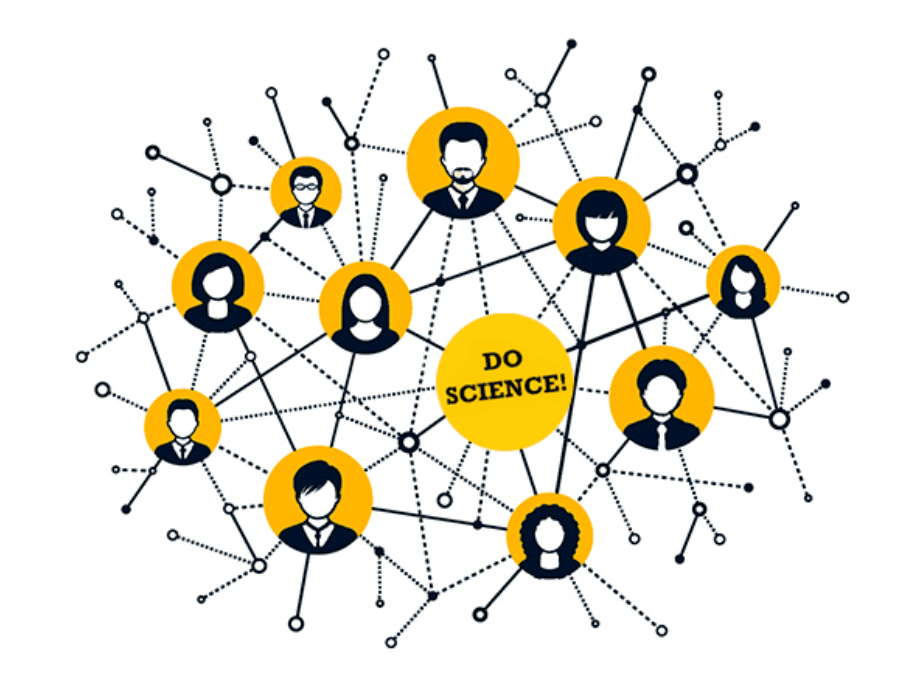

  <h1>do-science-covid-faq</h1>
    

Table of Contents
=================

* [do\-science\-covid\-faq](#do-science-covid-faq)
  * [Dobre źródła](#dobre-%C5%BAr%C3%B3d%C5%82a)
  * [Inne zbiory Pytań i Odpowiedzi](#inne-zbiory-pyta%C5%84-i-odpowiedzi)
  * [Strony z które sprawdzają fejki](#strony-z-kt%C3%B3re-sprawdzaj%C4%85-fejki)
* [Postaci, które się udzielają, a robią postawowe błędy w wypowiedziach](#postaci-kt%C3%B3re-si%C4%99-udzielaj%C4%85-a-robi%C4%85-postawowe-b%C5%82%C4%99dy-w-wypowiedziach)
  * [prof\. Roman Zieliński](#prof-roman-zieli%C5%84ski)
* [Pytania](#pytania)
  * [Czy mRNA może być włączone do DNA?](#czy-mrna-mo%C5%BCe-by%C4%87-w%C5%82%C4%85czone-do-dna)
    * [Przez odwrotną transkryptazę? NIE](#przez-odwrotn%C4%85-transkryptaz%C4%99-nie)
    * [Przez retrotraspozony LINE? NIE \#LINE](#przez-retrotraspozony-line-nie-line)
  * [W co wchodzą liposomy z mRNA?](#w-co-wchodz%C4%85-liposomy-z-mrna)
  * [Bezpieczeństwo](#bezpiecze%C5%84stwo)
  * [Kto ponosi odpowiedzialność za szczepienia?](#kto-ponosi-odpowiedzialno%C5%9B%C4%87-za-szczepienia)
  * [Jak to możliwe, że tak szybko gotowa?](#jak-to-mo%C5%BCliwe-%C5%BCe-tak-szybko-gotowa)
  * [Czy lekarze nie chcą się szczepić?](#czy-lekarze-nie-chc%C4%85-si%C4%99-szczepi%C4%87)
  * [Szczepienia a komórki płodów?](#szczepienia-a-kom%C3%B3rki-p%C5%82od%C3%B3w)
  * [mRNA a płody?](#mrna-a-p%C5%82ody)
  * [Jaka jest skuteczność szczepionki na grypę sezonowa?](#jaka-jest-skuteczno%C5%9B%C4%87-szczepionki-na-gryp%C4%99-sezonowa)
  * [Badania kliniczne Moderny trwają do?](#badania-kliniczne-moderny-trwaj%C4%85-do)
* [Pielęgniarka umarła w UK? NIE](#piel%C4%99gniarka-umar%C5%82a-w-uk-nie)
  * [Poszczepienne problemy?](#poszczepienne-problemy)

Created by [gh-md-toc](https://github.com/ekalinin/github-markdown-toc.go)

## Dobre źródła

- Polityka: https://www.polityka.pl/TygodnikPolityka/nauka/  
- Crazy Nauka https://www.facebook.com/crazynauka  
- Tomasz Dzieciątkowski  https://www.facebook.com/Tomasz-Dzieciątkowski-Trust-me-Im-a-Virologist-105823707854944 
- Kacper Toczyłowski https://www.facebook.com/DrToczylowski/

## Inne zbiory Pytań i Odpowiedzi

- https://www.gov.pl/web/szczepimysie/pytania-i-odpowiedzi

## Strony z które sprawdzają fejki

- https://fakenews.pl/
- https://sprawdzam.afp.com/list 
- https://demagog.org.pl/analizy_i_raporty/koronawirus-zestawienie-falszywych-informacji/ 
- http://konkret24.tvn24.pl

Po angielsku:

- https://www.reuters.com/article/uk-fact-check-mrna-vaccine-storage-temp-idUSKBN28E28D
- https://www.who.int/emergencies/diseases/novel-coronavirus-2019/advice-for-public/myth-busters 

# Postaci, które się udzielają, a robią postawowe błędy w wypowiedziach
## prof. Roman Zieliński
Długi opis problemu z wywiadem z prof. Zielińskim https://biokompost.wordpress.com/2020/12/23/nieuctwo-z-glupiej-gory/?fbclid=IwAR0AKAWou6hXMJqS10Za2xToZufeHXjR20EMYtRw8Kh349n_kbPQ88RiHas 

# Pytania
## Czy mRNA może być włączone do DNA?
### Przez odwrotną transkryptazę? NIE

### Przez retrotraspozony LINE? NIE #LINE

mRNA przetranskrybowane z retrotranspozonów LINE może się wiązać ze swoimi białkami ORF1 i ORF2 w cytoplazmie, tworząc tzw. kompleks rybonukleoproteinowy, który jest następnie transportowany z powrotem do jądra komórki. Tam ORF2 zaczyna odgrywać rolę endonukleazy ("otwierającej" łańcuch DNA w celu wklejenia do niego nowej kopii LINE) oraz odwrotnej transkryptazy (przepisującej mRNA z powrotem na DNA).

*Gdyby* te białka mogły się wiązać z dowolnym RNA, to mogłyby zabierać na gapę także mRNA że szczepionki. Tak się jednak nie dzieje. Odwrotną transkryptazę samolubnych transpozonów interesuje tylko transpozonowe RNA.

Tak czy siak nie ma mowy, żeby rewertaza transpozonu albo zabłąkanego retrowirusa w rodzaju HIV uprowadziła szczepionkowe mRNA. To są enzymy specyficzne, rozpoznające "swoją" sekwencję. Używanie uniwersalnego enzymu odwrotnej transkrypcji byłoby sprzeczne z egoistycznym interesem wirusa.

Source: internety, grupa pro-naukowa na fb

## W co wchodzą liposomy z mRNA?

TODO

## Bezpieczeństwo

Dlaczego uważasz, że na "argumenty naukowe" musimy poczekać? Już je mamy i są ogólnodostępne, każdy się może z nimi zapoznać - szczepionki mRNA są testowane od 30 lat, a sama szczepionka na COVID nie była tworzona od zera, a na podstawie szczepionki na SARS, która jest w użyciu od lat 18. Żadnych długofalowych skutków ubocznych nie stwierdzono. Jeśli zaś chodzi o szczepionkę na COVID, to chwilowo wśród 3 milionów zaszczepionych (na całym świecie) wystąpiło 6 reakcji alergicznych. Ponadto szczepionka była testowana tak samo jak wszystkie inne leki i szczepionki, żaden etap badań klinicznych nie został pominięty. -- Janina dailry

Sęk w tym, że nasz rząd zawłaszczył sobie (propagandowo) szczepionkę wynegocjowaną przez UE. I to nie naszego rządu należy słuchać w tym zakresie, tylko naukowców i specjalistów z instytucji unijnych (European Centre for Disease Prevention and Control - ECDC i EMA), którzy nad szczepionką pracowali i którzy ją starannie zlustrowali przed jej zatwierdzeniem. Zaręczam Ci, że najmniejsza wątpliwość zdyskredytowałaby tę szczepionkę, bo nikt w UE nie zaryzykowałby zatwierdzenia preparatu dla 450 milionów ludzi, który byłby niebezpieczny. -- Ola, crazy nauka

## Kto ponosi odpowiedzialność za szczepienia?

Słyszeliście zapewne, że Pfizer i inni producenci szczepionek na COVID-19 nie odpowiadają za powikłania po szczepieniach? O co w tym chodzi?
Opowiem Wam co się dzieje, kiedy firma ponosi bezpośrednią odpowiedzialność za możliwe problemy po szczepieniach. 
Od lat 70-tych ubiegłego wieku liczba przypadków boreliozy w USA gwałtownie rosła, sięgając w śmiałych szacunkach nawet kilkudziesięciu tysięcy rocznie. Firma SmithKline Beecham Pharmaceuticals (dzisiejszy GSK) opracowała więc pierwszą na świecie szczepionkę przeciwko boreliozie - LYMERix. W badaniach klinicznych jej skuteczność oszacowano na 78%. Od 1998 do 2000 roku podano w USA około 1.5 miliona dawek. Szczepionka była dobrze tolerowana i naprawdę skuteczna. Niestety, szybko pojawiły się pierwsze doniesienia o przypuszczalnych powikłaniach po szczepieniu. Do roku 2000 w bazie VAERS zarejestrowano kilkadziesiąt poważnych skutków ubocznych tej szczepionki. Było to dokładnie 66 poważnych powikłań na 1.5 miliona dawek. Co to jest VAERS? Baza VAERS jest prostym narzędziem dostępnym dla wszystkich, przy pomocy którego każdy może zgłosić dowolne działanie niepożądane szczepienia i nie jest to weryfikowane. Trafiają tam takie zgłoszenia, jak nawet przemiana w Hulka po szczepieniu. Wydaje się bez sensu, jednak w tym vaersowym chaosie można zauważyć pewne ważne sygnały. Jest to taki szczepionkowy system wczesnego ostrzegania. Dzięki bazie VAERS z rynku wycofano np. pierwszą szczepionkę przeciwko rotawirusom, bo zauważono wyraźnie większą częstość zgłoszeń wgłobienia jelita. W przypadku szczepionki przeciwko boreliozie po przeanalizowaniu raportów uznano, że nie ma żadnych podstaw do uznania szczepionki za niebezpieczną, a raportowane powikłania nie mają związku ze szczepieniem. Jednak ziarno niepewności zostało zasiane. Firmę zaczęły zalewać pozwy sądowe. W gazetach pojawiały się sugestywne nagłówki. Ludzie przestali kupować szczepionkę i ostatecznie w roku 2002, cztery lata po jej zarejestrowaniu, firma zdecydowała wycofać swoją szczepionkę z rynku. Druga firma (współczesny Sanofi) pracująca nad konkurencyjną szczepionką, w obliczu złej reputacji LYMERix, także porzuciła swój projekt. Do dziś nie mamy szczepionki przeciwko boreliozie i prawdopodobnie jeszcze długo jej nie będziemy mieć.
Dlaczego tak się stało? 
Szczepiona przeciwko boreliozie nie była zalecana dla wszystkich, a jedynie dla grup ryzyka, czyli osób przebywających na obszarach endemicznego występowania boreliozy. Z tego powodu LYMERix nie została objęta rządowym systemem odszkodowań powstałych po szczepieniu - National Vaccine Injury Compensation Program (NVICP). Program NVICP powstał właśnie z myślą o tym, żeby producenci szczepionek mogli zajmować się szczepieniami, a nie walkami w sądach (nie oznacza to jednak, że szczepienia nie podlegają żadnej kontroli - wciąż są to najbardziej rygorystycznie kontrolowane produkty medyczne na świecie). W przypadku licznych, nawet kompletnie nieuzasadnionych oskarżeń, producenci szczepionek musieliby podnieść ceny szczepionek lub zupełnie zrezygnowaliby z ich produkcji. Dlatego w razie powikłań, osoby poszkodowane mogą oczekiwać pomocy nie od producenta, a od rządu USA. Szczepionka LYMERix nie miała tej ochrony i została po prostu zniszczona przez liczne pozwy, plotki i fałszywe oskarżenia.
Dlatego polski Narodowy Program Szczepień przeciwko COVID-19 uwzględnia utworzenie funduszu kompensacyjnego, z którego popłyną odszkodowania dla osób mających niepożądane odczyny poszczepienne. Pozwala to producentom zająć się dopracowywaniem szczepionki, a jednocześnie zapewnia pomoc w przypadku powikłań.
Liczę, że będzie to krok ku otworzeniu funduszu na wzór amerykańskiego NVICP, którego moim zdaniem w Polsce bardzo brakuje. 

https://www.facebook.com/DrToczylowski/photos/a.141619736441869/781885772415259/?__tn__=%2CO*F

## Jak to możliwe, że tak szybko gotowa? 
Pewnie nie przebadana, bo normalnie to zajmuje wiele lat? 

https://www.nature.com/articles/s41586-020-2798-3

https://www.polityka.pl/tygodnikpolityka/nauka/1981764,1,ekspresowe-szczepionki-na-covid-jak-powstaly-i-czy-sa-bezpieczne.read

## Czy lekarze nie chcą się szczepić?

Jakbyście gdzieś widzieli argument "lekarze sie nie chcą szczepić" to można wrzucać to badanie PR

- https://m.facebook.com/story.php?story_fbid=2547785862180512&id=1530157060610069
- https://www.facebook.com/DrToczylowski/photos/a.141619736441869/781732925763877

## Szczepienia a komórki płodów?

## mRNA a płody?

W procesie produkcji szczepionek mRNA nie wykorzystuje się linii komórkowych, nie ma mowy, o żadnych komórkach z płodów.

## Jaka jest skuteczność szczepionki na grypę sezonowa?

Skuteczność szczepionki na grypę to około 60%, te szczepionki na covid maja skuteczność 95% [https://www.nejm.org/doi/full/10.1056/NEJMoa2034577]

## Badania kliniczne Moderny trwają do?

FDA do 2020 https://www.fda.gov/media/144637/download 

# Pielęgniarka umarła w UK? NIE

Nie, nie umarła.
https://konkret24.tvn24.pl/swiat,109/nie-pielegniarka-ktora-zemdlala-po-szczepieniu-nie-umarla,1042567.html

## Poszczepienne problemy?
Tak, były takie, choć też jest to podważane, ale być może konkretna szczepionka nie była w pełni bezpieczna.

Narkolepsja
- https://biotechnologia.pl/farmacja/tajemnica-poszczepiennej-narkolepsji-wyjasniona,15407
- https://www.mp.pl/szczepienia/specjalne/221171,narkolepsja-i-szczepienie-przeciwko-grypie-pandemicznej 
